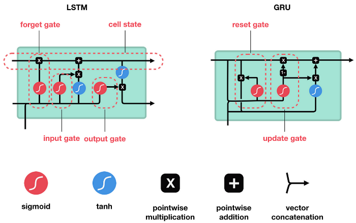
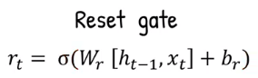
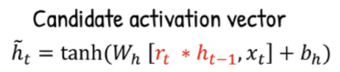
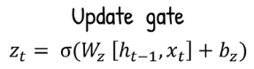
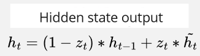

- **[Illustrated Guide to LSTM's and GRU's: A step by step explanation - The A.I. Hacker - Michael Phi](https://youtu.be/8HyCNIVRbSU?si=0rTiM6plo9mgv1gl)**
- **[Mengenal si GRU - Anak AI](https://youtu.be/mQ5CbaCK_Tg?si=zR552hFKhs_TWgy9)**

**Gated Recurrent Unit (GRU)** is a type of [recurrent neural network (RNN)](/deep-learning/rnn) and also the alternative of [long short-term memory](/deep-learning/lstm). GRU was developed to address LSTM limitation. LSTM has a complex architecture with different cell state and hidden state, making it computationally expensive. 

### LSTM vs GRU

GRU was designed to simplify LSTM architecture to reduce the number of parameters and computations involved. It has 2 gate :

- **Reset Gate** : The reset gate in a GRU determines how much of the previous hidden state is forgotten.
- **Update Gate** : The update gate in a GRU controls how much of the previous hidden state is combined with the new candidate activation to produce the updated hidden state.

  
Source : https://towardsdatascience.com/illustrated-guide-to-lstms-and-gru-s-a-step-by-step-explanation-44e9eb85bf21

### GRU Process

1. **Reset Gate** : The current time step input ($x_t$) with the previous hidden state ($h_{t - 1}$) are concatenated, it will be multipled by the **reset gate weight** ($W_r$), added with **reset gate bias term** ($b_r$), and transformed into the **sigmoid activation function**.
(1 - zt) * ht + zt * tilded ht
      
    Source : https://youtu.be/mQ5CbaCK_Tg?si=wl4wDGuYneso475E&t=61

2. **Candidate Activation** : The result of reset gate will be multiplied with the previous hidden state ($h_{t - 1}$), the output will be concatenated with the current time step input ($x_t$). Similarly, it will be multiplied by the **candidate activation weight** ($W_c$), added with **candidate activation bias term** ($b_c$), but transformed into the **tanh activation function**.

      
    Source : https://youtu.be/mQ5CbaCK_Tg?si=Lt5xHS8Y8w6Tjt1H&t=70

3. **Update Gate** : Again, the previous hidden state ($h_{t - 1}$) and the current input time step ($x_t$), it will be multiplied with the **update gate weight** ($W_z$), added with **update gate bias term** ($b_z$), transformed into the **sigmoid activation function**.

      
    Source : https://youtu.be/mQ5CbaCK_Tg?si=eNrIPhBA171dZl1k&t=85

4. **Hidden State Output** : The current time step hidden state is calculated by the following formula.

    - (1 - $z_t$) * $h_t$ : (1 - $z_t$) is the complement or the opposite of update gate $z_t$, it controls how much should the . When its close to 1, update gate is close to 0, meaning

      
    Source : https://youtu.be/mQ5CbaCK_Tg?si=3e1OgCWKpCDeyVgW&t=125 (with modification)

h_t = (1 - z_t) * h_t + z_t * \tilde{h_t}

overall gru is very similar to LSTM, the equivalent