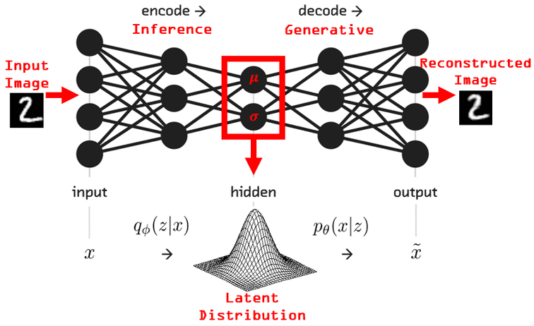
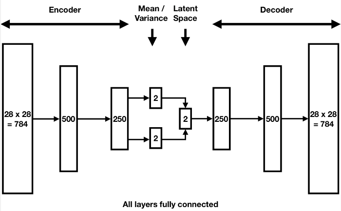
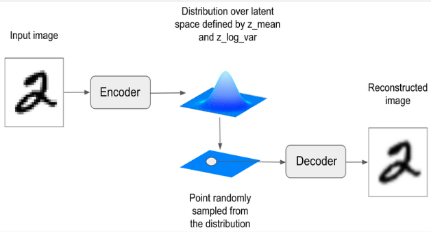
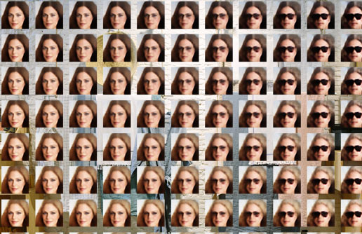
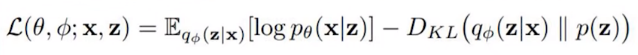
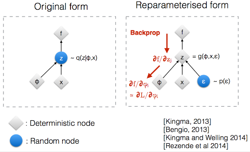

**Main Source:**

- **[Variational Autoencoders simplified — Prof. Ryan Ahmed](https://youtu.be/FzYBn1slG8w?si=5BBrGBCCEnZGe_N5)**
- **[Variational Autoencoders — Arxiv Insights](https://youtu.be/9zKuYvjFFS8?si=mj79JK4lr00vjQG3)**

Autoencoder is good for reconstructing input data, however, it has limitation for generating new data. They focus on learning how to reconstruct the original data. They are more suitable for task like image upscaling or compression, where we don't need to generate new data.

**Variational Autoencoder (VAE)** is a type of generative model, which is a model that learns to generate new data samples that are similar to the training data. The model capture patterns, dependencies, and the structure of the data to generate new samples.

The main concept is the data distribution, the model will capture the probability distribution of different data samples occuring. The generation process is a probabilistic, it is done by sampling the distribution. This will make the model able to generate samples that are similar to the training data but not necessarily identical.

Actually, we can use the similar concept of VAE that samples the data obtained from the encoder which will later be represented in the latent space to generate new image. However, the latent space doesn't model the variability or uncertainty of the data, it is simply a lower-dimensional representation of the data. They are also not continous or discrete, meaning sampling it would be challenging.

  
Source: https://theaisummer.com/Autoencoder/

### Encoder

Input data such as image is fed to the encoder. Similar to traditional autoencoder, it consist of several layers such as [convolution layers](/deep-learning/cnn#convolution-1) and [pooling layers](/deep-learning/cnn#pooling-1).

After going through encoder layers and arrived at the final fully-connected layer, the output kinda different. As explained before, the data samples will be represented in a distribution, and we will sample from the distribution. The output is still gonna be the lower-dimensional representation of the data, often called as **latent variables**. However, these latent variables will be modeled into a probability distribution instead of being flattened, they will be transformed into a probability distribution called **latent space distribution**.

The distribution follows the multivariate Gaussian distribution, it will be constructed based on two vectors parameters: **mean($\mu$)** vector and the **standard deviations ($\sigma$)** or **variance ($\sigma^2$)** vector. These vectors are produced in the two branch of the final fully-connected layer of the encoder.

In a more advanced VAE, the lower-dimensional representation of data may include multiple dimension of feature data, to be able to capture more aspect of the data.

:::note
The mean vector provides the central tendency of the distribution, while the standard deviation (or variance) vector determines the spread or uncertainty of the distribution, similar to statistics in math.
:::

  
Source: https://www.compthree.com/blog/autoencoder/

### Sampling

After constructing the distribution, we can start the sampling process. We will sample from the distribution defined by the mean and the variance. We will take sample as much as required to suit with the shape of the latent variables. The sampled latent is often denoted as $z$.

  
Source: https://notebook.community/diegocavalca/Studies/books/deep-learning-with-python/8.4-generating-images-with-vaes

#### Interpolation

Another technique in sampling is the **interpolation**, basically it takes multiple sample in the latent space and take the interpolation of it. By taking the interpolation, we will generate a similar data with the previous sample. The purpose of this is to make a smooth transition between different input data.

For example, we can use this to transform a face that originally doesn't wear sunglasses to wear it. We will first encode the original face to obtain the latent variables. We will then encode a face with sunglasses to obtain the latent variables aswell. Linear interpolation will be done between these two latent variables, we can choose the degree of interpolation, whether we want the result to be closer to original face or closer to the face with sunglasses. The interpolated vector will be passed to the decoder network and a reconstructed image between the interpolated path will be generated.

  
Source: https://www.compthree.com/blog/autoencoder/

### Decoder

The decoder layer of VAE is similar to the decoder layer in autoencoder, it is the reverse process of encoder that gradually increase the dimensionality of the sampled latent vectors, transforming them back into the original input space dimensions. Deconvolutional and reverse pooling process will be done.

#### Loss Calculation

After getting back the original input dimension, a new data is successfully generated. The loss calculation involve two terms, **reconstruction loss**, which measures the discrepancy between the reconstructed data and the original input data, same as the loss in traditional autoencoder. The second term is the **Kullback-Leibler (KL) divergence**, which measures the dissimilarity or information loss between two probability distributions. We compared the probability distribution we used to sample the new data with a normal distribution.

  
Source: https://youtu.be/9zKuYvjFFS8?si=wLkw3K_EXqw_1jpP&t=391

### Reparameterization Trick

The sampling process uses the mean and the standard deviation/variances, however, the sampling process is not differentiable, which means we can't use the backpropagation process to optimize the loss function and update the model's parameters.

This is where an epsilon ($\epsilon$) vector is introduced. Epsilon vector is randomly drawn from the normal distribution. However, during the backpropagation process, we aren't actually optimizing it, it is simply a trick to make the function differentiable.

  
Source: https://stats.stackexchange.com/questions/199605/how-does-the-reparameterization-trick-for-vaes-work-and-why-is-it-important
