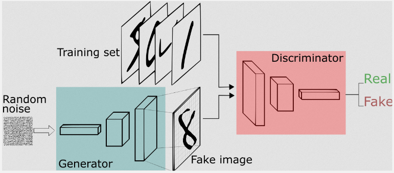
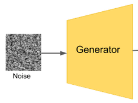
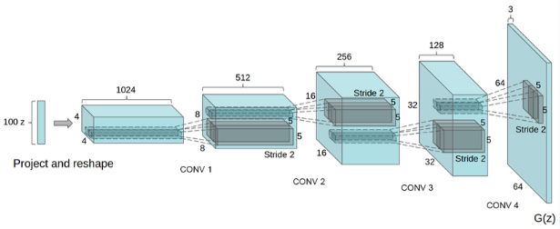
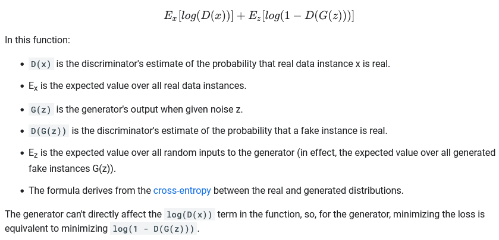
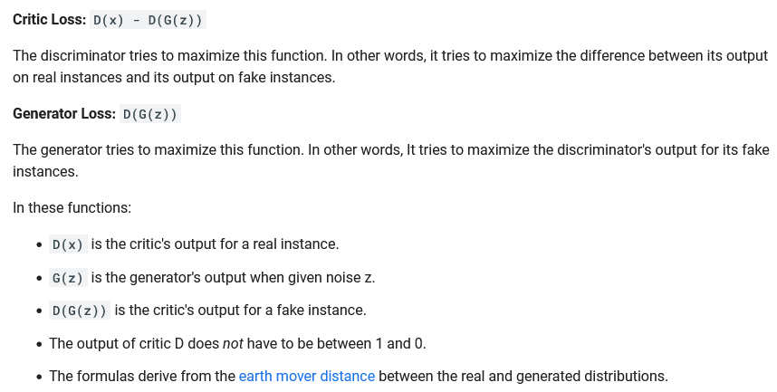
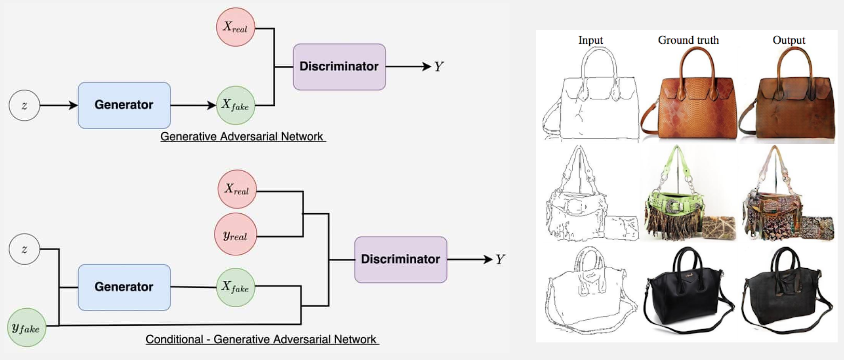
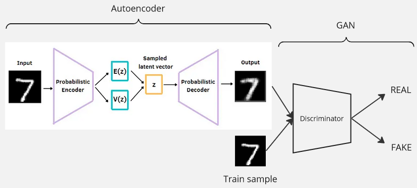
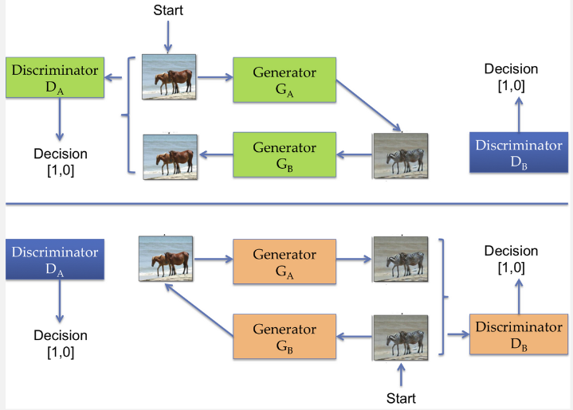

**Main Source :**

- **[Google ML GAN Course](https://developers.google.com/machine-learning/gan)**
- **[WGANs: A stable alternative to traditional GANs || Wasserstein GAN - Developers Hutt](https://youtu.be/QJOEmwvnmTM?si=NiUmbLBTvcLh7wVb)**
- **[VAE-GAN Explained! - Connor Shorten](https://youtu.be/yyqfZfnSzcw?si=WFBY7i7f-yAKT_i9)**
- **[CycleGAN Explained in 5 Minutes! - Matchue](https://youtu.be/-8hfnlxEPn4?si=nUnHWj5NL1H9Q2DN)**

**Generative Adversarial Network (GAN)** is a machine learning framework specifically used to generate data. GANs are a generative model, similar as [variational autoencoder (VAE)](/deep-learning/variational-autoencoder), meaning they generate new samples that are similar to the training data. We feed some data to the model, the model will capture the pattern and common structure of the data to generate new instance of data.

GAN can be used to generate new images, audio, video, or generating next word in a sentence.

GAN consist of two components: the **generator** and the **discriminator**. The generator is responsible for generating new data samples, while the discriminator acts as a binary classifier, distinguishing between different types of data. GANs is an unsupervised learning because they do not rely on labeled data with correct outputs or labels.

The idea behind GANs is that the generator produces new data, and the discriminator which is able to differentiate between different types of data, in this case the discriminator differentiate between real or fake data, act as a critic that provides feedback to the generator to improve its data generation capabilities.

#### Adversarial Training

Both generator and discriminator are trained in adversarial way, the generator's objective is to produce new samples that can fool the discriminator, while the discriminator's objective is to accurately distinguish between real and fake samples.

The discriminator takes input from the data generated by the generator and the data from training samples. The data are combined together, every data from generator is labeled as fake and every data from the training samples is labeled as real.

The loss will be calculated from the classification result, the loss represent how good is the data generated by the generator and how correct is the classification of the discriminator.

GAN is considered as a **minimax game** or a **zero-sum game**, which is a mathematical game concept that represents a competitive interaction between two players. The goal of one player is to minimize their maximum possible loss (minimizer), while the goal of the other player is to maximize their minimum possible gain (maximizer).

In this case, the generator aims to minimize the discriminator's ability to differentiate between real and fake samples, while the discriminator aims to maximize its ability to correctly classify real and fake samples.

  
Source : https://sthalles.github.io/intro-to-gans/

### Generator

The generator first takes a random input usually sampled from a normal or uniform distribution. The random input is often referred as **latent vector** or **noise vector**, which is a term for features that captures the charateristics of data. However, since it's just a random input they don't have necesarry meaning, they simply serve as a random seed for the starting point.

  
Source : https://www.researchgate.net/figure/The-semi-supervised-GAN-architecture-Random-noise-is-used-by-the-Generator-to-generate_fig4_335359919 (with modification)

The random input will then be transformed into a higher-dimensional representation. They are passed into some neural network architecture such as [convolutional neural network](/deep-learning/cnn) for image related tasks that also include [activation function](/deep-learning/deep-learning-foundation) to enable the network to capture complex patterns.

The final layer of generator produces the generated data, which could be images, text, or any other type of data depending on the application. The generated sample are then fed into discriminator to be classified.

  
Source : https://towardsdatascience.com/dcgans-deep-convolutional-generative-adversarial-networks-c7f392c2c8f8

### Discriminator

The discriminator can be any network architecture capable of classifying, if it's an image related task, [convolutional neural network](/deep-learning/cnn) can be used. The input data will be combined from the training samples and the generated samples. They will be labeled as fake or real and the discriminator will assign probability or how likely is the data to be real or fake.

#### Training Process

In GAN, the training process of both generator and discriminator are closely related. When the discriminator fails, meaning it fail to accurately distinguish between real and generated samples, this will also provide weak or incorrect feedback to the generator, which hold back the learning process. The generator may receive misleading signals that its generated samples are realistic, even if they are not, making it might not learn to improve and generate a better samples.

This is often called as **convergence failure**.

Both generator and discriminator are trained in alternating turns. This is to stabilize the learning process and to establish a feedback loop by improving iteratively from each other feedback.

### Loss Function

The loss function used for GAN will be two, one for generator and another for discriminator. We used two loss function to be able to measure both of their performance. As explained before, the generator tries to minimize its loss by generating more realistic data, while the discriminator tries to minimize its loss by becoming better at classifying the data.

#### Minimax

The minimax loss is the loss function used in the original paper that introduced GAN. The formula is :

  
Source : https://developers.google.com/machine-learning/gan/loss

The D and G is commonly used to refer the discriminator and generator, respectively. It is related to the [cross entropy loss function formula](/deep-learning/deep-learning-foundation#cross-entropy). The expected value measure of what we can expect to observe on average when dealing with uncertainty, in this case the uncertainty of the real data $E_x$ and the fake instance $E_z$.

The first term $E_x[\log(D(x))]$ represents the expected log-likelihood (the logarithm of a probability) of the **discriminator correctly classifying real data as real**. The generator aims to minimize this term to generate data that can "fool" the discriminator.

The second term $E_z[\log(1 - D(G(z)))]$ represents the expected log-likelihood of the **discriminator correctly classifying generated data as generated**. The discriminator aims to maximize this term by correctly distinguishing between real and generated data.

The minimization or maximization of specific term is done by taking the partial derivative with respect to the specific parameters. The loss will be optimized and backpropagation process will be done to adjust all the parameters involved. The generator is connected to the discriminator to receive its gradient for optimization step.

### Wasserstein (WGAN)

The Wasserstein loss is the alternative loss function for minimax, it modified the concept of standard GAN, becoming **Wasserstein Generative Adversarial Networks (WGANs)**. This was introduced to address GAN problem including the lack of meaningful loss metric.

The minimax loss does not provide a direct and meaningful measure of the quality of generated samples, it only provides a real or fake indicator. The objective function does not correlate well with the visual quality or desired characteristics of the generated samples, making it difficult to assess the progress of training.

In WGAN, the discriminator is no longer trained to classify samples as real or fake. Also, it is no longer called a discriminator, instead it is called a **critic**.

The real data from training sample and the fake data from generator is represented in a probability distribution. The discriminator or the critic still have its own network, however, the output of the network is a measure of how far is the input it received from the real data probability distribution. It is calculated using the **earth mover distance** or the **wasserstein distance**.

After that, the result of critic will be used in the wasserstein loss function, which is the below formula :

  
Source : https://developers.google.com/machine-learning/gan/loss

The critic is trained to maximize the critic loss which is the difference between the output on real and fake instance. This mean we are training the critic to be able to accurately estimate the distance between input distribution and the real distribution. And the generator is trained to maximize the critic output for fake instance (or minimizing the negative output of critic), where the higher means the more close it is to real data.

In summary, the benefit of having the critic produce real-valued outputs instead of binary real or fake labels is that it allows the critic to provide a measure of the degree of realism in the generated samples.

After that, the backpropagation process that optimize all the parameters involved, including the generator's parameters are done. The gradient from the discriminator as the output will be passed to the generator.

### Variations of GAN

GAN also have several variations, the two example are :

#### Conditional GAN (cGAN)

In traditional GAN, the generator takes random noise as input and produces new samples. In cGAN, both the generator and discriminator are conditioned on additional information, in the form of labels or class information. It uses the concept of conditional probability with the given condition instead of the concept of joint probability of the noise and real data.

This conditioning enables the generation of samples that are conditioned on specific attributes, making it useful for tasks like generating samples based on specific class labels or generating another image based on some input image (called image-to-image translation).

  
Source : https://learnopencv.com/conditional-gan-cgan-in-pytorch-and-tensorflow/, https://developers.google.com/machine-learning/gan/applications

#### Variational Autoencoder GAN (VAE-GAN)

VAE-GAN combines the [variational autoencoder](/deep-learning/variational-autoencoder) with the traditional GAN. The generator in GAN is replaced by the decoder of VAE. The step are :

1. Input data goes through encoder, the data will be transformed into latent space representation in the form of probability distribution.
2. The distribution will be sampled and goes into the decoder, transforming it back to higher-dimensional representation.
3. The generated data from decoder will be passed together with training sample to the discriminator
4. Discriminator classify real or fake data.

There are 3 loss function used which is combined from loss in VAE and GAN :

1. **Regularization / KL Divergence Loss** : The loss for encoder which is responsible to map input data into latent space representation, the loss is supposed to encourage the encoder to make the latent space representation close to the prior distribution, which is set to normal distribution.
2. **Reconstruction Loss** : The loss of VAE decoder, the difference between reconstructed image with the original image.
3. **Adversarial / GAN Loss** : The loss resulted from discriminator that classify whether data is real or fake. The generator or the decoder of VAE need to generate data that can fool the discriminator while the discriminator need to classify real images as real and generated images as fake.

  
Referenced from : https://wandb.ai/shambhavicodes/vae-gan/reports/An-Introduction-to-VAE-GANs--VmlldzoxMTcxMjM5, https://medium.com/dataseries/variational-autoencoder-with-pytorch-2d359cbf027b

#### CycleGAN

**Cycle-Consistent GAN** is a type of GAN designed for image-to-image translation tasks. It is an unsupervised learning model that can learn to convert/transform one image to another image smoothly without paired training data. It is achieved using two paired of generator and discriminator.

The generator consists of two, the $G_A$ that is responsible for transforming image from domain A to domain B, another one $G_B$ is responsible for transforming image from domain B to domain A.

The discriminator $D_A$ classify between real and fake image from domain A which is from $G_A$, while $D_B$ does the same from $G_B$.

:::note
The domain here means a specific style of an image that is visually distinguishable, a common example is a horse image (domain A) transitioning to zebra image (domain B).
:::

The CycleGAN process operates in a cycle :

1. Generator A takes an image from Domain A as input and translates it to Domain B. The goal is to generate a realistic image in Domain B as it is really coming from domain B.
2. Generator B takes that translated image and translates it back to Domain A. The goal is to reconstruct an image that is similar to the original input image from Domain A.
3. The discriminator compare the generated images with the same real images which we used as input for generator A in step 1.

The process is same for the other discriminator.

  
Source : https://www.oreilly.com/library/view/hands-on-artificial-intelligence/9781788836067/c2e7d914-4e45-4528-8627-c590d19107ef.xhtml

There are two loss function used, the same adversarial/GAN loss which is obtained from the discriminator classification (classify whether image is real or fake). Another loss is the **cycle consistency loss**, which is loss introduced to ensure the translation from A to B and then from B to A or vice versa reconstructs the original image.
