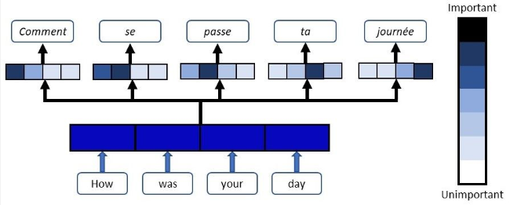
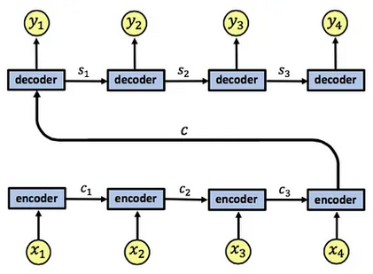
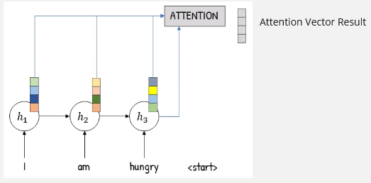
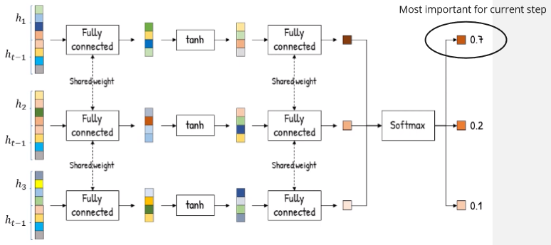
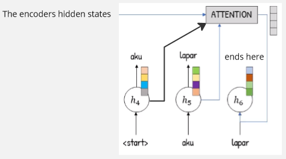
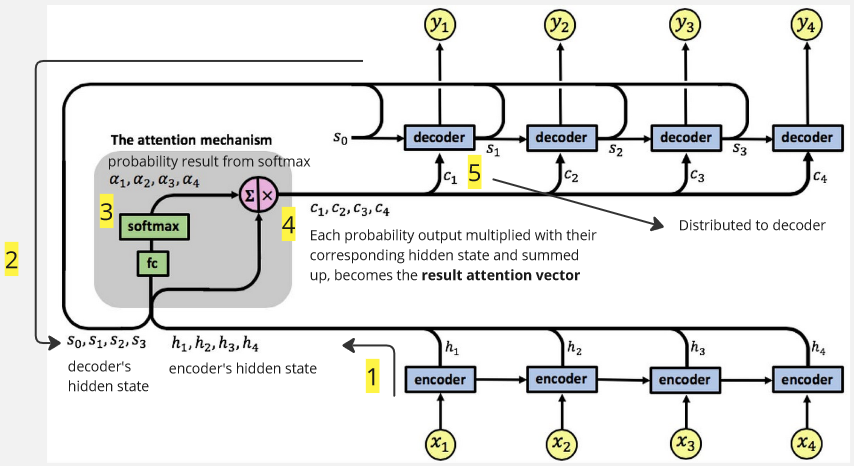

**Main Source :**

- **[RNN Encoder Decoder + Attention - Anak AI](https://youtu.be/y7YWo6XaVHc?si=4etprkoHN-e3X_vj)**
- **[Attention in RNNs by Nir Arbel - Medium](https://medium.datadriveninvestor.com/attention-in-rnns-321fbcd64f05)**

Sequence model like [RNN](/deep-learning/rnn), struggle in processing a large or long input sequence. The sequence input keep being processed through the network, the information from earlier steps might lost as it propagates through the recurrent connections. This makes sequence model like RNN struggle to capture long-term dependencies accurately.

Other type of sequence model such as [LSTM](/deep-learning/lstm) and [GRU](/deep-learning/gru) that address some of RNN limitation still have some issue. These model lack of global context or dependencies that span across long distances in the sequence as it is being processed through each time step. Their computation complexity also grows linearly with the length of input sequence.

### Attention Mechanism

**Attention mechanism** is a mechanism introduced to help address sequence model limitation. This mechanism works by capturing only the relevant parts of the input sequence. It assign weights or scores to different element of input to indicate their importance or relevance to the current step of processing.

LSTM and GRU maintain memory across time step by carrying the information through hidden states, attention mechanism instead selectively focus on different parts of the input sequence. It also assign importance regardless of the input position in the sequence. So, element that are far away from the current step can still be considered important as they may have strong relationship.

Another technique is the **positional encoding**, which capture the input position in the sequence. This is useful for a task where it require precise positional information.

Because attention mechanism focuses on specific part of the input, meaning it doesn't depend on the previous step. This allows for parallel computation while calcaluting the attention scores for all elements in the sequence, leading to a faster training.

  
Source : https://blog.floydhub.com/attention-mechanism/

### RNN with Attention

The [standard RNN](/deep-learning/rnn) can be equipped with attention mechanism. RNN with attention mechanism typically extend the [RNN encoder-decoder architecture](/deep-learning/rnn#rnn-encoder-decoder), which is the more advanced architecture of RNN used for sequence-to-sequence tasks.

#### Standard RNN encoder-decoder

  
Source : https://medium.datadriveninvestor.com/attention-in-rnns-321fbcd64f05

Image above shows the standard RNN encoder-decoder architecture, the $c_t$: ($c_1$, $c_2$, $c_3$) represent the encoder's hidden states, the $c$ is the summarized information from all encoder. The $s_t$: ($s_1$, $s_2$, $s_3$) is the state of each decoder. Each of it also produces output of $y_t$: ($y_1$, $y_2$, $y_3$, $y_4$).

The limitation of this architecture falls in the summarized information $c$, the entire input is compressed into a single fixed-length context vector. It limits the model capacity, especially when there is a degrees of relevance to different parts of the output sequence.

#### Attention

Each encoder's hidden state will be connected to an **attention layer**, which is the layer that stores all the information from all encoder. The result of attention layer which will distribute the information to the decoder later is called **attention vector**.

  
Source : https://youtu.be/y7YWo6XaVHc?si=RM1mtj9tFWSU3vGb&t=122  
(The 4 box represent the desired attention vector length, this depends on tasks or input)

Each encoder process an input and have its own hidden state. All the hidden state value from encoder will be passed to the attention layer together. Now it's time to determine which information is relevant enough to be passed into the decoder.

The attention vector is determined using probability, hidden state value from encoder is passed to attention layer and it goes into several fully connected layer (where they have shared weights) with tanh activation function on it and all the output will be transformed into probability with the [softmax activation function](/deep-learning/neural-network#softmax-activation-function). The probability output with the one being the highest represent the most important information.

  
Source : https://youtu.be/y7YWo6XaVHc?si=-lrYn-yFFkqoiCj7&t=258

Actually, hidden state passed into the fully connected layer is not only from the encoder, the $h_{t - 1}$ represent the previous hidden state of decoder. Decoder, like the standard RNN encoder-decoder architecture, will have their own hidden state. We will use their hidden state in the attention layer combined together with all encoder's hidden state in a distributed manner. This is done to ensure proper processing if current output depends on the previous output.

Because we used $t$ variable in the formula, it means the attention layer will be recalculated in each time step. This makes attention mechanism dynamically or adaptively focuses on different parts of the input sequence at each decoding step. This allows the model to utilize the current most relevant information or context at each output step.

Each probability output will be multiplied with their corresponding hidden state and summed up, the result is the final vector for attention layer, which will be passed into the decoder.

  
Source : https://youtu.be/y7YWo6XaVHc?si=bFftYfpJpQ9nS2uZ&t=274

The attention layer will distribute the information to each decoder, each of it will produce an output. The process will be repeated until the end of the processing.

  
Source : https://youtu.be/y7YWo6XaVHc?si=ThCduvO7eaqGYc2L&t=159 (with modification)

  
Source : https://medium.datadriveninvestor.com/attention-in-rnns-321fbcd64f05 (with modification)

### Transformers

**Transformers** is... architecture 
