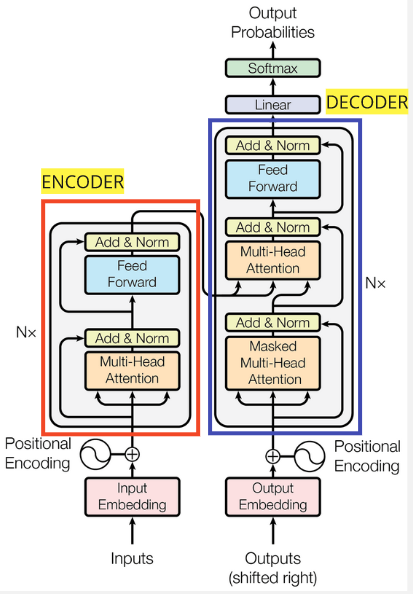
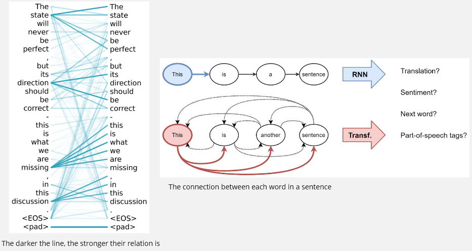
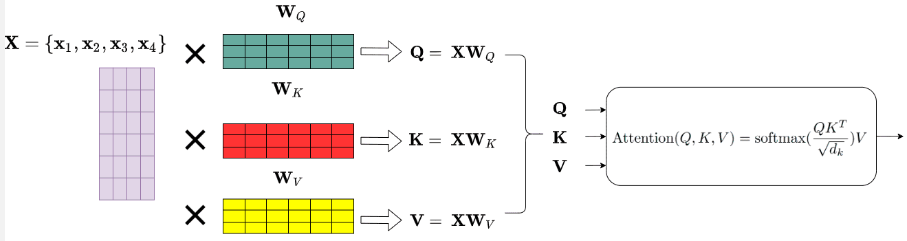
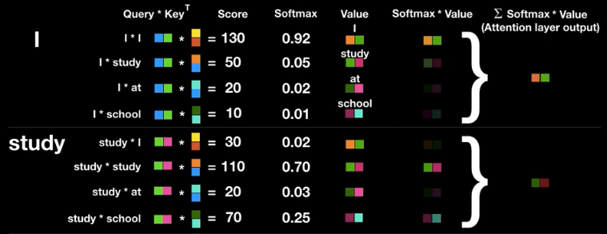
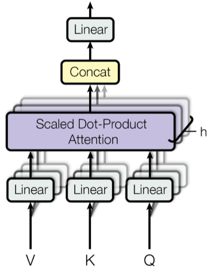
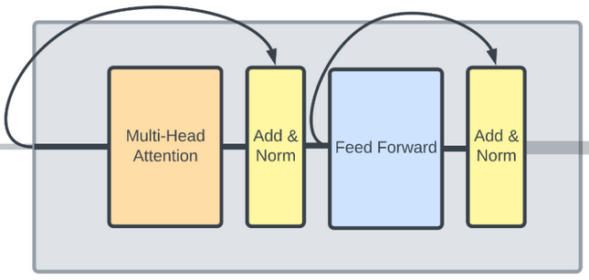
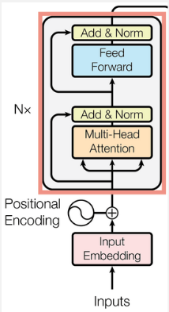
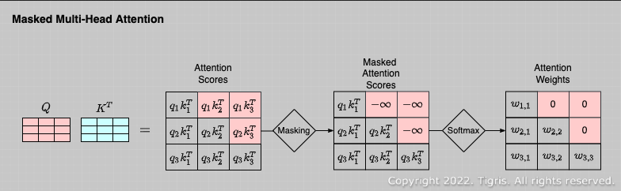
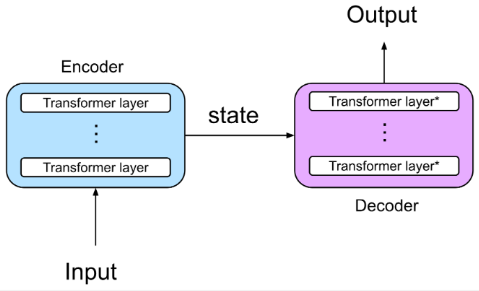

**Main Source :**

- **[Transformer (Attention is all you need) - Minsuk Heo 허민석](https://youtu.be/z1xs9jdZnuY?si=_rWDHRCle8k-x8SG)**
- **[Illustrated Guide to Transformers Neural Network: A step by step explanation - The A.I. Hacker - Michael Phi](https://youtu.be/4Bdc55j80l8?si=hHjopC6GvZl-mZTv)**
- **[Hugging Face NLP course part 1](https://huggingface.co/learn/nlp-course/chapter1/1)**

**Transformers** is a type of deep learning architecture that specifically uses the [attention mechanism](/deep-learning/transformers/attention-mechanism) as the key component. While [RNN with attention](/deep-learning/transformers/attention-mechanism#rnn-with-attention) also use the attention mechanism, transformers is a standalone architecture that doesn't need traditional sequential model like [RNN](/deep-learning/rnn).

RNN processes information in sequence, each step has to wait for the previous step to complete, this will makes computation slow. The removal of RNN will indeed allow us to get better performance. The motivation behind transformers is to address the performance issue we are facing in RNN. The question is, how can we remove RNN while preserving the attention mechanism?

## Transformers Architecture

  
Source : https://machinelearningmastery.com/the-transformer-model/ (with modification)

Transformers follow the encoder and decoder architecture, meaning one component should capture and summarize information from input and another is the one that produces output.

### Encoder

The encoder is responsible for taking and processing the input sequence, it consist of multiple layer that works together. Here is the walkthrough of input processing in encoder :

1. **Input Embedding** : The input sequence is first transformed into a dense vector (often called as **token**) that of course contain numbers. The input embedding is a learnable process, meaning it can be adjusted during the backpropagation process.

2. **Positional Encoding** : Since transformers doesn't include RNN that process input sequentially, **positional encoding** is a technique to capture the relative position of tokens within a sequence.

   Positional encoding is done by adding a sinusoidal function (sin and cos) of different frequency to the token vector. Basically the sinusoidal function will model the position information of each element in the sequence using different variation of frequency. There are few reason why sinusoidal function is used, one of the important is the **periodic** nature offers an unlimited encoding regardless of our input length. Other reason are its smooth transition and non-linear function.

     
   Source : https://datascience.stackexchange.com/questions/51065/what-is-the-positional-encoding-in-the-transformer-model

The first and second is the input pre-processing, the third and so on is the actual processing inside an encoder layer.

3. **Self-Attention** : Transformers uses a mechanism called **self-attention**. The standard attention mechanism produces a context vector (vector that contains important information about the sequence we are processing) by considering the input sequence and the current output we are generating. In other word, it needs two sequence which is the input and current output to generate another output.

   On the other hand, self-attention only need a single sequence. Self-attention weigh the relevance or importance of each element by comparing it with other element in the sequence itself. This will make different element have different relevance in the sequence.

   What makes it superior than the standard attention mechanism, it offers us **parallelization**. Remember that in [RNN with attention](/deep-learning/transformers/attention-mechanism#attention) on each output step, the attention vector is different, they are computed based on current output step. Self-attention that uses single sequence allows us to compute attention scores for all elements simultaneously, leading to better performance.

   - **Self-attention process** :  
     The self-attention is implemented by matrix multiplication. The token embedding are fed into the first layer in encoder. The self-attention mechanism is applied, it is done by calculating three types of vector called **query, key, and value vectors**. The tokens embedding are combined in a matrix, it will be multiplied by three types of matrices that correspond to each vector mentioned. The matrix are **Wq, Wk, and Wv**, they are basically weights in form of matrix, which mean they are learnable.

   These three vector carries the information of token, they will be used to calculate an attention weight, which is the value of importance of a token in sequence.

   - The query vector represent specific position of token in the input sequence that we want to compute the attention weights for.
   - Key vector represent the other token in the sequence that is being compared to the query vector. As explained in self-attention mechanism, we will compare all the element with each other to consider which one is more important than other.
   - Value vector contain the actual information or the features of each token in the sequence.

   Visualization of the relation between each word or token in self-attention.  
     
   Source : https://www.researchgate.net/figure/A-visualization-of-a-learned-self-attention-head-on-a-sentence-The-visualization-shows_fig5_346522738, https://babich.biz/transformer-architecture/

   The query and key vector (transposed) will be multiplied together, producing something called **attention scores**, it can be interpreted as the similarity between two token. The higher the result is the stronger the relevance. They will be divided by the square root of the dimensionality of the key vectors, to prevent large number. [Softmax activation function](/deep-learning/neural-network#softmax-activation-function) will be applied to the previous result, resulting normalized value (they sum up to 1).

   The normalized value will be multiplied with the value vector. The result of it is what we call **attention weights**. The normalized value which represent the similarity of information is multiplied by the actual information of the token in input sequence. This mean we are assigning the similarity of information to each token.

   The output (called **attention layer output**) will be the sum of all attention weights and this will be done for all element in sequence. The properties of encoder that consider each token in sequence including the previous and subsequent token to capture the information that lies on the input is called **bi-directional**. In other word, it can pay attention to every token in the sequence.

     
   Source : https://theaisummer.com/transformer/

     
   Source : https://youtu.be/z1xs9jdZnuY?si=czJyixA7IV3DxG7k&t=475

4. **Multi-Head Attention** : Multi-head attention is an extension of the self-attention mechanism that improves its efficiency through parallel computation.

   The set of query, key, and value vector we have obtained is grouped in something called **attention head**. They first goes into a linear layer to be projected into different vector spaces, basically projecting them mean we are looking through these vector from different perspective. This will allows the model to capture different representation of the input.

   So, to calculate attention weights in parallel, we will compute all the attention head simultaneously. The same calculation that includes multiplication between query and key vector, softmax normalization, and multiplication with the value vector, is also performed.

   By calculating them simultaneously, the model can have longer dependencies when processing the input sequence. The model attends to all other tokens and can access different parts of the sequence during the matrix multiplication process.

   Each result of attention head will be concatenated together and will be passed into a linear layer again, producing the final output of multi-head attention layer.

     
   Source : https://paperswithcode.com/method/multi-head-attention

5. **Residual Connection and Layer Normalization (Add & Norm)** : We did alot of calculation, during the backpropagation process, we may lose some information including the positional encoding we did in the earlier step. Transformers uses the [residual connection concept](/deep-learning/resnet#residual-connection) to help prevent the vanishing gradient issue. This is implemented by adding the input that bypass the attention layer with the same input that goes to the attention layer. This layer also include a normalization process to normalize the output of attention layer, to prevent large number and stabilize the training process.

6. **Feed-Forward Networks (FFN)** : The attention output is passed through a feed-forward network within the encoder layer. The FFN that includes activation function like ReLU introduces non-linearity. The output of the FFN is then passed through another residual connection and layer normalization. Similar to residual connection in multi-head attention layer, we will add the input that bypass the feed-forward network with the one that goes through it.

     
   Source : https://deepgram.com/learn/visualizing-and-explaining-transformer-models-from-the-ground-up

The step from 3 to 6 represent the process of a single encoder layer. In conclusion, a single layer of encoder processes and transform the input sequence to capture relevant information in the sequence. The output of encoder is a key and value pair that represent the information about the input sequence.

Transformers architecture may includes multiple encoder layer, they have identical architecture but they don't share weights.

  
 Source : https://machinelearningmastery.com/the-transformer-model/ (with modification)

### Decoder

The decoder is responsible for generating the output sequence, it consist of similar layer with encoder like multi-head attention, add & norm, and feed-forward network. The decoder takes input from encoder layer (the relevant information) and from the previous output as well.

The decoder first process the previous output and then it will be combined with the output from encoder.

1. **Output Embedding** : The previously generated output embedded or will be turned into a vector representation (token), similar to input embedding in encoder.

2. **Positional Encoding** : The similar encoding process to capture the relative position of each token in the sequence.

3. **Masked Multi-Head Attention** : In the normal multi-head attention, we calculated the attention weights using matrix multiplication which include multiplying every element with each other. Multiplying with every element includes accessing its query, key, vector, meaning we have information about them. However, we don't want this to happen in decoder, we don't want to generate output with the information from future. This is implemented by changing some of the value in the matrix during the matrix multiplication to a very large negative number. The properties of decoder that only access previously generated token is called **uni-directional**.

     
   Source : https://tigris-data-science.tistory.com/entry/%EC%B0%A8%EA%B7%BC%EC%B0%A8%EA%B7%BC-%EC%9D%B4%ED%95%B4%ED%95%98%EB%8A%94-Transformer4-Masked-Multi-Head-Attention%EA%B3%BC-Decoder

4. **Add & Norm** : It then goes to the add & norm layer again which consist of residual connection and normalization layer.

5. **Multi-head Attention** : Also known as **encoder-decoder attention** or **cross-attention**, in this step, the multi-head attention will be done again. Multi-head attention will need query, key, and value vector, the input for them will be the combination of the output from encoder and previous result from decoder. Encoder provides the key and value pair, the decoder's previous output is transformed into a query. So basically, the encoder provides the contextual information from key and value pair and its combined with the query from decoder that represent what we need to generate the output now. It then goes to add & norm layer again.

6. **Feed-Forward Network + Add & Norm** : The next component in the decoder layer is the feed-forward network. Same as the encoder, it consist of fully connected layer with non-linear activation function. Next, it will be normalized again in the add & norm layer.

7. **Output** : Finally, the output from previous layer will go into a linear layer, followed with softmax activation function to produces the probability of each token. The model select the token with highest probability and use it as the input for next decoder step. Decoder is considered as  **auto-regressive** or **causal-attention**, meaning it output sequence one step at a time, in an iterative and sequential manner.

     
   Source : https://www.linkedin.com/pulse/intro-transformer-architecture-jithin-s-l

#### Learning Process

After output is generated, the prediction or whatever the output is will be compared with the actual label of the input. For example :

- In machine translation, the labels would be the target sequences or translations corresponding to the source sequences.
- In text classification, the labels represent different categories of the input text.

After loss is calculated, the similar learning process will be done, including the backpropagation process through all the layer of transformers model from the decoder output until the encoder input.

#### Extras

Transformers consists of encoder and decoder, however, they are not necesarry used together. In tasks like text classification or sentiment analysis, where understanding of the input is the primary objective, the encoder captures contextual information about the data, the information can be fed into classifier directly. A decoder-only model is designed for generating output. It is applicable in tasks such as dialogue generation, where it generates the subsequent word based on previously generated words.

They are often used together for sequence-to-sequence tasks like text translation that require understanding of input data and the output generation.

Transformers model is considered as semi-supervised learning. The semi-supervised learning involve techniques like pre-training and fine tuning. The pre-training technique mean the model is trained on unlabeled data. During the pre-training process, the model learns the general language representation and capture how each word relate with each other. It will then be fine tuned, a smaller labeled dataset will be fed to the model to adapt it on specific tasks or specific topic (the method is also called **transfer learning**).
