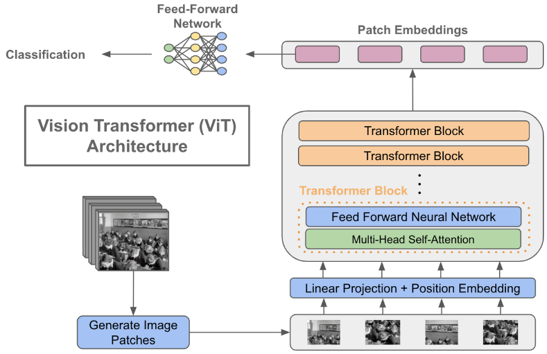
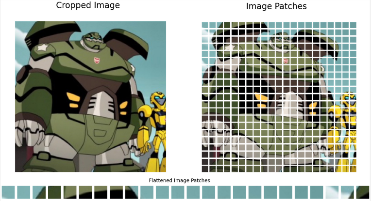

**Vision Transformers (ViT)** is a [transformer-like architecture](/deep-learning/transformers/transformers-architecture) used for computer vision tasks, it is known as the competitor of [CNN](/deep-learning/cnn). Leveraging transformers architecture, ViT treats 2-dimensional images as a flat sequence and then use the self-attention mechanism to capture the relationship within an image.

### Architecture

The original ViT architecture is an encoder only model. At the end of encoder's output, a feed-forward network is used to classify the image.

  
Source : https://towardsdatascience.com/using-transformers-for-computer-vision-6f764c5a078b

1. **Input** : The input of ViT is indeed an image, the image will be divided into smaller non-overlapping region called **patch**. The number of patches depend on the image size and the chosen patch size. For example, if the image size is 224x224 pixels and the patch size is 16x16 pixels, then it will result in 196 patches.

   The patch will be turned into vector representation or linearly projected into an embedding space (embedding process). In addition, positional embedding that encode the relative position of the patch in the input image is also added.

     
   Source : https://gowrishankar.info/blog/transformers-everywhere-patch-encoding-technique-for-vision-transformersvit-explained/

2. **Transformers or Encoder Block** : The embedded patches are fed into the transformers encoder block, consisting multi-head self-attention, fully connected layer, and add & norm layer. The ViT model stack several encoder block together. Transformers architecture make it possible to capture the global information about the image, compared to CNN that captures only the local patterns.

3. **Output** : The output is a sequence of patch embedding that captured the global representation of the image. Depending on the task, the output processing may be different. In a classification tasks, the output goes to a fully connected layer to produce probability distribution over different classes or labels.
