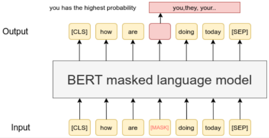
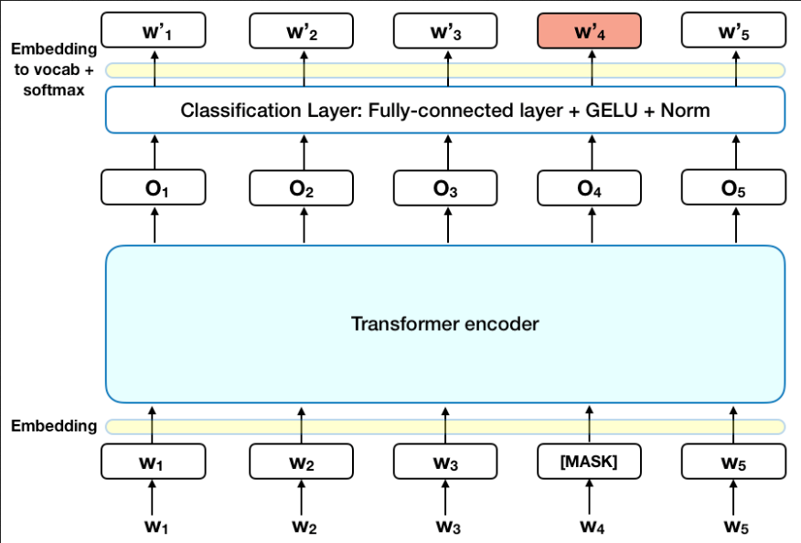

**Main Source :**

- **[What is BERT and how does it work? | A Quick Review - AssemblyAI](https://youtu.be/6ahxPTLZxU8?si=5KlmpJLnNZRHyKl_)**
- **[Based on the transformers architecture](/deep-learning/transformers/transformers-architecture)**

**Bidirectional Encoder Representations from Transformers (BERT)** is a [transformers-based architecture](/deep-learning/transformers/transformers-architecture) which consist of encoder that processes input sequence without involving decoder that generates output sequence. BERT is typically used for text classification, identifying identity (NER), question answering, and etc.

BERT is the encoder part of transformers, which they shares similar properties including :

- **Contextual Understanding** : Given the input sequence, BERT encoder will capture the dependencies and relationship between each words within the context.
- **Attention Mechanism** : The mechanism that assign the importance or relevance of each word within the context.
- **Bidirectional Processing** : The bidirectional here means the encoder processes the input by considering both the left and right context of each word.

### Masked Language Modeling (MLM)

MLM is the key aspect of BERT, it is a pretraining objective used in BERT that randomly mask or hide some of the input and then train the model to predict what actually is hidden based on the context provided by the other input.

The image below show an illustration of masking, the input is "how are `<mask>` doing today". The `<mask>` indicate the portion the model should predict. The output of the model is a token that has the highest probability to fit into the input sentence.

:::note
[CLS] stands for classification, indicates the beginning of a sentence used for classification task  
[SEP] stands for separator, to help model understand which token belong to which sentence
:::

  
Source : https://www.sbert.net/examples/unsupervised_learning/MLM/README.html

### Architecture

  
Source : https://towardsdatascience.com/bert-explained-state-of-the-art-language-model-for-nlp-f8b21a9b6270

1. **Input** : The input is the masked sentence, they are tokenized or converted into numerical representation (tokenization) and will be converted into vector (token embedding). Positional embedding that captures the position of each token is also done.

2. **Transformers Encoder** : Next, they goes into transformers encoder to capture the dependencies and relationship as well as the importance of each token to other token (attention mechanism). The BERT architecture consist of multiple transformers encoder that works together.

3. **Output** : The output goes into classification layer that consist of fully connected layer, GELU activation function, and a normalization layer. The result of that layer will be embedded back to actual vocabulary. The actual output is the vocab that has highest probability produced by the softmax activation function.

The output processing may vary depending on the task, we may need other kind of output processing for other task beyond MLM. For example, in sentiment analysis, we might want the output to be a label. The model may also be fine tuned to be adapted into a more specific task.
