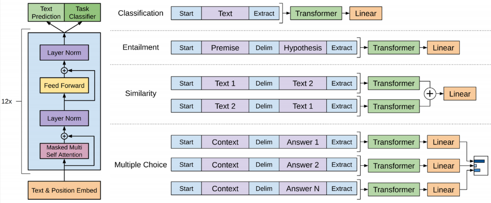

**Main Source:**

- **[GPT - Explained — CodeEmporium](https://youtu.be/3IweGfgytgY?si=Fed0FkK55LAH5SAL)**
- **[Transformers Architecture](/deep-learning/transformers/transformers-architecture)**

**Generative Pre-trained Transformer (GPT)** is language model (computational model trained to understand and generate human language) based on the [transformers architecture](/deep-learning/transformers/transformers-architecture). GPT is a decoder-only model, meaning it can only generates sequence based on the previous sequence. In other word, GPT predict next word in a sequence given the context provided by the preceding words. So, GPT require an initial word or prompt as input to provide the context to generate text.

The key features of GPT are:

- **Autoregressive**: Also known as **causal-attention** which is similar to the properties of decoder of the standard transformers architecture, it generates next word based on preceding word in sequential manner. GPT is often called **causal language model** because it predict the next word in causal manner.
- **Pre-trained & Fine Tuned**: GPT model is pre-trained on a large amount of text dataset to helps the model learn the general representation of the langauge. The model will then be fine tuned on specific tasks to adapt them on specific application.

### Architecture

GPT consist of 12 transformers decoder stacked on top of each other. Each decoder layer consider the previously generated words and uses self-attention mechanisms to capture the relationships between the words.

  
Source: https://paperswithcode.com/method/gpt

1. **Input**: The input of GPT which is a decoder is its own previous output or the initial prompt. The input is tokenized or turned into numerical representation and then transformed into vector (embedding). Alongside the input embedding, GPT also incorporates positional encoding to capture the position of the tokens in the sequence.

2. **Decoder Layer**: A single decoder layer includes masked multi self attention, add & layer normalization, feed forward network, and another add & layer normalization.

3. **Output**: The output from previous layer is passed into linear layer and a softmax activation function, the probability produced represents the likelihood of each word in the vocabulary being the next word in the generated text. The output processing can be customized into the task requirement.

### GPT Version

GPT has introduced improvements and advancements over its predecessors:

- **GPT-1**: The original version of GPT released in June 2018, consist of 12 transformer decoder layers and approximately 117 million parameters.

- **GPT-2**: GPT-2 was released in February 2019, ranging from 117 million to 1.5 billion parameters and have up to 48 decoder layers.

- **GPT-3**: Released in June 2020, it introduced significant leap in scale and performance. Has 125 million to 175 billion parameters and 96 decoder layers.

- **GPT-3.5**: Released in March 2022 and used for [ChatGPT](https://chat.openai.com/) which is the fine tuned model from GPT-3.5 series released in November 2022.

- **GPT-4**: The latest model released in March 2023, it was pre-trained on a combination of public data and fine tuned with reinforcement learning for a better feedback for human.
