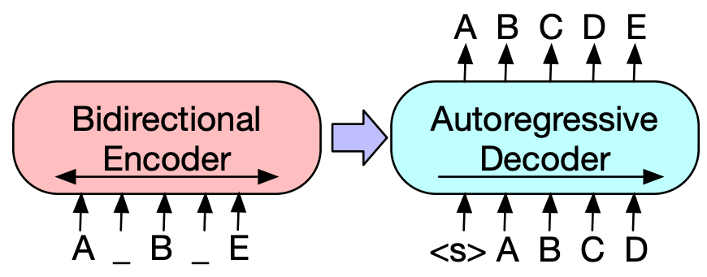
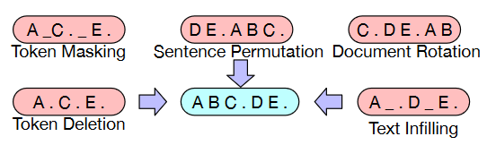

**Main Source:**

- **[BART: Denoising Sequence-to-Sequence Pre-training for Natural Language Generation, Translation, and Comprehension — arxiv](https://arxiv.org/abs/1910.13461)**
- **[Transformers Architecture](/deep-learning/transformers/transformers-architecture)**

**Bidirectional and Auto-Regressive Transformer (BART)** is a sequence-to-sequence [transformed-based architecture](/deep-learning/transformers/transformers-architecture) that utilizes both encoder and decoder layer. BART can be seen as the combination of [BERT](/deep-learning/transformers/bert) and [GPT](/deep-learning/transformers/gpt) that captures contextual information of input sequence while also having the component to generates new output sequence.

### Denoising Auto-Encoding

During the BART pre-training, an objective called **denoising auto-encoding** is used. BART is trained to reconstruct the original text from the corrupted versions of the same text. The corrupted version involve randomly masking or replacing the world in the input text, similar to the [mask language modeling in BART](/deep-learning/transformers/bert#masked-language-modeling-mlm). Then it uses the decoder to generate the original text based on surrounding words, just like GPT.

### Architecture

BART modifies architecture the architecture of BERT and GPT and incorporates some additional techniques. BART uses 12 stack for each encoder and decoder, each of the decoder takes the encoded representations from the encoder. BERT originally uses feed-forward network for its classification output, it is instead passed into the decoder.

  
Source: https://paperswithcode.com/method/bart

1. **Input**: Input processing includes tokenization, embedding, position encoding, and also some data augmentation:

   - **Token Masking**: The same technique used in BERT
   - **Token Deletion**: Deletes a random token
   - **Text Infilling**: Randomly removing tokens from the input sequence and replacing them with a special "mask" token. This will teach the model to handle missing or incomplete input
   - **Sentence Permutation**: Input sentences is shuffled randomly
   - **Document Rotation**: Rotating the order of documents to help the model learn to identify the start of the document

     
   Source: https://arxiv.org/abs/1910.13461

2. **Encoder Layer**: Embedded tokens are passed into the stack of transformers encoder layers. Each with its own multi-head self-attention and other component.

3. **Decoder Layer**: Decoder takes input from the output of encoder in the cross-attention mechanism and also its own previously generated output.

4. **Output**: The output is the most likely next word at each step, based on its learned knowledge and the context.

After the pre-training process, BART will be fine tuned and have different objective depending on its tasks. The labeled dataset is used to train BART on the task-specific objective. In tasks like text classification or summarization, the objective may involve minimizing the cross-entropy loss between the model's predicted outputs and the ground truth labels.
