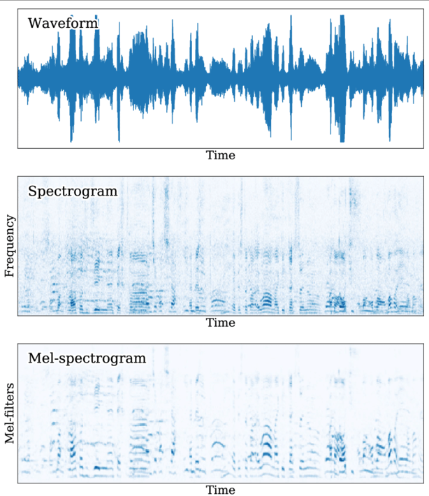
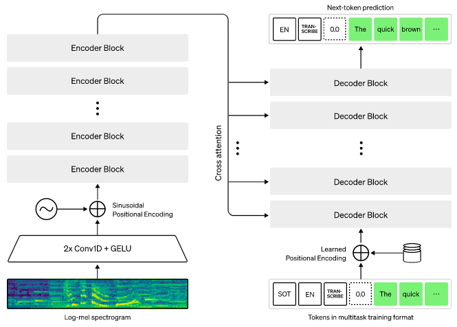

**Main Source:**

- **[Hugging Face Audio course part 3](https://huggingface.co/learn/audio-course/chapter3/introduction)**

[Transformers architecture](/deep-learning/transformers/transformers-architecture) can also be used for audio task, the application are speech recognition, music generation, audio classification, text-to-speech, and many more.

By audio task, it means transformers architecture will be modified to take input or produce output of text or audio. As long as the input can be turned into number, then we can use machine learning model for that task.

If the input is text then it will be easy, same as the original transformers architecture, it will be tokenized and turned into vector (embedding process). If the input is an audio data, one way to turn it into number is to transform it into **spectogram**.

### Spectogram

Spectogram is a visual representation of the frequency of a signal over time. The audio signal is divided into short segment, each segment will be transformed into frequency domain using technique like [fourier transform](/digital-signal-processing/fourier-transform). Representing it in frequency domain helps us know which different frequency contribute to the overall signal, therefore it's a good way to capture information lies on the audio data for processing it in the transformers architecture.

Another variation of spectogram is the **Mel-spectogram**, it is a form of spectogram specifically made to focus on human perception of sound. Basically, we scale the audio signal so that lower frequency is more emphasized than higher frequency, this is because human perception is more sensitive to lower frequency range.

Another way to represent audio is using **waveform**, the representation shows how the amplitude of the signal varies over time. However, waveform tend to have longer length than spectogram, leading to more computation and memory usage.

  
Source: https://www.researchgate.net/figure/Waveform-spectrogram-and-mel-spectrogram-of-a-10-s-speech-segment-obtained-from-Google_fig1_333834541

:::tip
Find more about [signal processing](/digital-signal-processing) or about [audio](/digital-media-processing/sound-audio-properties).
:::

#### Input & Output

To input waveform or spectogram into transformers encoder, they are typically divided into small segment first. The smaller segment will be fed into a **[convolutional neural network (CNN)](/deep-learning/cnn)**, which act as the feature extractor. CNN can be a good feature extractor as it capable of capturing local patterns (e.g. frequency shape variation) from input data through the convolution operation.

If the output is a text, it will be similar to the original transformers architecture, we uses linear layer and softmax function on top of the decoder's output. To produce audio output, we will need some layer that produces audio sequence. The layer can be additional neural network such as linear layer or CNN. The layer can also refine the audio output for better quality.

### Seq2Seq

There are many variation of transformers architecture for audio processing. Some use encoder only to classify the audio or use decoder only to generate audio, other like Seq2Seq which is used in [Whisper AI](https://github.com/openai/whisper), uses both encoder and decoder to takes sequence and output another sequence.

  
Source: https://huggingface.co/learn/audio-course/chapter3/seq2seq

1. **Input**: It takes log-mel spectogram which is the log scaled of mel spectogram as the input.

2. **Spectogram Pre-processing (Conv1D + GELU)**: The spectrogram is fed into a convolutional layer to extract features and patterns. It will use the GELU activation function, which is the variation of ReLU that has more smoother shape. The output of the CNN layers is then tokenized into smaller segments, similar to the tokenization step in the standard transformer models.

3. **Positional Encoding**: Positional encoding is added to the tokens to provide information about their relative positions in the sequence.

4. **Encoder Block**: This includes the similar process to the standard transformers architecture, it includes attention layer that provide high-level summary and captures the "meaning" of the audio data.

5. **Decoder Input**: The decoder takes **input from its own previously generated token**. It will be positional encoded and will be passed into the next decoder's layer.

6. **Cross-Attention**: Cross-attention is when the encoder output is combined with the decoder previous result. The encoder, provides key and value vector while the decoder provides the query vector, similar to the original transformers architecture.

7. **Decoder Output**: The decoder outputs a token, the token can be converted back into text or converted into spectogram with further processing depending on the use case. The decoder will then use it for the next output step.

Overall, the transformers architecture for audio is similar to the standard transformers, the difference falls in the input processing.
