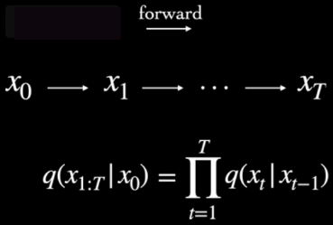
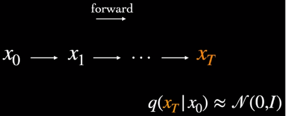
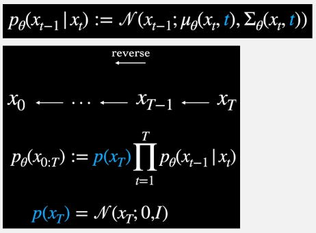
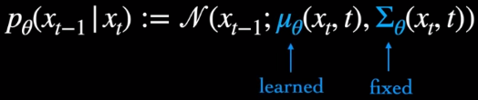
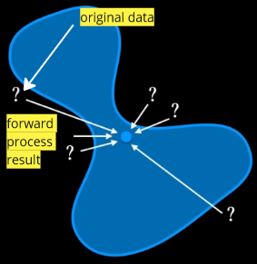
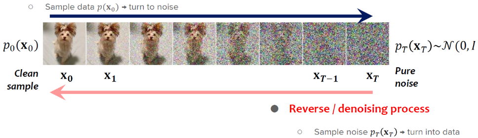

**Main Source :**

- **[Wikipedia Diffusion model](https://en.wikipedia.org/wiki/Diffusion_model)**
- **[What are Diffusion Models? - Ari Seff](https://youtu.be/fbLgFrlTnGU?si=tR6le4piBvVpeR_9)**
- **[Introduction to Diffusion Models for Machine Learning - AssemblyAI](https://www.assemblyai.com/blog/diffusion-models-for-machine-learning-introduction/)**

**Diffusion Model** is a class of generative model, meaning it generates new data by learning the underlying distribution of a given dataset and uses this knowledge to generate new data samples. Diffusion model is typically used for tasks including image generation, image denoising, generating high-resolution image, and etc.

Diffusion model is inspired by the concept of [diffusion](https://en.wikipedia.org/wiki/Diffusion) in physics, which is a stochastic phenomenon where particles spread out from an area of high concentration to an area of low concentration, eventually leading to a uniform concentration. The underlying principles and equations of diffusion in physics provide a mathematical foundation that is adapted and applied to model to generates data.

The idea of diffusion model is, we model the target image (the target image we want to generate) as a data distribution (called target distribution), and then the model will aim to transform a simple base distribution, typically a Gaussian distribution, into the target distribution through an iterative diffusion process.

<video width="720" height="360" controls>
  <source src="https://learnopencv.com/wp-content/uploads/2023/02/denoising-diffusion-probabilistic-models_flower_inference_2.mp4" type="video/mp4"/>
</video>

Source : https://learnopencv.com/denoising-diffusion-probabilistic-models/

## Denoising Diffusion Model

There are many variation of diffusion model, each with their own concept, **Denoising Diffusion Model** is the type of diffusion model that uses the diffusion concept.

### Denoising Diffusion Probabilistic Model (DDPM)

the type of denoising diffusion model that learns the underlying **probability distribution** of a dataset and generate new samples from that distribution.

The overall process of denoising diffusion model consist of two steps, the forward process that gradually add noise to the image, and the reverse process that tries to reverse the process or remove the noise to generate clean samples.

#### Forward Process

In DDPM, the noising process is modeled using a [**Markov chain**](/machine-learning/reinforcement-learning/markov-models#markov-chain). Markov chain is a mathematical model that assumes the future state of a system only depends on current step. In other word, the current state of a system depends only on the previous state. The key idea behind using a Markov chain in diffusion models is to describe the evolution of the system's state as an iterative stochastic process.

The forward process begins with adding noise to the image in gradual manner, the process will be divided into discrete time steps. The noise, we are adding is modeled using a **Gaussian (normal) distribution**. A Gaussian distribution is characterized by its mean ($\mu$) and variance ($\sigma^2$), which determine the central tendency and spread of the distribution, respectively.

  
Source : https://analyticsindiamag.com/a-guide-to-different-types-of-noises-and-image-denoising-methods/

Utilizing the Markov chain with diffusion model, the distribution of noise at some time step $t$ only depends on previous time step $t-1$. Following the calculation in Markov chain, current step distribution will be calculated by the product of each previously conditional step.

  
Source : https://youtu.be/fbLgFrlTnGU?si=tR6le4piBvVpeR_9&t=109

:::note
The forward process is fixed, meaning it doesn't have adjustable parameters.
:::

In the context of diffusion model, the type of Gaussian distribution used is the **diagonal Gaussian distribution**. The variance, denoted as $\beta$, varies at each time step and is constrained to be within the range of 0 and 1. The lower variance implies that the diffusion or transformation of the distribution occurs more gradually and with smaller perturbations, which may help us on the reverse process.

  
Source : https://youtu.be/fbLgFrlTnGU?si=mN1d8DKDP9vYJjQ0&t=129

As we iteratively perform the forward diffusion process, the noise gradually converges towards a Gaussian distribution. Mathematically speaking, the noise can be approximated as a **multivariate Gaussian distribution with a mean vector of zero and an identity covariance matrix**.

  
Source : https://youtu.be/fbLgFrlTnGU?si=C8gzMh3VVKSUXqBg&t=163

#### Reverse Process

The reverse process will also be modeled using Markov chain, the noise will be assumed as a **unimodal diagonal Gaussian distribution** (the formula above in the image below), which takes current state ($x_t$) and current time step ($t$) as input.

In the reverse process of a diffusion model, it involves inferring the previous step given the current step. The calculation is done by multiplying the product of conditional distributions at each time step in reverse order ($x_{t - 1} | x_t$) with the Gaussian noise distribution, denoted as $p(x_T)$, which was generated during the forward process (We assume the forward diffusion approaches Gaussian distribution).

  
Source : https://youtu.be/fbLgFrlTnGU?si=v6ixlxk-gmWiHtDW&t=279

The inference process is where the process is made learnable or adjustable. In the implementation of reverse process, there are two parameters, the mean ($\mu$) and the variance ($\Sigma$) of the Gaussian distribution. The variance is made fixed and only the mean is made learnable, for training stabilization purposes. In essence, the model will dynamically learn and adapt the optimal parameters to effectively reverse the diffusion process.

  
Source : https://youtu.be/fbLgFrlTnGU?si=o0xlAFVkGm6B4nHr&t=651

#### Training Objective

The forward and reverse process can be understood as process that transform data or distribution (the input image) in two different directions. The forward process involves adding noise that will make the data distribution approach Gaussian distribution. The reverse process involves transforming the data back to its original distribution. This is done by approximating the unnoised data, by doing this, we effectively generate new data points during this process.

  
Source : https://youtu.be/fbLgFrlTnGU?si=lOk5eb9Au4EJumjW&t=376 (with modification)

The process and objective of diffusion model is similar to [**variational autoencoder (VAE)**](/deep-learning/variational-autoencoder). In VAE, the encoder takes the input data and maps it to a lower-dimensional representation called the **latent space**. This latent space serves as a compressed representation that captures the essential information and underlying structure present in the input data. The decoder takes the latent space and sample from it, to generate new data samples. The objective is to approximate the true data distribution from the sampled distribution.

The similar objective can be applied to diffusion model, "Given transformed data, how to untransform it?". The primary aim of a diffusion model is to enhance the inference process, particularly by focusing on the reverse process that involves computing the preceding state of the Markov chain.

The training objective can be summarized with the following formula ([similar to loss in VAE]) :

  
Source : https://youtu.be/fbLgFrlTnGU?si=D6pH6EyDnxSz0j1P&t=458 (with modification)

The $\log p_{\theta}(x)$ represent the likelihood of the original data, it must be greater or equal to the first term subtracted by second term. We represent the original data as a likelihood because our goal is to reconstruct it. By maximizing the likelihood, we aim to ensure that the reconstructed data closely resembles the original data.

The first term is the **reconstruction term**, which is the comparison of generated data and the original data. The second term is the **KL divergence** measures the difference of probability distribution between the target distribution (input data) and the learned distribution (generated distribuion).

#### Summary

In summary, diffusion model starts with the forward process where we add Gaussian distribution noise to the image. After a bunch of step, we obtained a distribution approximately close to Gaussian distribution. In the reverse process, the model aims to remove the noise by inferring the previous distribution based on the current distribution, which is where the model learns. This process is often described as sampling because it entails generating samples from an approximated distribution obtained at the current step.

  
Source : https://scholar.harvard.edu/binxuw/classes/machine-learning-scratch/materials/foundation-diffusion-generative-models

After training the model, to generate new data using a trained diffusion model, we start with a random noise sample and then perform the reverse diffusion steps.

  
Source : https://tree.rocks/make-diffusion-model-from-scratch-easy-way-to-implement-quick-diffusion-model-e60d18fd0f2e

### Denoising Diffusion Implicit Models (DDIM)

The type of denoising diffusion model previously we talked about uses the probabilistic Markov chain as the framework. However, it is slow.... because it involves forward and reverse using markov chain that involves alot of calculation.... instead DDIM use denoiser...

### Conditional & Unconditional Generation

Diffusion model can also be integrated with a conditional prompt. The conditional prompt serves as a guide or constraint during the generation process, allowing for more controlled and targeted generation of data. The conditional prompt can be in the form of text, images, or any other type of input.

#### Unconditional

In the unconditional generation, we do not include any additional constraint. The model will start with a random noise sample and applies the reverse process to progressively reduce the noise and generate new data samples. The resulting data will be similar to the training data.

  
Source : https://betterprogramming.pub/beginners-guide-to-unconditional-image-generation-using-diffusers-c703e675bda8

#### Conditional

In the conditional generation, the model is trained to learn the distribution of the training data given certain input conditions. During the generation process, the model takes the input conditions into account and adjusts the reverse process accordingly to generate samples that satisfy the given conditions.

The target data in reverse process which is $p_{\theta}(x_{0})$ becomes $p_{\theta}(x_{0}|y)$. The reverse step also takes the additional condition. The conditional generation can actually simplify the generation process by constraining the range of possible outputs.

  
Source : https://youtu.be/fbLgFrlTnGU?si=luVZ1O9GCWV8_2PH&t=714

## Score-Based Diffusion Model

uses score function, gradient with respect to data distribution to guide the generation.

## Latent Diffusion Model (LDM)

uses [variational autoencoder (VAE)](/deep-learning/variational-autoencoder)

---

The entire diffusion topics is based on the fast.ai part 2 course, with addition from other sources.

- **[fast.ai Part 2 course](https://course.fast.ai/Lessons/part2.html)**

this note should include the general principle of how diffusion model works, the next notes should explain it in more detailed along with the explanation about the method and technique used.

what to explain in diffusion :

- Diffusion method (done)
- Denoising Diffusion Probabilistic Models (DDPM) (done)
- Denoising Diffusion Implicit Models (DDIM) (done)
- conditional and unconditional diffusion (done)
- sampler
- CLIP
- a
- b
- c
  the last 3: stable diffusion, dall-e, and midjourney will explain what diffusion model technique they specifically uses, it can be thought as the application of diffusion model.
  will also explain how stable diffusion and others apply the conditional generation technique such as cross attention with transformers
- stable diffusion
- dall-e
- midjourney
