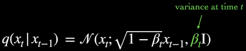

**Main Source :**

- **[Wikipedia Diffusion model](https://en.wikipedia.org/wiki/Diffusion_model)**
- **[What are Diffusion Models? - Ari Seff](https://youtu.be/fbLgFrlTnGU?si=tR6le4piBvVpeR_9)**
- **[Introduction to Diffusion Models for Machine Learning - AssemblyAI](https://www.assemblyai.com/blog/diffusion-models-for-machine-learning-introduction/)**

**Diffusion Model** is a class of generative model, meaning it generates new data by learning the distribution of given dataset and then sample it. Diffusion model is typically used for tasks including image generation, image denoising, generating high-resolution image, and etc.

Diffusion model is inspired by the concept of [diffusion](https://en.wikipedia.org/wiki/Diffusion) in physics, which is a stochastic phenomenon where particles spread out from an area of high concentration to an area of low concentration, eventually leading to a uniform distribution. The underlying principles and equations of diffusion in physics provide a mathematical foundation that is adapted and applied to model to generates data.

The idea of diffusion model is, we model the target image (the target image we want to generate) as a data distribution (called target distribution), and then the model will aim to transform a simple base distribution, typically a Gaussian distribution, into the target distribution through an iterative diffusion process.

<video width="720" height="360" controls>
  <source src="https://learnopencv.com/wp-content/uploads/2023/02/denoising-diffusion-probabilistic-models_flower_inference_2.mp4" type="video/mp4"/>
</video>

Source : https://learnopencv.com/denoising-diffusion-probabilistic-models/

## Denoising Diffusion Model

There are many variation of diffusion model, each with their own concept, **Denoising Diffusion Model** is the type of diffusion model that uses the diffusion concept.

### Denoising Diffusion Probabilistic Model (DDPM)

Diffusion model consist of two steps, the forward process that gradually add noise to the image, and the reverse process that tries to reverse the process or remove the noise to generate clean samples.

#### Forward Process

In Diffusion model, the noising process is modeled using a [**Markov chain**](/machine-learning/reinforcement-learning/markov-models#markov-chain). Markov chain is a mathematical model that assumes the future state of a system only depends on current step. In other word, current step depends only on the previous step. The key idea behind using a Markov chain in diffusion models is to describe the evolution of the system's state as a stochastic process.

We will add noise to the image gradually, the process will be divided into discrete time steps. Connecting the Markov chain with diffusion model, the distribution of noise at some time step $t$ only depends on previous time step $t-1$. Following the calculation in Markov chain, current step distribution will be calculated by the product of each previously conditional step.

  
Source : https://youtu.be/fbLgFrlTnGU?si=tR6le4piBvVpeR_9&t=109

:::note
The forward process is fixed, doesn't have learnable parameters.
:::

The noise of the image will be modeled using a **Gaussian (normal) distribution**. A Gaussian distribution is characterized by its mean ($\mu$) and variance ($\sigma^2$), which determine the central tendency and spread of the distribution, respectively.

In the context of diffusion model, the type of Gaussian distribution used is the **diagonal Gaussian distribution**. The variance, denoted as $\beta$, varies at each time step and is constrained to be within the range of 0 and 1. The lower variance implies that the diffusion or transformation of the distribution occurs more gradually and with smaller perturbations, which may help us on the reverse process.

  
Source : https://youtu.be/fbLgFrlTnGU?si=mN1d8DKDP9vYJjQ0&t=129

As we repeatedly apply the forward diffusion process, mathematically speaking, the covariance matrix will tend to become more and more like an identity matrix. In other word, the injected noise will become less correlated or becomes more random and less predictable. The overall distribution of noise becomes more uniform.

  
Source : https://youtu.be/fbLgFrlTnGU?si=C8gzMh3VVKSUXqBg&t=163

#### Reverse Process

The reverse process will also be modeled using Markov chain, the noise will be assumed as a **unimodal diagonal Gaussian distribution** (the formula above in the image), which takes current state ($x_t$) and current time step ($t$) as input.

In the reverse process of a diffusion model, the calculation involves inferring the previous step given the current step. This is done by applying the conditional distributions at each time step in reverse order and multiplying them with the Gaussian noise distribution, denoted as $p(x_T)$, which was generated during the forward process. By gradually decreasing the noise, we successfully generated new samples. The inference process is where the process is made learnable or adjustable.

  
Source : https://youtu.be/fbLgFrlTnGU?si=v6ixlxk-gmWiHtDW&t=279

In the implementation of reverse process, there are two parameters, the mean ($\mu$) and the variance $\Sigma$ of the Gaussian distribution. The variance is made fixed and only the mean is made learnable, to stabilize the learning process.

  
Source : https://youtu.be/fbLgFrlTnGU?si=o0xlAFVkGm6B4nHr&t=651

#### Training Objective

The forward and reverse process can be understood as process that transform data or distribution (the input image) in two different directions. The forward process involves adding noise that will make the data distribution approach uniform distribution, which help to simplify complex data. The reverse process involves transforming the data back to its original distribution. This is done by approximating the unnoised data, by doing this, we effectively generate new data points during this process.

  
Source : https://youtu.be/fbLgFrlTnGU?si=lOk5eb9Au4EJumjW&t=376 (with modification)

The process and objective of diffusion model is similar to [**variational autoencoder (VAE)**](/deep-learning/variational-autoencoder). In VAE, the encoder takes the input data and maps it to a lower-dimensional representation called the **latent space**. This latent space serves as a compressed representation that captures the essential information and underlying structure present in the input data. The decoder takes the latent space and sample from it, to generate new data samples. The objective is to approximate the true data distribution from the sampled distribution.

The similar objective can be applied to diffusion model, "Given transformed data, how to untransform it?". The primary aim of a diffusion model is to enhance the inference process, particularly by focusing on the reverse process that involves computing the preceding state of the Markov chain.

The training objective can be summarized with the following formula :

  
Source : https://youtu.be/fbLgFrlTnGU?si=D6pH6EyDnxSz0j1P&t=458 (with modification)

The $\log p_{\theta}(x)$ represent the likelihood of the original data, it must be greater or equal to the first term subtracted by second term. The first term is the **reconstruction term**, which is the comparison of generated data and the original data. The second term is the **KL divergence** measures the difference of probability distribution between the target distribution (input data) and the learned distribution (generated distribuion).

### Denoising Diffusion Implicit Models (DDIM)

The type of denoising diffusion model previously we talked about uses the probabilistic Markov chain as the framework. However, it is slow.... instead DDIM use denoiser...

### Conditional & Unconditional Generation

abcdef

## Score-Based Diffusion Model

uses score function

## Latent Diffusion Model (LDM)

uses [variational autoencoder (VAE)](/deep-learning/variational-autoencoder)

---

The entire diffusion topics is based on the fast.ai part 2 course, with addition from other sources.

- **[fast.ai Part 2 course](https://course.fast.ai/Lessons/part2.html)**

this note should include the general principle of how diffusion model works, the next notes should explain it in more detailed along with the explanation about the method and technique used.

what to explain in diffusion :

- Diffusion method
- Denoising Diffusion Probabilistic Models (DDPM)
- Denoising Diffusion Implicit Models (DDIM)
- conditional and unconditional diffusion
- sampler
- CLIP
- a
- b
- c
  the last 3: stable diffusion, dall-e, and midjourney will explain what diffusion model technique they specifically uses, it can be thought as the application of diffusion model.
- stable diffusion
- dall-e
- midjourney
