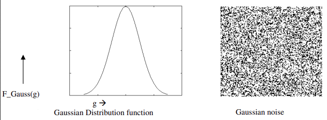
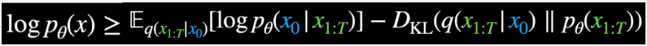
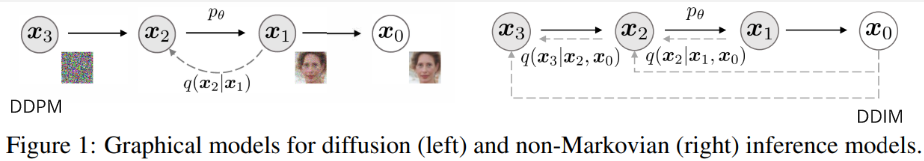
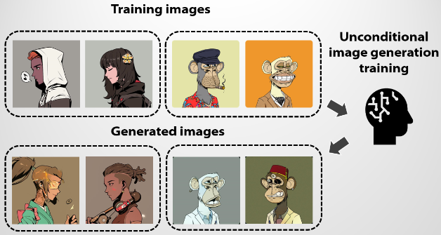
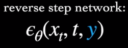
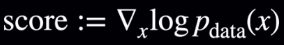
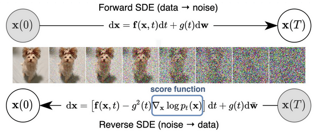
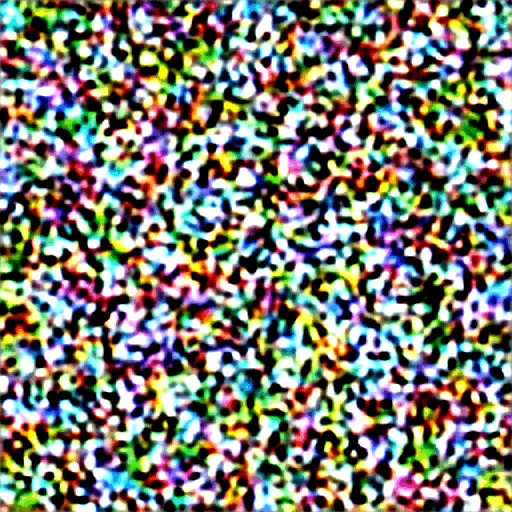
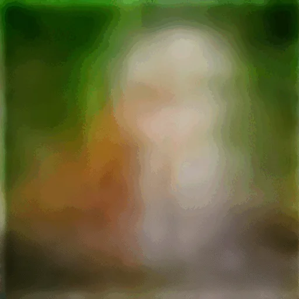

**Main Source :**

- **[Wikipedia Diffusion model](https://en.wikipedia.org/wiki/Diffusion_model)**
- **[What are Diffusion Models? - Ari Seff](https://youtu.be/fbLgFrlTnGU?si=tR6le4piBvVpeR_9)**
- **[Introduction to Diffusion Models for Machine Learning - AssemblyAI](https://www.assemblyai.com/blog/diffusion-models-for-machine-learning-introduction/)**
- **[[Lab Seminar] DDIM: Denoising Diffusion Implicit Model (ICLR, 2021) - DSAIL SKKU](https://youtu.be/aUqbWBQTKaA?si=BONjB3Ul4iGOmy-1)**
- Good article : **[How diffusion models work: the math from scratch by Sergios Karagiannakos,Nikolas Adaloglou](https://theaisummer.com/diffusion-models/)**
- **[Stable Diffusion Samplers: A Comprehensive Guide](https://stable-diffusion-art.com/samplers/)**

**Diffusion Model** is a class of generative model, meaning it generates new data by learning the underlying distribution of a given dataset and uses this knowledge to generate new data samples. Diffusion model is typically used for tasks including image generation, image denoising, generating high-resolution image, and etc.

Diffusion model is inspired by the concept of [diffusion](https://en.wikipedia.org/wiki/Diffusion) in physics, which is a stochastic phenomenon where particles spread out from an area of high concentration to an area of low concentration, eventually leading to a uniform concentration. The underlying principles and equations of diffusion in physics provide a mathematical foundation that is adapted and applied to model to generates data.

The idea of diffusion model is, we model the target image (the target image we want to generate) as a data distribution (called target distribution), and then the model will aim to transform a simple base distribution, typically a Gaussian distribution, into the target distribution through an iterative diffusion process.

<video width="720" height="360" controls>
  <source src="https://learnopencv.com/wp-content/uploads/2023/02/denoising-diffusion-probabilistic-models_flower_inference_2.mp4" type="video/mp4"/>
</video>

Source : https://learnopencv.com/denoising-diffusion-probabilistic-models/

## Denoising Diffusion Model

There are many variation of diffusion model, each with their own concept, **Denoising Diffusion Model** is the type of diffusion model that uses the diffusion concept.

### Denoising Diffusion Probabilistic Model (DDPM)

the type of denoising diffusion model that learns the underlying **probability distribution** of a dataset and generate new samples from that distribution.

The overall process of denoising diffusion model consist of two steps, the forward process that gradually add noise to the image, and the reverse process that tries to reverse the process or remove the noise to generate clean samples.

#### Forward Process

In DDPM, the noising process is modeled using a [**Markov chain**](/machine-learning/reinforcement-learning/markov-models#markov-chain). Markov chain is a mathematical model that assumes the future state of a system only depends on current step. In other word, the current state of a system depends only on the previous state. The key idea behind using a Markov chain in diffusion models is to describe the evolution of the system's state as an iterative stochastic process.

The forward process begins with adding noise to the image in gradual manner, the process will be divided into discrete time steps. The noise, we are adding is modeled using a **Gaussian (normal) distribution**. A Gaussian distribution is characterized by its mean ($\mu$) and variance ($\sigma^2$), which determine the central tendency and spread of the distribution, respectively.

  
Source : https://analyticsindiamag.com/a-guide-to-different-types-of-noises-and-image-denoising-methods/

Utilizing the Markov chain with diffusion model, the distribution of noise at some time step $t$ only depends on previous time step $t-1$. Following the calculation in Markov chain, current step distribution will be calculated by the product of each previously conditional step.

  
Source : https://youtu.be/fbLgFrlTnGU?si=tR6le4piBvVpeR_9&t=109

:::note
The forward process is fixed, meaning it doesn't have adjustable parameters.
:::

In the context of diffusion model, the type of Gaussian distribution used is the **diagonal Gaussian distribution**. The variance, denoted as $\beta$, varies at each time step and is constrained to be within the range of 0 and 1. The lower variance implies that the diffusion or transformation of the distribution occurs more gradually and with smaller perturbations, which may help us on the reverse process.

  
Source : https://youtu.be/fbLgFrlTnGU?si=mN1d8DKDP9vYJjQ0&t=129

As we iteratively perform the forward diffusion process, the noise gradually converges towards a Gaussian distribution. Mathematically speaking, the noise can be approximated as a **multivariate Gaussian distribution with a mean vector of zero and an identity covariance matrix**.

  
Source : https://youtu.be/fbLgFrlTnGU?si=C8gzMh3VVKSUXqBg&t=163

#### Reverse Process

The reverse process will also be modeled using Markov chain, the noise will be assumed as a **unimodal diagonal Gaussian distribution** (the formula above in the image below), which takes current state ($x_t$) and current time step ($t$) as input.

In the reverse process of a diffusion model, it involves inferring the previous step given the current step. The calculation is done by multiplying the product of conditional distributions at each time step in reverse order ($x_{t - 1} | x_t$) with the Gaussian noise distribution, denoted as $p(x_T)$, which was generated during the forward process (We assume the forward diffusion approaches Gaussian distribution).

  
Source : https://youtu.be/fbLgFrlTnGU?si=v6ixlxk-gmWiHtDW&t=279

The inference process is where the process is made learnable or adjustable. In the implementation of reverse process, there are two parameters, the mean ($\mu$) and the variance ($\Sigma$) of the Gaussian distribution. The variance is made fixed and only the mean is made learnable, for training stabilization purposes. In essence, the model will dynamically learn and adapt the optimal parameters to effectively reverse the diffusion process.

  
Source : https://youtu.be/fbLgFrlTnGU?si=o0xlAFVkGm6B4nHr&t=651

:::tip
The implementation of the reverse or denoising process typically uses the [U-Net architecture](/deep-learning/u-net) for image data or a [transformers](/deep-learning/transformers/transformers-architecture) for non-image data.
:::

#### Training Objective

The forward and reverse process can be understood as process that transform data or distribution (the input image) in two different directions. The forward process involves adding noise that will make the data distribution approach Gaussian distribution. The reverse process involves transforming the data back to its original distribution. This is done by approximating the unnoised data, by doing this, we effectively generate new data points during this process.

  
Source : https://youtu.be/fbLgFrlTnGU?si=lOk5eb9Au4EJumjW&t=376 (with modification)

The process and objective of diffusion model is similar to [**variational autoencoder (VAE)**](/deep-learning/variational-autoencoder). In VAE, the encoder takes the input data and maps it to a lower-dimensional representation called the **latent variables**. This latent variables serves as a compressed representation that captures the essential information and underlying structure present in the input data. Latent variables will then be modeled in a probability distribution with some mean and variance, this is now called a **latent space**. The decoder sample from the latent space distribution, to generate new data samples. The objective is to approximate the true data distribution from the sampled distribution.

The similar objective can be applied to diffusion model, "Given transformed data, how to untransform it?". The primary aim of a diffusion model is to enhance the inference process, particularly by focusing on the reverse process that involves computing the preceding state of the Markov chain.

The training objective can be summarized with the following formula ([similar to loss in VAE]) :

  
Source : https://youtu.be/fbLgFrlTnGU?si=D6pH6EyDnxSz0j1P&t=458 (with modification)

The $\log p_{\theta}(x)$ represent the likelihood of the original data, it must be greater or equal to the first term subtracted by second term. We represent the original data as a likelihood because our goal is to reconstruct it. By maximizing the likelihood, we aim to ensure that the reconstructed data closely resembles the original data.

The first term is the **reconstruction term**, which is the comparison of generated data and the original data. The second term is the **KL divergence** measures the difference of probability distribution between the target distribution (input data) and the learned distribution (generated distribuion).

#### Summary

In summary, diffusion model starts with the forward process where we add Gaussian distribution noise to the image. After a bunch of step, we obtained a distribution approximately close to Gaussian distribution. In the reverse process, the model aims to remove the noise by inferring the previous distribution based on the current distribution, which is where the model learns. This process is often described as sampling because it entails generating samples from an approximated distribution obtained at the current step.

  
Source : https://scholar.harvard.edu/binxuw/classes/machine-learning-scratch/materials/foundation-diffusion-generative-models

After training the model, to generate new data using a trained diffusion model, we start with a random noise sample and then perform the reverse diffusion steps.

  
Source : https://tree.rocks/make-diffusion-model-from-scratch-easy-way-to-implement-quick-diffusion-model-e60d18fd0f2e

### Denoising Diffusion Implicit Models (DDIM)

The type of denoising diffusion model previously we talked about uses the probabilistic Markov chain as the framework, which can be slow during the sampling process in the reverse diffusion (there is some technique to skip the diffusion in forward process). Furthermore, DDPM require alot of forward diffusion step, which also increase the step in reverse process.

DDIM is a non-Markovian diffusion model, it removed the use of Markov chain. In Markov chain, during the reverse process, we assume that previous step only depends on current step (e.g. $x_1$ depends on $x_2$ = $q(x_2|x_1)$).

  
Source : https://betterprogramming.pub/diffusion-models-ddpms-ddims-and-classifier-free-guidance-e07b297b2869 (with modification)

DDIM does not rely on a strict sequential dependence on previous steps. The elimination of the Markov chain allows for the consideration of multiple states beyond just the previous one in the reverse diffusion process. This transformation turns the process into an optimization problem, as the inclusion of more states introduces complex dependencies and variations in the data.

The goal is to find an optimal **latent code**, latent code is nothing but a set of parameters that captures the information required to generate a denoised or clean sample from a corrupted input. We adjust the parameters by minimizing the reconstruction loss between the generated sample and the corrupted input.

:::tip
DDPM can be seen as a special case of DDIM, where we only consider the previous state for current state.  
The term "implicit" in DDIM means that we do not explicitly try to denoise the image, instead we just find the best parameters that minimize the lost.
:::

### Conditional & Unconditional Generation

Diffusion model can also be integrated with a conditional prompt. The conditional prompt serves as a guide or constraint during the generation process, allowing for more controlled and targeted generation of data. The conditional prompt can be in the form of text, images, or any other type of input.

#### Unconditional

In the unconditional generation, we do not include any additional constraint. The model will start with a random noise sample and applies the reverse process to progressively reduce the noise and generate new data samples. The resulting data will be similar to the training data.

  
Source : https://betterprogramming.pub/beginners-guide-to-unconditional-image-generation-using-diffusers-c703e675bda8

#### Conditional

In the conditional generation, the model is trained to learn the distribution of the training data given certain input conditions. During the generation process, the model takes the input conditions into account and adjusts the reverse process accordingly to generate samples that satisfy the given conditions.

The target data in reverse process which is $p_{\theta}(x_{0})$ becomes $p_{\theta}(x_{0}|y)$. The reverse step also takes the additional condition. The conditional generation can actually simplify the generation process by constraining the range of possible outputs.

  
Source : https://youtu.be/fbLgFrlTnGU?si=luVZ1O9GCWV8_2PH&t=714

## Score-Based Diffusion Model (SBDM)

**Score-Based Diffusion Model (SBDM)** is also known as **Noise Conditional Score Network (NCSN)** or **Score-Matching with Langevin Dynamics (SMLD)**. SBDM introduces the concept of **score**, mathematically, it is the gradient of the log-likelihood of the data distribution.

### Score Function

  
Source : https://youtu.be/fbLgFrlTnGU?si=lEL8BBYdL0f1cetc&t=907

A gradient with respect to some variables tells us the direction and magnitude of the steepest ascent or descent of a function at a particular point. Specifically in the context of SBDM, the gradient measures the direction in which the noise should be adjusted to move towards denoising or generating the desired output. It act as a guide for diffusion process by providing information on how to update the noise, but it does not provide a direct measure of similarity or dissimilarity.

The integration of score-based guidance with diffusion model fall between each diffusion step, score or gradient of the log-likelihood of the data distribution will be estimated with respect to the noise process. After that, the noise is updated in the direction of the estimated score.

## Continuous Diffusion Model

Continuous diffusion model is a type of diffusion model that model the noise distribution of the data in a continuous manner. Instead of modeling how the noise distribution changes over discrete time step, SBDM instead treat the distribution as a continous process that evolves over a continuous time.

The diffusion process is modeled using **stochastic differential equations (SDEs)**. SDEs are mathematical equation that describe how a system transitions from one state to another, which is affected by deterministic and random factor.

The score-based diffusion model can be combined together with SDE-based modeling. The SDE-based deterministic and random factor terms can be incorporated into the score-based model to guide the denoising and transformation steps of the diffusion process.

  
Source : https://theaisummer.com/diffusion-models/#score-based-generative-modeling-through-stochastic-differential-equations-sde

### Sampler

Continous diffusion model uses SDE to model the system, in order to know the system state over time and sample from it to actually generates data, the SDE needs to be solved.

While solving an SDE, we do not find the exact analytical solution, we instead approximate the solution (also called numerical integration). Some of the methods are Euler–Maruyama method, Heun's method, and linear multistep methods, these are also called **sampler**.

The sampler we are using will gradually reduce the noise of the image, we can use a technique called **noise scheduling** to controls how fast they sample.

  
Source : https://stable-diffusion-art.com/samplers/ (sampler that gradually reduce the noise)

#### Ancestral Sampler

There is another type of sampler called **ancestral sampler**, these sampler introduce randomness to the sampling process. At each sampling step, they add noise to the image to introduce variations in the generated images. This makes the image produced may not reach a consistent and reproducible state, the image can turn differently at each step.

|               Ancestral sampler               |             Normal sampler              |
| :-------------------------------------------: | :-------------------------------------: |
|  |  |

https://stable-diffusion-art.com/samplers/

## Latent Diffusion Model (LDM)

In diffusion model, we are approximating what an unnoised image will look like from a random noised image. In other word, we are approximating the probability distribution of a target image from a simple base distribution. This makes diffusion model is often called a general method to model a probability distribution.

An encoder-decoder pair is a type of network that consist of two component. The encoder, serve as the one that takes input and transform it into **latent variables** or lower-dimensional representation of the input data. The other component, decoder, will take the output of encoder and do the reverse process. An example of encoder-decoder pair are [autoencoder](/deep-learning/autoencoder) and [Variational autoencoder (VAE)](/deep-learning/variational-autoencoder), which model the latent variables in probability distribution, called **latent space**.

**Latent diffusion model** or **LDM** is a type of diffusion model combined with an encoder-decoder pair (typically a VAE). The idea of using diffusion model with an encoder-decoder pair is because the encoder outputs a probability distribution which we can use as the input for diffusion model.

Instead of forward diffusing a raw image and then do the reverse process, LDM instead takes the input from encoder and model the probability distribution. To actually generate image, we can sample from the output of the diffusion model and use the decoder to decode it back to image.

Latent space provides meaningful representation of the input, the diffusion process which includes forward and reverse diffusion can be seen as exploring the latent space to allow for diverse generation of data.

LDM can also be integrated with additional condition such as text, image, or any other meaningful representation. This integration can leverage technique like [cross-attention](/deep-learning/transformers/transformers-architecture), which is also used in the transformers architecture. First, the encoder encodes the data into the latent space, followed by the forward diffusion process. The conditional input, typically the encoded representation of the original input, which can be produced by [transformers encoders](/deep-learning/transformers/transformers-architecture#encoder), is concatenated together with the output of forward diffusion process. Subsequently, the cross-attention mechanism is incorporated to guide the reverse diffusion or denoising process. Once the reverse diffusion is completed, we can sample the output and fed it into the decoder.

  
Source : https://theaisummer.com/diffusion-models/
