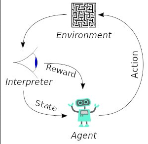
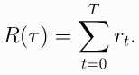
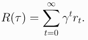
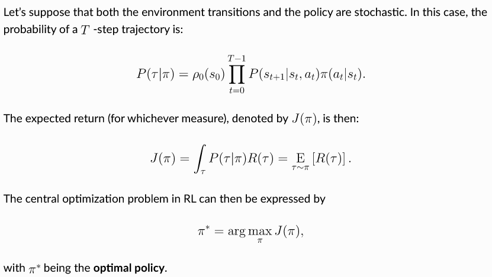
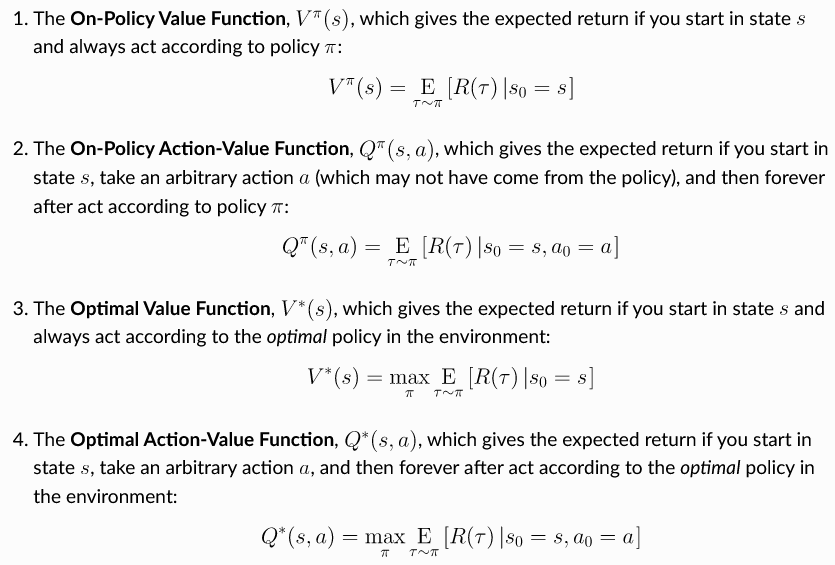
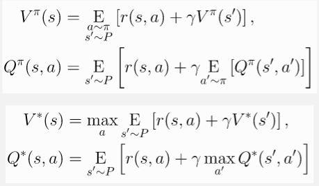
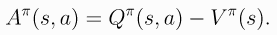

**Main Source :**

- **[OpenAI Spinning Up Introduction To RL](https://spinningup.openai.com/en/latest/spinningup/rl_intro.html)**

**Reinforcement Learning (RL)** is one of the three machine learning paradigm alongside supervised learning and unsupervised learning. In RL, we do not teach the model how to perform a task directly by providing labeled examples (supervised learning) or by discovering patterns in unlabeled data (unsupervised learning).

The machine learning model, called **agent** needs to learn the environment by taking action and receiving feedback. The learning process in RL involves trial and error. The agent initially has no knowledge about the environment and randomly explores different actions. There will be reward and penalty as the positive or the negative feedback. The objective of RL is to maximize the reward while also adhering to any specified regulations or constraints.

In summary, we do not explicitly teach the model or agent. Instead, we allow the agent to explore and learn on its own. To guide the agent towards specific tasks, we provide rules or guidelines and provide feedback based on its actions.

:::note
We can also combine RL with deep learning techniques, this is called **Deep Reinforcement Learning (Deep RL)**, techniques like [convolutional neural networks (CNN)](/deep-learning/rnn) or [recurrent neural networks (RNN)](/deep-learning/rnn) are used.
:::

A simple example for RL problem is solving a maze. The objective is to find the optimal path from start to the end. A state correspond to the location of agent in the maze. The action is the direction to move (e.g. left, right, down, up). The positive reward is when the agent reaches the goal while the negative reward is when it hits a wall or takes a suboptimal path.

  
Source : https://neptune.ai/blog/reinforcement-learning-applications

### Terminology

#### Agent

Agent is the machine learning model or the entity that make decision and interacts with environment. The agent's actions are influenced by its current state, which represents the information it has about the environment at a given time.

#### Environment

Environment is the world or system in which RL agent operates. It can be a real-world or a simulated environment. The environment should have well-defined state, action, and reward to ensure the learning efficiency of the agent.

An environment can also be stochastic, which means it doesn't entirely depends on the current state and action, it involves element of randomness or uncertainty.

#### State

State, denoted as $s$ is the condition of the environment at a particular time. It contains all the information about the environment such as the agent's location. While a state represent complete condition, an **observation** is a partial representation of that state, it can be a sensor measurement in a robotics problem.

A state can be discrete or continuous. A discrete or categorical state can be the coordinates of the agent's position in the grid of maze. A continuous state can be found in robotic problem such as joint angles, end-effector position, and velocities.

#### Action

Action, denoted as $a$ is the choice or decision made by agent to interact with the environment. The action did by agent will influence the state of the environment.

A set of all valid action in a given environment is called **action space**. Similar to state, action can also be discrete or continuous.

#### Policy

A policy is a strategy or instructions that guide an RL agent to make decisions. It determines the agent's behavior by specifying which actions it should take in different situations or states. Policy is defined as a function that takes a state and returns an action.

A policy can be deterministic or stochastic :

- Deterministic : A deterministic policy maps a state directly to specific actions, it is represented as $a = \mu(s)$. This mean, according to the policy if we are at state $s$, we need to take action $a$.
- Stochastic : A stochastic policy gives different action in a probabilistic manner based on the given state, it is represented as $a \sim \pi(\cdot | s)$. The $a \sim$ means we are randomly selection an action $a$ from a probability distribution given by the policy function $\pi(\cdot | s)$, conditioned on state $s$. The dot here is a placeholder for an action variable.

Policy act as a brain for the agent, it will keep being updated to adjust with the environment so that it can guide the agent toward best result.

Here is an example of a stochastic policy for a specific state :

- $\pi(\text{up} | s) = 0.25$
- $\pi(\text{down} | s) = 0.25$
- $\pi(\text{left} | s) = 0.25$
- $\pi(\text{right} | s) = 0.25$

The policy act as the rules for agent to select an action. The action of the agent will be randomly sampled from these policy. So, when the agent is at state $s$, it may sample or select one of these four.

In the context of deep RL algorithm, where we utilize paramaters of neural network (e.g. weight and bias), we can set the policy as a learnable parameters. The parameters are often denoted as $\theta$ or $\phi$ and then it will be written on the policy's subscript (e.g. $a = \mu_{\theta}(s)$).

#### Trajectory

A trajectory is a sequence of state and action that an agent experiences while interacting with an environment. It is denoted as $\tau = (s_0, a_0, s_1, a_1, ...)$, where $s$ and $a$ are state and action, respectively. The very first state $s_0$ is randomly sampled from $p_0$, which is the initial state distribution

The movement from one state to another is called a **state transition**. A state transition is described by a **transition function**, together they are denoted as $s_{t+1} = f(s_t, a_t)$, this means the next state is given by the transition function (depends on the problem) which takes current state and action.

The state transition can also be stochastic : $s_{t+1} \sim P(\cdot | s_t, a_t)$, when the agent takes a particular action in a given state, there is a probability distribution over the possible resulting states.

#### Reward, Return & Horizon

Reward $r$ serves as a value that provides feedback indicating the quality of its action. It is determined by the **reward function** : $r_t = R(s_t)$ (state-based reward) or $r_t = R(s_t, a_t)$ (state-action-based reward). This mean the reward at time $t$ is determined by the reward function that takes either current state only or takes both current state and action.

The return, also known as **cumulative reward** or the **discounted sum of future rewards**, is the total amount of rewards the agent accumulated over a **time horizon**. A horizon is a predetermined length or number of time steps in an **episode** or a task. An episode is a complete sequence of interactions between an agent and its environment.

A horizon represents the limit or duration of the agent's interaction with the environment. It can be finite, meaning there is a fixed number of time steps until the end of the episode, or it can be infinite, allowing the interaction to continue indefinitely.

- **Finite-Horizon Undiscounted Return** : In the case of a finite horizon, the agent's objective is to maximize the **undiscounted return**. The undiscounted return is the sum of rewards obtained from the current time step until the end of the episode, without any discounting factor applied.  
    
  Source : https://spinningup.openai.com/en/latest/spinningup/rl_intro.html#reward-and-return

- **Infinite-Horizon Discounted Return** : When the horizon is infinite, the agent's objective is to maximize the discounted return. The discounted return is the sum of rewards obtained from the current time step until infinity, but each reward is discounted by a factor (\gamma) (gamma) between 0 and 1. The gamma will be raised to the power of $t$, which causes it to decrease as $t$ increases.  
    
  Source : https://spinningup.openai.com/en/latest/spinningup/rl_intro.html#reward-and-return

Both have the same purpose, which is to maximize return, they differ in the use of discount factor. The discount factor introduces a trade-off between immediate and future rewards, serving as a balancing mechanism. The agent can choose to prioritize obtaining high reward to minimize the impact of the discount factor or delay the rewards in the risk of large discount amount.

#### RL Main Objective

The main goal of RL is to maximize the expected cumulative return or total reward obtained by an agent over time. Combining all together, we can construct the following formula :

  
Source : https://spinningup.openai.com/en/latest/spinningup/rl_intro.html#the-rl-problem

The $P(\tau|\pi)$ represent the trajectory or event that will occurs (in probability distribution) given that a policy $\pi$ applies. It is obtained by the product of the very first state $s_0$ with initial the state $p_0$ multiplied with the product of each state transition ($P(s_{t+1}|s_t, a_t)$) with the policy ($\pi(a_t|s_t)$) from time step 0 to $T - 1$.

The $J(\pi)$ is the expected return, it represents the expected cumulative reward that an agent will receive when following a specific policy $\pi$ over an extended period of time.

And the last expression basically means that we are looking for optimal policy $\pi$ that yields the highest expected return among all possible policies $J(\pi)$.

#### Value Function

Value function is a function that assigns a value to each state or state-action pair, the value represent the expected return an agent can obtain from that state or state-action pair under a given policy.

There are four main value function :

1. **On-Policy Value Function (V-function)** : It describe the value that agent can obtain when starting in state $s$ and following a particular policy.
2. **On-Policy Action-Value Function (Q-function)** : It describe the value that agent can obtain when starting in state $s$, taking action $a$, and following a particular policy.
3. **Optimal Value Function ($\text{V}^*$-function)** : The optimal or maximum of V-function.
4. **Optimal Action-Value Function ($\text{Q}^*$-function)** : The optimal or maximum of Q-function.

  
Source : https://spinningup.openai.com/en/latest/spinningup/rl_intro.html#value-functions

#### Bellman Equation

Bellman equation is an equation, typically used in dynamic programming, it is an equation that decompose a problem into smaller subproblems and finding the optimal solution by iteratively updating the value.

In the context of RL, Bellman equation is applied to describes how the value of a state (or state-action pair) is related to the values of its successor states. It says that the value of a state is the reward for current state plus the discounted value for next state. The value for the next state also depends on the next and next state, making it a recursive equation.

  
Source : https://spinningup.openai.com/en/latest/spinningup/rl_intro.html#bellman-equations

Bellman equation provides a mathematical framework to model the values of states or state-action pairs in reinforcement learning. We can compute the value iteratively and the agents can adjust their estimates of the value of states by considering the rewards they have observed so far and the values of the states that follow.

#### Advantage Function

Advantage function is a function that estimate the advantage or benefit of taking a particular action in a given state compared to other actions corresponding to a policy. It measures the relative value of an action with respect to the value function.

  
Source : https://spinningup.openai.com/en/latest/spinningup/rl_intro.html#advantage-functions

The $A^{\pi}(s,a)$ represent the advantage of taking action $a$ in state $s$. A positive advantage indicates that the action is better than average, while a negative advantage suggests that the action is worse than average. A value close to zero means the action is roughly equivalent to the average.

### Model-Based & Model-Free

Model-Based and Model-Free are the two approach of reinforcement learning.

- Model-Based : In model-based RL, the agent has access to a **model of the environment**. Model of an environment is a simulation of the environment in which an agent operates. It provides information about the dynamics of the environment, including transition probabilities and rewards. The agent uses this model to simulate the environment and plan its actions. The use of model is to enable the agent to simulate and plan ahead before actually taking actions.

- Model-Free : In model-free RL, the agent does not have access to the model of the environment. Instead, it learns directly from interacting with the environment without prior knowledge of the transition probabilities and rewards. Model-free RL algorithms learn by trial and error, exploring the environment and updating their policy or value estimates based on observed rewards. They aim to find an optimal policy or value function that guides them toward the best return.
