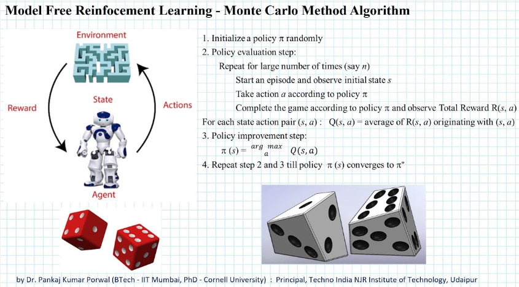

**Main Source :**

- **[Monte Carlo for Reinforcement Learning with example by Mehul Gupta - Medium](https://medium.com/data-science-in-your-pocket/monte-carlo-for-reinforcement-learning-with-example-1754439dd628)**

**Monte Carlo Method** is a technique to estimate a [value](/deep-learning/reinforcement-learning/reinforcement-learning-fundamental#value-function) of a state or state-action pairs based on the experiences gained through interactions with the environment. Monte Carlo method is a [model-free](/deep-learning/reinforcement-learning/reinforcement-learning-fundamental#model-based--model-free) method, meaning we don't need information or prior knowledge about the environment such as the transition probabilities and the rewards associated with each state and action.

The question is :

> How does Monte Carlo method interact with the environment without knowing it?

Monte Carlo method works by simulating the environment, it simulates the environment based on current knowledge and observations. Initially, we start with a not perfect simulation, we will then define the initial state and action. The agent begins its interaction, the observed interaction will be used to update the simulation. We will also do the main purpose of this method, which is to estimate the value or policy based on the agent experience or outcomes. The value is estimated based on the average rewards the agent received, while the policy is updated to maximize the estimated value.

The process is done in a single **episode**, which is a predetermined length sequence of interactions between an agent and its environment. This will be repeated for multiple times, as we gain more information about the environment, we can also estimate the value more accurately.

The simulated environment allows the agent to interact with the environment without having real access to it. Overall, it's a very nice method to use if we have limited knowledge about the environment.

### Algorithm

  
Source : https://youtu.be/o8XGKkIA1gE?si=NpJ_6VxZwT06ZHta

#### Example

For example, consider a maze problem. In this case, we don't know the information about the environment including its state, action, and rewards. We don't know where we at, we don't know if we should move in definite direction (e.g. left, right, up, or down). The goal of the problem may also be unknown, it is purely driven by rewards.

The agent starts exploring the maze randomly in any direction. During the visits, we also record the states it observed to improve the simulation and the rewards it received. For each state it visited, update the value estimate by averaging the returns obtained after visiting that states. Based on the value estimation, we will also update the policy. This process is done in a single episode and will be repeated for multiple times.
