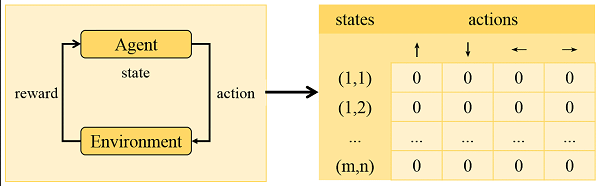
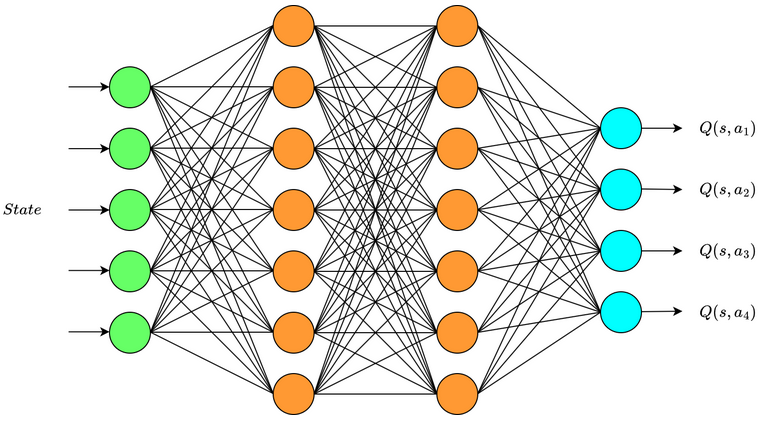
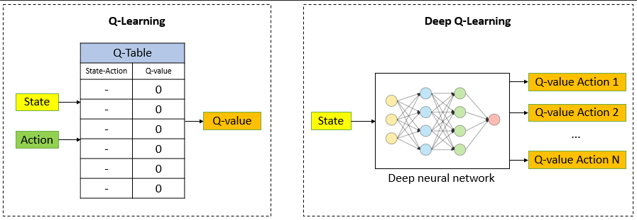
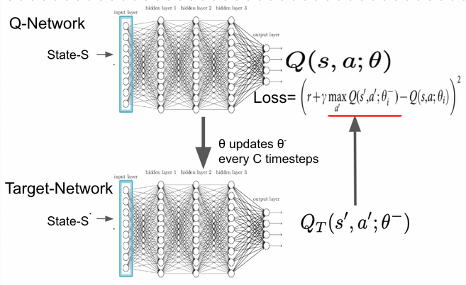

(/deep-learning/reinforcement-learning/reinforcement-learning-fundamental)
(/deep-learning/reinforcement-learning/temporal-difference)
(/deep-learning/reinforcement-learning/sarsa)

**Main Source:**

- **[Q-Learning Explained - A Reinforcement Learning Technique — deeplizard](https://youtu.be/qhRNvCVVJaA?si=UPvDuOOCuOsDQf9V)**
- **[Deep Q-Learning Tutorial: minDQN by Mike Wang — Medium](https://towardsdatascience.com/deep-q-learning-tutorial-mindqn-2a4c855abffc)**

**Q-Learning** is a [model-free](/deep-learning/reinforcement-learning/reinforcement-learning-fundamental#model-based--model-free) algorithm to estimate the action-value function (Q-values). Q-learning is an **off-policy algorithm** that updates its policy without using its current policy, it differs with on-policy algorithms like [SARSA](/deep-learning/reinforcement-learning/sarsa) that update based on the current policy.

### Algorithm

Q-Learning is another type of [TD](/deep-learning/reinforcement-learning/temporal-difference), the algorithm is similar to [SARSA](/deep-learning/reinforcement-learning/sarsa), however, it differs in the update rule.

1. **Initialization**: First, the Q-values is initialized to some arbitary or some initial values.

2. **Choose action**: The agent selects an action to take in the current state based on the Q-values. It can use the [epsilon-greedy](/deep-learning/reinforcement-learning/reinforcement-learning-fundamental#epsilon-greedy) strategy to balance the [exploration and exploitation](/deep-learning/reinforcement-learning/reinforcement-learning-fundamental#exploration--exploitation).

3. **Update Rule**: Based on the observed transition (state, action, reward, next state), the agent update the Q-value using the following update rule:

   > $\text{new } Q(s, a) \leftarrow Q(s, a) + \alpha \space (r + \gamma \space \text{max}[Q(s', a')] - Q(s, a))$

   The difference between SARSA is the $\text{max}[Q(s', a')]$ term. It represent the maximum Q-value among all possible actions in the next state $s'$. In SARSA we instead used the $Q(s', a')$, which is the Q-value of the action the agent takes in the next state **by following a policy**.

   So in Q-learning, we do not follow policy to select action nor use it to update its own policy. The choice of next action depends on the estimated next maximum Q-value, in a greedy manner.

4. **Repeat**: Repeat the step 2 and 3. At the end of the learning process, we then find the optimal policy based on the Q-value we gathered.

### Q-Table

Q-table (also known as the action-value table) is a data structure that stores the estimated Q-values for each state-action pair in Q-learning. Initially, the Q-table is usually initialized with arbitrary values or set to zeros. Then, as the agent interacts with the environment and learns from the observed rewards, we will use [Bellman equation](/deep-learning/reinforcement-learning/reinforcement-learning-fundamental#bellman-equation) to update the Q-values in the Q-table.

  
Source: https://www.researchgate.net/figure/The-model-of-Q-learning-and-the-structure-of-Q-table_fig1_339665871

### Q-Network

A Q-network, also known as a Q-function approximator or Q-value function approximator, is a type of [neural network](/deep-learning/neural-network) used in reinforcement learning to approximate the Q-values for state-action pairs.

Neural network is pretty good at approximating complex and non-linear function. The Q-values in reinforcement learning problems can be highly complex and depend on intricate relationships between states and actions. Using neural network will also help us generalize on unseen states.

The network can be implemented using a simple fully connected network or a [convolutional neural network (CNN)](/deep-learning/cnn) if related to image problem.

The network will take a state, it will be passed through the network and will produce a set of Q-values of all possible action over a given state. We will then choose the maximum Q-values and continue the agent exploration.

The parameter of the network will be updated to minimize the loss. The loss is calculated by comparing the predicted Q-values and the target Q-values. The target Q-values are computed using the [Bellman equation](/deep-learning/reinforcement-learning/reinforcement-learning-fundamental#bellman-equation), which takes current Q-values and reward the agent received.

  
Source: https://wikidocs.net/174548

  
Source: https://www.baeldung.com/cs/q-learning-vs-deep-q-learning-vs-deep-q-network

#### Target Network

In the previous approach, we updated the Q-network parameter based on the target value or the current estimate of Q-values. This can be unstable, because they are constantly changing. Q-values is estimated using Bellman equation, which takes current Q-values, however, the Q-values itself depend on the estimated Q-values.

The approach is to use two distinct network, the other network is called **target network**. The target network is a separate copy of the Q-network that is periodically updated to match the current Q-network's weights.

The tight coupling can be reduced by introducing separate target network. The use of target network is to improve the stability and convergence of the learning process. We will then update the Q-network based on the target network, not directly based on the computed target values.

  
Source: https://arshren.medium.com/deep-q-learning-a-deep-reinforcement-learning-algorithm-f1366cf1b53d
