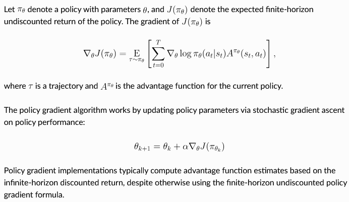

**Main Source:**

- **[Vanilla Policy Gradient — OpenAI Spinning Up Docs](https://spinningup.openai.com/en/latest/algorithms/vpg.html)**

**Policy-Gradient** is a class of reinforcement learning algorithm that find optimal policy directly without estimating the value function first. The policy is adjusted by using the notion of gradient, which provides information on how the policy should be updated.

The policy will be parameterized, meaning we will model it with a parameters or value that can be adjusted or learned. We will then take the gradient of the rewards we earned with respect to the policy parameters. The gradient tells us how our current policy affects the rewards, we can then update the policy to maximize the rewards.

### Vanilla Policy Gradient (VPG)

VPG, also known as **REINFORCE**, is a very simple policy gradient method.

  
Source: https://spinningup.openai.com/en/latest/algorithms/vpg.html

1. **Collect Trajectory**: [Trajectory](/deep-learning/reinforcement-learning/reinforcement-learning-fundamental#trajectory), or the sequence states, actions, and rewards the agent made during the interaction with environment using the current policy.

2. **Compute Reward & Advantage Function**: Compute the return for each state and action encountered in the trajectory, also compute the [advantage function](/deep-learning/reinforcement-learning/reinforcement-learning-fundamental#advantage-function).

3. **Compute Policy Gradient**: The policy function outputs a probability distribution over actions in a given state. By updating the policy parameters, it means we are updating how will it produce the distribution. The agent take action by sampling from that distribution, we have option to sample it in a stochastic or greedy (select highest reward) manner.

   The computation of policy gradient involve taking the gradient of the logarithm of the policy's probability distribution with respect to the policy parameters, which is scaled by the advantage function to encourage actions that are better than the expected return and discourage actions that are worse. The result will be summed up for each time step.

4. **Update Policy Parameters**: The policy parameters will be updated with the [gradient descent algorithm](/machine-learning/linear-regression#gradient-descent).

5. **Value Function Update**: The value function, which estimates the expected return, can be fitted using regression techniques such as [linear regression](/machine-learning/linear-regression). This involves minimizing the difference between the predicted values and the observed returns by using the mean squared error loss function and the gradient descent algorithm.
