Related to Markov Decision Process (MDP)

**Main Source :**

- **[Markov Chains Clearly Explained! Part - 1 - Normalized Nerd](https://youtu.be/i3AkTO9HLXo?si=zrwm_M_hDVTET2Pv)**
- **[Hidden Markov Model Clearly Explained! Part - 5 - Normalized Nerd](https://youtu.be/RWkHJnFj5rY?si=hgmQRyM2Za9v6McB)**

**Markov Models** are a mathematical model used to describe system where the future behavior of the system depends on its current state and is independent of its past states. In other word, the probability of transitioning to a future state depends solely on the current state and not on the history of how the system arrived at the current state, this behavior is called **Markov property**.

### Markov Chain

Markov chain is the simplest type of Markov model, consisting of a set of states or the condition that describe the system at a specific point of time and the probabilities of transitioning between those states.

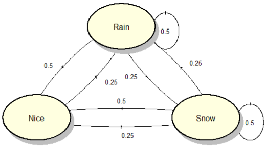  
Source : https://math.stackexchange.com/questions/2730955/markov-model-to-compute-the-probability-on-the-nth-day

In this example, we are trying to model weather condition in Markov model.

We have 3 states: "nice", "rain", "snow", each of them have their own probabilities of transitioning between the states which may vary. Following the unique charateristics of Markov model, future weather solely depends on current weather condition. This means that the occurrence of "rain" yesterday, for example, does not impact the weather condition for tomorrow.

The probability associated with each arrow represents the chance of transitioning to another state or remaining in the current state. For example, if current condition is "rain", then it has 0.5 probability for the future state to arrive at "rain" again. It has 0.25 probability and 0.5 probability to transition to "snow" and "nice" respectively.

The formula for markov chain is :

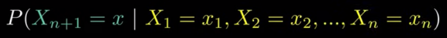  
Source : https://youtu.be/i3AkTO9HLXo?si=C9O8_H6l9o3D2ts9&t=129

Conditional probability of the next state, $X_{n+1}$, being a specific value, $x$, given that the current state, $X_n$, is $x_n$. This formula represent the system will be in state $x$ at next time step $n+1$, given that we are currently at state $x_n$ at time step $n$.

#### Equilibrium State

Markov chain is a stochastic process, after many transition step, it may reach a state where the probability of each state converge to some value. This is known as **equilibrium state**, also known as **stationary distribution**.

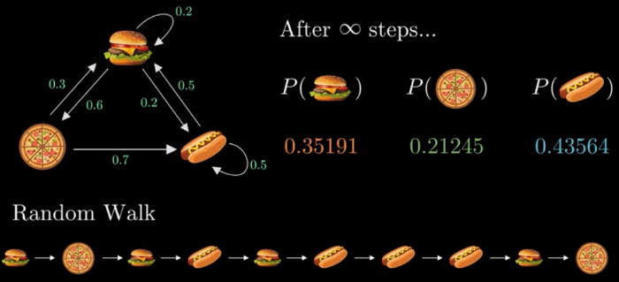  
Source : https://youtu.be/i3AkTO9HLXo?si=aeY6kx691nIP6x8W&t=292

#### Adjacency Matrix

However, that was done using a direct experiment, another way to achieve equilibrium state is by changing the markov chain from a directed graph into an adjacency matrix.

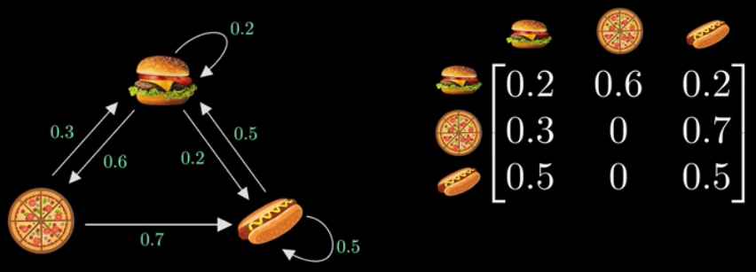  
Source : https://youtu.be/i3AkTO9HLXo?si=wFt8ueAFpZ-2aKhf&t=347

A row must add up to 1, reflecting the fact that the system must move to one of the possible states. The left represent current state, the upper represent future state. For example, if we are currently at "pizza", the probability of the next state to be "burger" is 0.3.

Using adjacency matrix, the probability distribution of the state is denoted using a $\pi$ vector. The image below shows the initial $\pi$ vector, the 1 in the middle denotes that the first state is on "pizza".

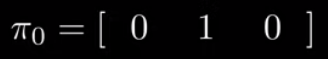  
Source : https://youtu.be/i3AkTO9HLXo?si=nej1XVJsMfkMel94&t=405

Multiplying the $\pi$ vector with the adjacency matrix will give us the future state, given that the current state is the current $\pi$ vector.

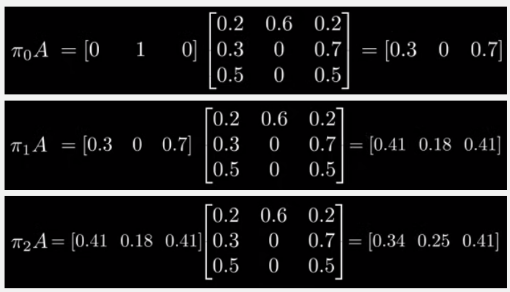  
Source : https://youtu.be/i3AkTO9HLXo?si=k_uGplu0Ayxoc-vL&t=395

To transition further, the result of the multiplication is then multiplied again with the adjancency matrix. We know that if we reach equilibrium state, then the multiplication result will be same or close to the current result. Similar to the convergence of transitioning using random walk.

The multiplication between the adjacency matrix with the $\pi$ vector will result in the $\pi$ vector itself, it can be mathematically written as :

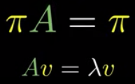  
Source : https://youtu.be/i3AkTO9HLXo?si=_wHrzK50S0IrXmiR&t=466

Which is an eigenvector equation, where the eigenvector is the $\pi$ vector and its eigenvalue is 1. We also have another constraint, which is the sum of the $\pi$ vector must add up to 1. So, we have 2 equation, after solving it, we can obtain the equilibrium state.

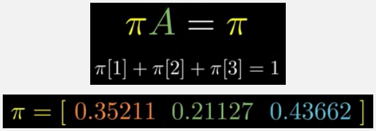  
Source : https://youtu.be/i3AkTO9HLXo?si=vgPy44kBYp1kYLIt&t=482

### Hidden Markov Models

In a Markov chain, the states are directly observable and known at each time step. The transition from one state to another is determined solely by the current state and follows a probabilistic rule. The transition probabilities between states are explicitly defined in the graph.

Hidden Markov Models (HMMs) also consist of a Markov chain, however, the states are not directly observable. This mean we don't know what is the current state in our Markov chain. HMM also have another component called **observable variables**, these are variables that we can observe.

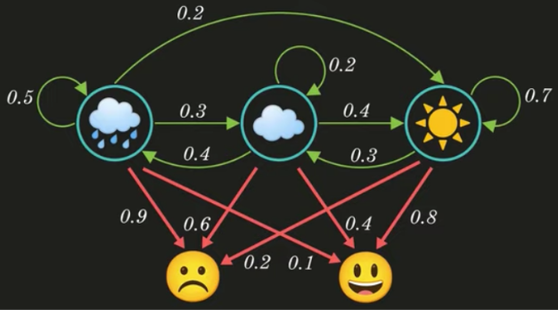  
Source : https://youtu.be/RWkHJnFj5rY?si=HRrIudfCGLgH3hr9&t=160

An HMM look like the image above, consisting a Markov chain and the extra observable variables, the variables are dependent on the states. Because of the dependencies, these variables help us infer or estimate the hidden states. The current observable variable solely depends on today weather. For example, the state of raining today given that the observable variable is the "sad" mood is 0.9.

The markov chain and the observable variable can be represented as a matrix, it is called **transition** and **emission matrix**, respectively.

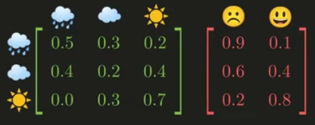  
Source : https://youtu.be/RWkHJnFj5rY?si=uoBYGBw5aKzTSB5m&t=187

#### Scenario Example

Suppose a scenario where we know the current hidden state, the first state is "sunny" with the "happy" observable variable, second state is "cloud" with "happy" again, and the third state is "sunny" with "sad". The probability of each event can be calculated by looking at the previous matrix. The single event probability, such as the $P(X_1 = \text{sunny})$ can be calculated by solving the eigenvector equation just like the original markov chain.

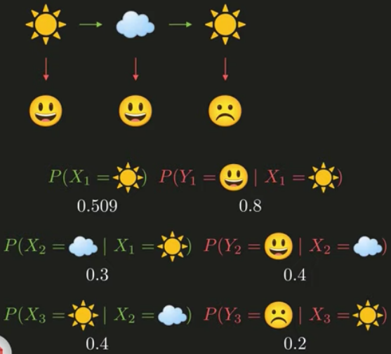  
Source : https://youtu.be/RWkHJnFj5rY?si=u08WzVyxzEOiciK_&t=308

If we multiply all of the probability, it will result in 0.00391.

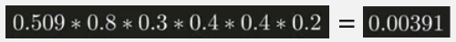  
Source : https://youtu.be/RWkHJnFj5rY?si=wssnrc_7-UPWsEj0&t=314

#### Real Scenario

In the real scenario, we don't know the current hidden state, we only know the observable variable. We could ask a question: "what is the most likely weather sequence for the observed mood sequence", the answer should be the maximum probability for given mood. With the corresponding transition and emission matrix, we should achieve : "sunny", "sunny", and "cloud".

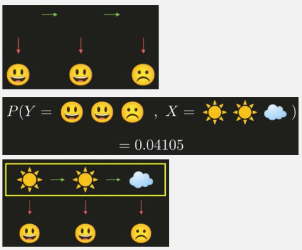  
Source : https://youtu.be/RWkHJnFj5rY?si=hTDdHvP--RoDw6bE&t=391

#### Mathematically

Mathematically, the maximum probability or the joint probability, which is the probability of two or more events occurring together or simultaneously can be written as :

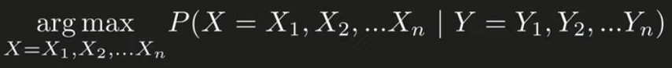  
Source : https://youtu.be/RWkHJnFj5rY?si=jYuMuZ1vtTy2Ygp4&t=413

Where X is the weather condition and Y is the mood condition, the "arg max" means we are maximazing them.

This equation can be solved using Bayes Theorem :

  
Source : https://youtu.be/RWkHJnFj5rY?si=Z_It2HuG7ClolvxV&t=452

- The $P(Y|X)$ denotes what is the probability of current mood given some weather state. We know that current mood only depends on current weather state, we can calculate it with product as before, by filling them with the probability inside our transition and emission matrix. The product will then be simplified using the big product symbol.

- The $P(X)$, which is the probability of current weather state, depends on previous weather state, just like the standard Markov chain property.

- And the $P(Y)$ can be neglected.

Thus the final equation becomes :

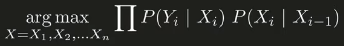  
Source : https://youtu.be/RWkHJnFj5rY?si=TgSCI_wcvnsbghl6&t=530
