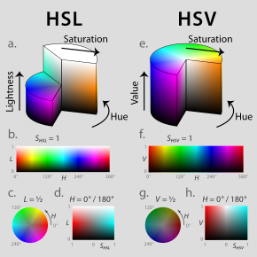

**Main Source:**

- **Various source from Google and YouTube**

Computers represent images as a collection pixel, which is the smallest addressable element within a digital image. A pixel represent color or intensity in a specific location. Images that are represented with grid of pixel are called **raster images**.

:::tip
More detail about images representation in:

- [Computer Images (Part 1)](/computer-graphics/computer-images-part-1)
- [Computer Images (Part 2)](/computer-graphics/computer-images-part-2)
  :::

A digital image file stores more than just raw image data. It may include image characteristics and attributes. Some of them are: compression methods, image format, and metadata, which refers to data about the image, such as the image dimensions, resolution, color depth, file format, creation date, and more.

More detail about image properties:

1.  **Size/Resolution**: The dimensions of the image, which is related to the amount of pixels present in image, and measured by width x height. The higher resolution the more detailed the image is.

      
    Source: https://vimeo.com/blog/post/the-basics-of-image-resolution/

2.  **Color Space**: Represent how the color are represented, such as RGB, RGBA, CMYK, HSV or grayscale. See also [color representation](/computer-and-programming-fundamentals/data-representation#color).

      
    Source: https://en.wikipedia.org/wiki/HSL_and_HSV

3.  **Bit Depth**: Measure how many number of bits are used to represent each pixel in the image. A common bit depth is 8 bit in the RGB color space. It can represent 256 different color each channel. With the red, green, and blue channel altogether, they can represent up to 16.777.216 different color.

      
    Source: https://youtu.be/6yXYxp0UiVg

4.  **Image Format**: The image format used, such as [JPEG](/digital-media-processing/jpg-jpeg), [PNG](/digital-media-processing/png), [BMP](/digital-media-processing/bmp), TIFF, [GIF](/digital-media-processing/gif), or RAW. They represent different feature and compression methods (if any).

5.  **Spatial Domain**: Properties that describe the spatial characteristics of the image, such as brightness, contrast, sharpness, texture, edges, and patterns.

    - **Brightness**: Overall lightness or darkness of an image.
    - **Contrast**: The difference of brightness between the lightest and darkest parts of an image. Higher contrast result in lighter and darker part easier to differentiate.
    - **[Alpha](/computer-graphics/computer-images-part-2#alpha)**: The transparency or opacity of an image or a specific pixel within an image. Typically, alpha is specified within the RGBA color space, where the value range between 0 (fully transparent) to 1 (fully opaque).
    - **[Gamma](/computer-graphics/computer-images-part-2#gamma)**: Measure the contrast between the darker and lighter parts of an image. A higher gamma value means that the darker parts of the image will appear darker, while a lower gamma value means that the darker parts of the image will appear lighter. An adjustment called **gamma correction** can be applied to image to compensate for differences in the way human eyes perceive brightness.
    - **Saturation**: Saturation controls the intensity or purity of colors in an image. A high saturation value produces vibrant and vivid colors, while a low saturation value results in more muted or grayscale-like colors.
    - **Hue**: Represents the color itself, such as red, blue, green, etc. It denotes the position of a color on the color wheel.
    - **Dynamic Range**: Range of brightness levels that can be represented in an image, from the darkest shadows to the brightest highlights.
    - **Sharpness**: Represents how abrupt is the changes of a pixel color to another.
    - **Color Temperature**: Color temperature is a measure of the warmth or coolness of a light source. It is measured in degrees Kelvin. Warm light sources, such as candles and incandescent bulbs, have a low color temperature, while cool light sources, such as fluorescent bulbs and sunlight, have a high color temperature.

      
    Source: [Brightness](https://www.gifgit.com/image/adjust-image-brightness),
    [Contrast](https://visualdisplaysltd.com/resources/tools/specifying/contrast),
    [Alpha](https://blenderartists.org/t/alpha-vs-alpha-clip-transparency-and-display-problem/514289),
    [Gamma](https://doc.stride3d.net/4.0/en/manual/graphics/post-effects/color-transforms/gamma-correction.html),
    [Saturation](https://apps4lifehost.com/Apps/SmartSaturation/), [Hue](https://en.wikipedia.org/wiki/Hue),
    [Dynamic Range](https://www.imaginated.com/blog/what-is-dynamic-range/),
    [Sharpness](https://www.imatest.com/support/docs/23-1/sharpness/),
    [Color Temperature](https://www.ledrise.eu/blog/color-temperature-explained-lr/)

:::tip
See also [computer display](/computer-graphics/computer-display).
:::
