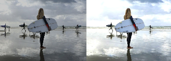
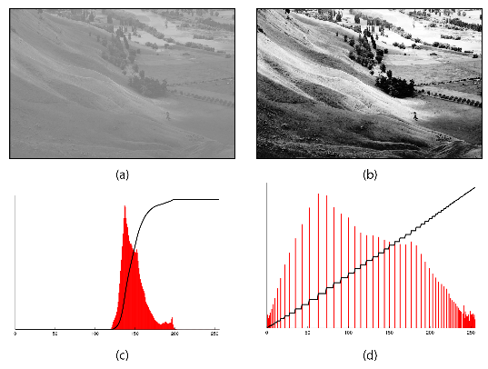
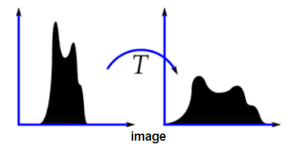
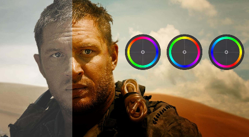
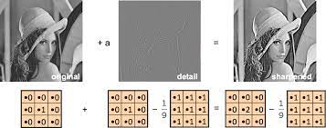
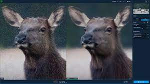

**Main Source : Various source from Google and Youtube**

**Image Enhancement** is the process of improving the visual quality of an image by adjusting its properties. There are many properties to be adjusted and many techniques to use.

Image enhancement is different with image editing. Image editing includes changing the content of an image such as removing objects or changing the background. On the other hand image enhancement doesn't change the content, it adjusts the properties of image.

  
Source : https://www.behance.net/gallery/115047653/PORTRAIT-EDIT-BEFORE-AFTER

1.  **Brightness Adjustment** : Modify the overall brightness level of an image. It involves increasing or decreasing the intensity of pixel values to make the image appear brighter or darker. The simple method is to add a constant value to all the pixel. Other method such as gamma correction or histogram equalization also works.

      
    Source : https://www.gifgit.com/image/adjust-image-brightness

    - Histogram Equalization : This is a method to transform pixel intensity of an image by stretching it. The color of image is represented in histogram, then the central distribution will be spread out.

        
       Source : https://commons.wikimedia.org/wiki/File:Histogram_equalization.png

2.  **Contrast Enhancement** : It aims to improve the visual contrast and distinguishability of details in an image. The method are : linear contrast transformation, histogram equalization like the previous.

    - Linear Contrast Stretching : maps original pixel values to a new range of values. For example a color ranging between 0 to 255 will be mapped to 50 to 255. This effect will be an increase in brightness or lightness of the image.
        
      Source : https://theailearner.com/2019/01/30/contrast-stretching/

3.  **Color Correction** : Correct the colors of an image by altering the color values of an image. Color correction includes : balancing white color to effect overall warmth or coolness of the colors, removing unwanted color in the scene, adjusting hue and saturation, adjusting color using curves to better smoothen the color.

    Color correction differs with color grading. The goal of color correction is to fix color related issues, while color grading enhance the color to achieve desired mood.

      
    Source : https://www.studiobinder.com/blog/color-grading-vs-color-correction-process/

4.  **Image Filtering** : Applies a set of filters which is a mathematical function to the pixel values of the image. Find out more in [Computer Graphics Image Filters](/computer-graphics/signal-processing#image-filters).
      
    Source : https://www.cosmo.ph/entertainment/how-to-choose-the-best-instagram-filter

5.  **Sharpening** : Enhance the perceived sharpness and clarity of edges and fine details in an image. Sharpening is typically achieved by applying a sharpening filter.

      
    Source : https://ai.stanford.edu/~syyeung/cvweb/tutorial1.html

6.  **Noise Reduction** : Process of reducing or removing unwanted noise from an image. Noise is an unwanted signal or data, in the case of image, the random pixel color that degrades image quality and affect visual clarity. Find out more in [DSP Denoising](/digital-signal-processing/denoising)
      
    Source : https://www.dvdfab.cn/resource/video/denoise
