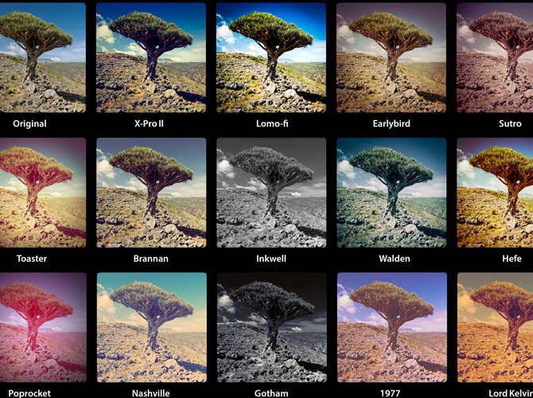

**Main Source:**

- **Various source from Google and YouTube**

**Image enhancement** is the process of improving the visual quality of an image by adjusting its properties.

Image enhancement differs slightly from [image editing](/digital-media-processing/image-editing). Image editing is a broader term that includes altering the content of an image, such as removing objects or changing the background. In contrast, image enhancement refers to the process that adjusts the properties of the image without changing its content.

  
_before and after image enhancement_  
Source: https://www.behance.net/gallery/115047653/PORTRAIT-EDIT-BEFORE-AFTER

Examples of enhancement:

1. **Brightness Adjustment**: Modify the overall brightness level of an image. It involves increasing or decreasing the intensity of pixel values to make the image appear brighter or darker. A simple method to adjust brightness is by adding a constant value to all the pixels. This can also be done by multiplying the original pixel value by a brightness factor. This results in increasing the intensity of each pixel, which, if done excessively, will approach the maximum value (e.g., if using RGB it will approach (255, 255, 255), representing white).

   Another method is [gamma correction](/computer-graphics/computer-images-part-2#gamma).

     
   Source: https://www.gifgit.com/image/adjust-image-brightness

2. **Contrast Enhancement**: This aims to improve the visual contrast and distinguishability of details in an image. One method is linear contrast stretching and histogram equalization.

   Linear contrast stretching maps original pixel values to a new range of values linearly. For example, a color ranging from 50 to 155 is mapped to 60 to 165. This effect will increase the overall brightness or lightness of the image.

     
   Source: https://theailearner.com/2019/01/30/contrast-stretching/

   On the other hand, histogram equalization is quite similar to the former. Histogram equalization instead use non-linear transformation. The color of an image is represented as a histogram. The distribution central distribution is then spread out by some non-linear function.

     
   Source: https://commons.wikimedia.org/wiki/File:Histogram_equalization.png

3. **Color Correction**: Correct the colors of an image by altering its color values. Color correction includes: balancing white color to effect overall warmth or coolness of the colors, removing unwanted color in the scene, adjusting hue and saturation, adjusting color using curves to better smoothen the color.

     
   Source: https://www.studiobinder.com/blog/color-grading-vs-color-correction-process/

   :::info
   Color correction differs with color grading. The goal of color correction is to fix color related issues, while color grading enhance the color to achieve desired mood.
   :::

4. **Image Filtering**: Applies a set of filters to the pixel values of the image. These filters change the color of each pixel by some amount of value. See also [image filters](/computer-graphics/signal-processing#image-filters).

     
   Source: https://www.cosmo.ph/entertainment/how-to-choose-the-best-instagram-filter

5. **Sharpening**: Enhance the perceived sharpness and clarity of edges in an image. Sharpening is typically achieved by applying a [sharpening filter](/computer-graphics/signal-processing#image-filters).

     
   Source: https://ai.stanford.edu/~syyeung/cvweb/tutorial1.html

6. **Noise Reduction**: Process of reducing or removing unwanted noise from an image. Noise is any unwanted signal or data. In the case of image, they can be random pixel color that degrades image quality and affect visual clarity. See also [denoising](/digital-signal-processing/denoising).

     
   Source: https://www.dvdfab.cn/resource/video/denoise
