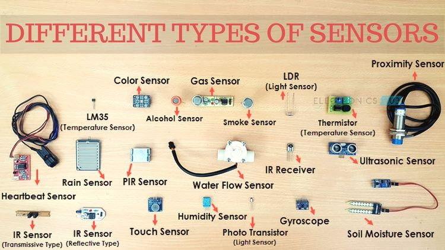

**Main Source:**

- **[Digital Imaging — Wikipedia](https://en.wikipedia.org/wiki/Digital_imaging)**
- **[Sensor — Wikipedia ](https://en.wikipedia.org/wiki/Sensor)**
- **[Face detection — Wikipedia ](https://en.wikipedia.org/wiki/Face_detection)**
- **[Image Segmentation — Wikipedia ](https://en.wikipedia.org/wiki/Image_segmentation)**

**Sensing** refers to the detection and measurement of physical phenomena. The device to detect or responds to a specific physical stimulus or environmental condition is called **sensor**.

**Image acquisition** is the physical process of capturing visual data using various devices such as cameras, scanners, or sensors. The goal is to convert the optical information present in the real world into a digital representation that can be processed and analyzed by computer systems.

### Sensor

Common sensor includes:

- **Temperature sensor**: Measures the temperature of the environment or an object.
- **Pressure sensor**: Measures the pressure or force exerted on an object or in a system.
- **Proximity sensor**: Detects the presence or absence of an object within a certain range.
- **Gyroscope**: Measures the orientation or angular velocity of an object.
- **Magnetic sensor**: Measures the presence or strength of a magnetic field.
- **Gas sensor**: Detects the presence and concentration of specific gases in the environment.

The exact working principle of a sensor depends on its type and the physical phenomenon it is designed to detect. The general idea of a sensor is to detect and measure physical phenomena or environmental conditions and convert them into a usable form, typically an electrical or digital signal.

For example, a gas sensor designed to detect a specific target gas can utilize a sensing element that interacts with the gas through a chemical reaction. This reaction can result in a change in the electrical conductivity, resistance, or voltage of the sensing element.

Another example is an infrared temperature sensor that measures the infrared radiation emitted by an object. The principle is that all objects above absolute zero temperature emit infrared radiation. The sensor absorbs the infrared radiation and converts it into a heat signal. The change in heat is then converted into an electrical signal proportional to the intensity of the radiation.

  
Source: https://www.electronicshub.org/different-types-sensors/

### Face Detection

Face detection is a computer vision technology that involves identifying and locating human faces in images or video frames. The concept of face detection is to search for specific features in an image that are characteristic of faces.

- Eyes: Eyes are one of the most distinctive features of a face. They are typically dark and round, and they are located in the upper part of the face.
- Nose: The nose is another distinctive feature of a face. It is typically located in the middle of the face, and it is slightly larger than the eyes.
- Mouth: The mouth is also a distinctive feature of a face. It is typically located below the nose, and it is usually open or closed.
- Facial Landmarks: Facial landmarks are specific points on the face, such as the corners of the eyes, the tip of the nose, and the corners of the mouth. Facial landmarks are often used to help with face detection, as they can provide more accurate information about the location of the face in an image.

    
  Source: https://en.wikipedia.org/wiki/Face_detection

### Self-driving Cars

Self-driving cars are vehicles that can navigate and operate without or less human intervention. They use a variety of sensors, including cameras, radar, LIDAR, and artificial intelligence (AI) to perceive their surroundings and make decisions about how to move.

The use of AI in self-driving cars allows them to learn and adapt to their surroundings. The AI is trained on a large dataset of images, videos, and sensor data. This allows the AI to learn to recognize objects and to make predictions about how the environment will change.

Sensor and AI use characteristics such as shape, size, speed, motion to detect if it's a human, a bike, a car. For example, cars are typically boxy, while humans are more rounded.

Cars and humans can be a variety of colors, but some colors are more common for cars, such as white, black, and silver. Humans are more likely to be wearing clothes of various colors.

  
Source: https://centralcoastdatascience.org/projects/all/2021/how-pixel-differences-can-affect-sensors-self-driving-cars

### Image Segmentation

Image segmentation is the process of partitioning an image into multiple segments, where each segment represent to a different object or region of interest. This has many applications in areas like medical imaging, robotics, and self-driving cars.

Image segmentation is classified into:

- **Semantic Segmentation**: Assign a class label to each pixel in an image, thereby dividing the image into meaningful semantic regions. For example, we might label each pixel in an image as "road", "car", "person", or "building."
- **Instance Segmentation**: This is a more detailed approach than semantic segmentation. It doesn't only assign class labels to pixels but also differentiating between individual instances of objects within the same class. For example, we may differentiate two different cars as "car1" and "car2" or "red car" and "blue car".
- **Panoptic Segmentation**: Combines the prediction from both instance and semantic segmentation into a general unified output.

There are two main approaches in image segmentation:

- **Boundary-based**: This focuses on identifying the boundaries or edges between different objects or regions in an image. This approach typically involves detecting discontinuities in pixel intensities, gradients, or other image features to locate the edges.
- **Region-based**: Region-based aims to group pixels together based on similarity criteria, such as color, texture, intensity, or other image properties. This approach seeks to create homogeneous regions within the image that share common characteristics.

  
Source: https://data-flair.training/blogs/image-segmentation-machine-learning/
