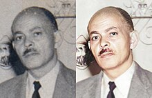
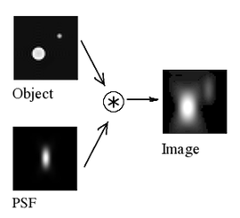
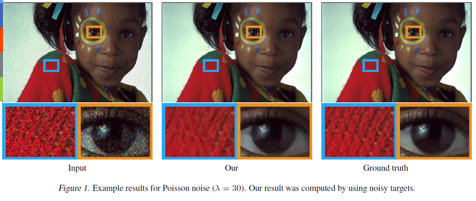

**Main Source [Wikipedia Image restoration by artificial intelligence](https://en.wikipedia.org/wiki/Image_restoration_by_artificial_intelligence)**

**Image Restoration** is the process of improving the quality or appearance of a digital image that has been degraded or corrupted. By degradation or corrupted, this means image may have noise, blurring, compression artifacts, or other forms of distortion.

  
Source : https://en.wikipedia.org/wiki/Image_restoration_by_artificial_intelligence

### How does it works

Image restoration works by reversing the process, this will including analyzing the image.

For example if we have a blurred image, the image must lack of sharpness between the pixel color. We will have to figure out what was the method and the parameters such as the blur size, orientation, or intensity used to blur the image.

We will try to estimate the parameter and apply the reverse blur to the image. One of the technique to estimate is the Point Spread Function (PSF).

PSF works by treating the blurring process as an optical system. It describe how a point object is spread out by an optical system, such as a camera or microscope. It describes the intensity of light at each point in the image plane. PSF can be thought of as a mathematical representation of the blurring process.

After getting the blur approximation, we can apply reverse blur which involves predicting the original pixel values for each pixel in the blurred image.

A reverse blurred image may introduce another artifacts, so a further enhancement may be done.

  
Source : https://en.wikipedia.org/wiki/Point_spread_function

### Image Restoration by AI

Image restoration can also use AI. The AI will be trained with large dataset of images that have been labeled with their ground truth (original) state. This allows the algorithms to learn the patterns that are present in natural images and to use this knowledge to restore degraded images.

We can also use AI for the enhancement technique such as increasing the resolution, denoising, recoloring, and etc.

  
Source : https://developer.nvidia.com/blog/ai-can-now-fix-your-grainy-photos-by-only-looking-at-grainy-photos/
