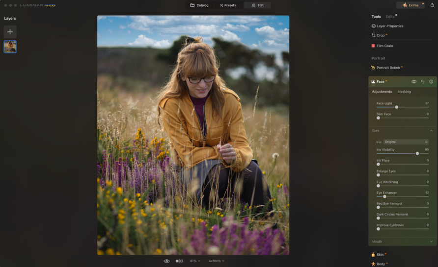
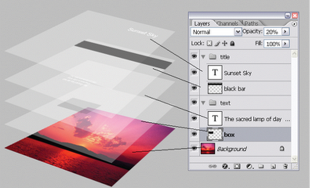

**Main Source:**

- **Various source from Google and YouTube**

**Image editing** is the process of modifying the content of an image, such as adjusting its properties, removing objects, changing the background, cropping parts of the image, and more. Modifying the content involves altering the color of individual pixels. There are many techniques and tools suited for different purposes.

Image editing is typically done using software like Photoshop, GIMP, Paint, Canva, and others. Image editors provide an easy way to modify images and offer various tools such as erasing, cloning, recovering specific parts of the image, cropping and resizing, brushes and text, filters, and adjusting properties like brightness and contrast.

  
Source: https://zapier.com/blog/best-ai-photo-editor/

### Adobe Photoshop

Adobe Photoshop is a commonly used and popular editing software.

#### Photoshop Layer

Photoshop editing revolve around the concept of **layer**. Layer can be thought as transparent sheet that are stacked on top of each other. These layer stack are responsible for which layer should be visible first. Each layer in Photoshop has its own properties, such as opacity, blending mode, and effects. In real case, a part of image can be stacked so that the part can be edited individually without affecting others.

Layer can also be used as non-destructive editing, this mean we don't modify the original image at all, instead we just add layer on top of it. In other word, editing is typically done on each new layer. Together, multiple layers form the edited image. This way we can undo a change that has been made on their individual layer.

  
Source: https://www.desainku.info/2020/01/mengenal-layer-pada-adobe-photoshop.html

#### Changing Background

Consider a person photo with sky background behind. We need to modify the background into a space background. We want to avoid altering the person, so we will need to identify which section belong to the person and which is the background.

Photoshop has a tool called **selection tool**, which is used to isolate specific areas or objects within an image. Under the hood, the process may include detecting abrupt change of pixel color to determine which region belong to which. We can isolate the person and move it to another layer. The new layer will be the desired background layer.

  
Source: https://www.bwillcreative.com/how-to-change-background-color-in-photoshop/
