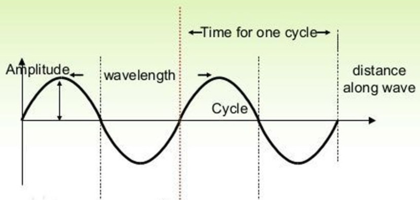
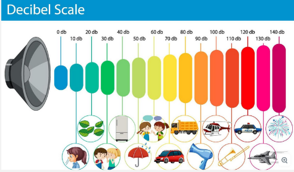
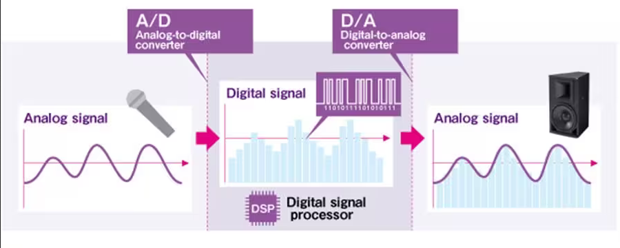
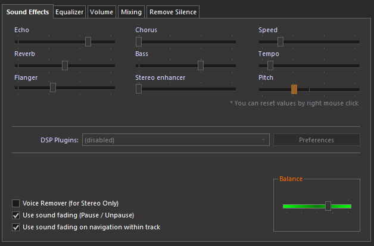

**Main Source:**

- **[Sound Properties (Amplitude, Period, Frequency, Wavelength) | Physics | — Khan Academy](https://youtu.be/-_xZZt99MzY)**
- **[Digital audio — Wikipedia](https://en.wikipedia.org/wiki/Digital_audio)**

### Sound

Sound is a form of energy produced when an object vibrates, creating pressure waves in a medium such as air, water, or solids. The vibrating object causes surrounding particles to vibrate, which in turn pass the vibration to neighboring particles.

  
Source: https://blog.docsity.com/en/living/science-2/physics-sound-visual-representation-gifs/

When sound waves reach our ears, they cause our eardrums to vibrate, and these vibrations are then transmitted to the inner ear. The inner ear converts these mechanical vibrations into electrical signals that are sent to the brain, which processes them as sound, allowing us to perceive and interpret what we hear.

:::note
The chain vibration property of sound makes it require a medium to transmit the vibrations.
:::

Sound vibration is measured in frequency (Hz) which refers to the number of cycles or vibrations per second. Higher frequencies are perceived as higher pitches, while lower frequencies are perceived as lower pitches. Human is able to hear sound in range of 20 Hz to 20 kHz (called audiosonic range).

### Sound Properties

The behavior of sound wave that vibrates can be modeled in a sine or cosine wave. This brings sound to have some properties similar to wave:

- **Frequency**: Number of cycles or vibrations per second and is measured in Hertz (Hz)
- **Period**: The time it takes for one cycle vibration
- **Amplitude**: The maximum length of displacement, it measures strength or intensity of a sound wave.
- **Wavelength**: Physical distance between two corresponding points of a sound wave
- **Phase**: The position of a sound wave at a particular point in time within its cycle

  
Source: https://www.jagranjosh.com/general-knowledge/what-are-the-characteristics-of-sound-waves-1525678871-1 (cropped)

The loudness of sound are measured in dB (decibels), it expresses the relative level or intensity of a sound signal, electrical signal, or other quantity. It is a logarithmic scale that compares the magnitude of a quantity to a reference level.

  
Source: https://www.vecteezy.com/vector-art/7207013-decibel-scale-sound-levels

### Audio

Audio is the electronically reproduced or recorded sound. It involves the capture, processing, storage, and reproduction of sound using electronic devices and systems. Audio in digital is represented using binary data.

:::tip
See also [sound representation in computers](/computer-and-programming-fundamentals/data-representation#sound).
:::

The process of audio goes through analog-to-digital or digital-to-analog conversion.

During the analog-to-digital conversion, the signal goes through [sampling process](/digital-signal-processing/sampling) and [quantization](/digital-signal-processing/quantization) process. The result is then encoded in binary and can be processed or stored digitally.

During the digital-to-analog conversion, the audio file goes through the reverse process. The result is the original sound in analog form, which can be played through device like speaker for human to hear.

  
Source: https://id.yamaha.com/id/products/contents/proaudio/docs/better_sound/part1_06.html

### Audio Properties

Digital audio introduces additional properties and effects that are specific to the digital domain.

- **Sampling Rate**: Sample rate is the number of samples taken per second to represent an analog audio signal in the digital domain. Commonly used sample rates are 44.1 kHz and 48 kHz. A higher sample rate allows for more accurate representation of high-frequency content in the audio.
- **Bit Depth**: The bit depth is related to the quantization process. It determines the number of levels of amplitude that can be represented in the digital audio recording. A higher bit depth will capture more levels of amplitude, resulting in a smoother and more accurate representation of the original sound. Common bit depth include 16-bit, 24-bit, and 32-bit.

Digital audio can undergo additional processing or modified with special effects:

- **Sound Enhancement & Effect**: We can modify sound signal to improve the quality or for specific desire. There are many tools and technique used, for example an equalizer (EQ) is used to adjust frequencies in an audio signal. Audio effect can also be applied to apply effect such as simulating echo, sound reflection, making the sound slower.
- **Spatial Audio**: Digital audio make it possible to create the illusion of sound coming from different direction, distance, and location of sound sources in a virtual or augmented environment.
- **Audio Channels**: Audio channel is a representation of sound coming from or going to a single point. A single microphone can be used to produce one channel of audio, while a single audio speaker can also accept one channel of audio.

  - **Mono**: Uses a single audio channel to reproduce the entire audio signal, without any sense of stereo separation or directionality.
  - **Stereo**: Stereo uses two audio channels, typically labeled as left (L) and right (R), to create a sense of spatial separation and directionality.
  - **Surround Sound**: Contains more than two channels of audio. This allows for a more immersive audio experience, with sound coming from all around the listener.
  
- **Dynamic Range Compression**: Dynamic range of an audio signal is the range between the quietest and loudest parts. A wide range of sound means that it can either have a very loud sound or a very quiet sound. This operation can reduce the volume of loud sounds or amplifies quiet sounds, it helps to create more consistent level throughout the audio.
- **Noise Reduction**: Audio processed in digital can also be [denoised](/digital-signal-processing/denoising). This can help improve the quality of sound compared to a live sound.

  

:::tip
See also [digital signal processing](/digital-signal-processing), [audio effects](/digital-media-processing/audio-effects), and [audio equalization](/digital-media-processing/audio-equalization).
:::
