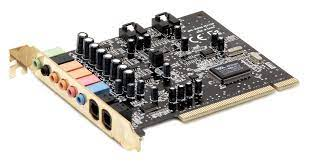
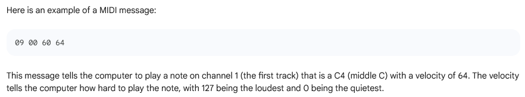
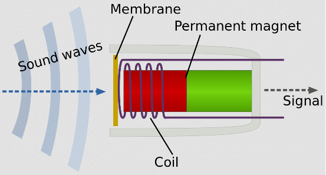
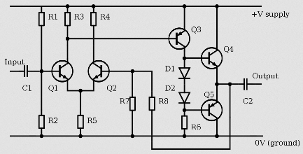
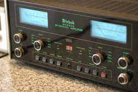
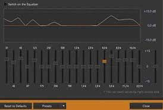
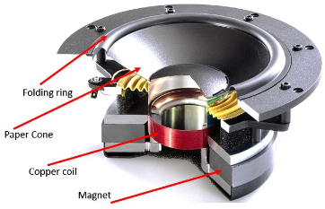
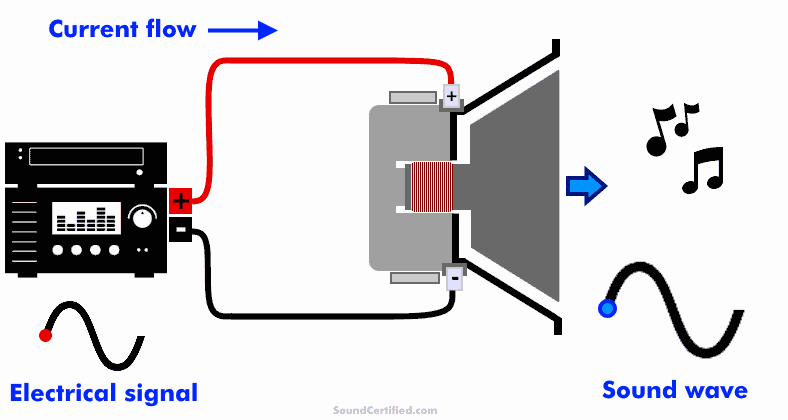

**Main Source:**

- **[Microphone — Wikipedia](https://en.wikipedia.org/wiki/Microphone)**
- **[Loudspeaker — Wikipedia](https://en.wikipedia.org/wiki/Loudspeaker)**

**Audio input** is the process of capturing and conversion of sound waves into an electronic signal that can be processed and interpreted by an electronic device. Common examples of audio input devices include microphones, which convert sound waves into electrical signals.

**Audio output** on the other hand is the reproduction of sound from an electronic device. This can be achieved through speakers, headphones, or any other audio output device. The electronic signal representing the sound is converted back into sound waves that can be heard by humans.

#### Sound Card

The convertion between analog and digital signal are handled by sound card, which is also known as audio card or audio interface. It serves as an interface between the computer's digital system and audio devices such as speakers, headphones, microphones.

  
Source: https://warmadewa.id/fungsi-sound-card/

#### MIDI

MIDI (Musical Instrument Digital Interface) is a standard to exchange information about digital audio. It is a way for audio related devices, such as a dedicated music player, audio editing software, even a game, electronic musical instrument, or other related devices to easily communicate with each other. In other word, MIDI defines a common language for electronic musical instruments and devices to exchange information.

MIDI establish format for digital audio. It doesn't have actual audio produced by the instruments, but rather information like: which notes are played, when the notes are played, how loud the notes are, pitch and the duration of the notes, etc.

  
Source: https://bard.google.com/

### Audio Input Device

Common type of audio input device is microphone. There are many types of microphone, the common ones are condensed and dynamic. The former is more suitable for recording a higher frequency while the latter is better for capturing loud and strong sounds.

#### How Microphone Works

Microphone utilizes the principle of electromagnetic induction.

They consist of a diaphragm, a coil of wire, and a magnet. Inside a mic, there is a diaphragm which is a thin, flexible membrane that vibrates in response to sound waves. Behind the diaphragm, there is a coil which is wrapped around a permanent magnet.

When sound wave hit the diaphragm, it vibrates, causing the attached coil to move within the magnetic field. This motion generates an electrical current in the coil through electromagnetic induction. The electrical current represents the variations in air pressure caused by the sound waves.

The electrical signal generated is in analog signal form, it is then sent through the microphone's output connector for further processing.

  
Source: https://en.wikipedia.org/wiki/Microphone

#### Signal Processing

One of the technique to further process an audio is amplification. Amplification is the process of increasing the amplitude or level of an electrical signal. It involves boosting the strength or the loudness of sound to a desired level. The analog electrical signal is amplified using amplifier tools.

The concept of amplifier is related to electrical transistors. In electrical circuits, transistor increases the voltage and power of an electrical signal. Amplifying audio is done by adding up voltage or power to the audio signal.

  
Source: https://en.wikipedia.org/wiki/Amplifier

  
Source: https://en.wikipedia.org/wiki/Integrated_amplifier

#### Digital Signal Processing

After electrical signal is amplified, it will be converted to a digital format using an analog-to-digital converter (ADC). Digital form of sound data or audio can be further processed using various digital signal or media processing techniques. This can include [equalization](/digital-media-processing/audio-equalization), [compression](/digital-signal-processing/compression), [filtering](/digital-signal-processing/filtering), [audio effects](/digital-media-processing/audio-effects), or other audio processing algorithms.

After processing, audio data can be encoded into specific digital audio formats, such as [MP3](/digital-media-processing/mp3), AAC, [WAV](/digital-media-processing/), or FLAC, depending on the intended use or distribution requirements.

  
Source: https://www.gearrice.com/update/4-tricks-with-aimp-to-better-listen-to-rock-and-metal-music/

### Audio Output Device

Digital audio file contains sequence of binary data. The first step in outputting an audio data is to decode and read the audio file. Decoding is done by software that knows the structure and the format of the audio file.

The binary data will then be converted into analog electrical signal using a digital-to-analog converter (DAC). The analog audio signal is sent to the computer's audio output device, such as the sound card or built-in audio interface. The sound card is connected to audio output ports, which is speakers, headphones, or other audio playback devices.

#### How Speaker Works

The concept of speaker is like the reverse process of microphone and is also based on the principle of electromagnetism. The speaker consists of a permanent magnet and a coil. The voice coil is a wire coil attached to a diaphragm.

Electrical audio signal passes through the coil, creating a changing magnetic field around the coil. Changing magnetic field interacts with the fixed magnet, resulting in a force acting on the coil.

Force generated by coil causes the attached diaphragm to move back and forth. Movement of diaphragm will create pressure variations or variation of sound wave, it depends on the force which is also dependent on the electrical signal.

Sound wave will then propagate through the air and reach our ears.

  
Source: https://www.how2shout.com/what-is/what-is-speaker-and-how-it-functions.html

  
Source: https://soundcertified.com/how-do-speakers-work/
