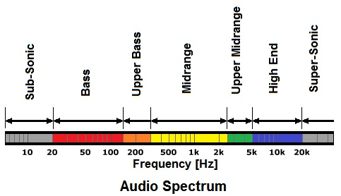

**Main Source :**

- **[Wikipedia Equlization](<https://en.wikipedia.org/wiki/Equalization_(audio)>)**
- **[What Is Equalization?](https://youtu.be/4FkKiWJfd00)**

**Audio Equalization**, often referred to as EQ, is the process of adjusting a specific range of frequency to make it stronger (sounds louder) or weaker (sounds softer).

### Frequency Range

Human audible range is divided into specific frequency range, categorizing these make us easier to target specific sound. Overall, they are divided into 3 general range, bass, mids, and highs.

- **Sub-bass** : Below 60 Hz, these frequencies are felt more than they are heard. They provide the foundation for bass-heavy sounds like kick drums and rumbling effects.

- **Bass** : Ranging from 60 Hz to 250 Hz, these frequencies are responsible for the low-end body and warmth in music.

- **Low-mid** : Spanning from around 250 Hz to 2,000 Hz, these frequencies contribute to the fullness and presence of instruments and vocals.

- **Mid** : Extending from roughly 2,000 Hz to 5,000 Hz, these frequencies often define the intelligibility and clarity of vocals and the bite of certain instruments.

- **High-mid** : Occupying the range of 5,000 Hz to 8,000 Hz, these frequencies influence the presence and brilliance of sounds.

- **High** : Above 8,000 Hz, these frequencies add sparkle and airiness to the audio.

    
   Source : https://www.audioreputation.com/audio-frequency-spectrum-explained/

### Equalizer

EQ works in between human audible frequency which is from 20 Hz to 20 kHz. An EQ also consists of a number of [filters](/digital-signal-processing/filtering), they are used to filter off specific frequency.

  
Source : https://www.musicguymixing.com/eq-filters/

EQ is typically used in audio processing software, the range is divided by 3. The straight line represent the default or when all the frequency range are set to the same level. This mean the intensity of either bass, mids, or highs should be the same. The level or the loudness scale of the sound is measured in dB (decibels).

By adjusting the line, we can make specific frequency may sounds louder than the others. For example dragging the line between the 7 kHz frequency to up would make it sounds louder, and the surrounding frequency will also be adjusted.

The range of adjusted surrounding frequency is called Q-factor. A lower Q or smaller range will make the sound sharper or louder in small range of frequency. A higher Q or bigger range will make the sound sounds smoother.

  
Source : https://youtu.be/4FkKiWJfd00?t=179

