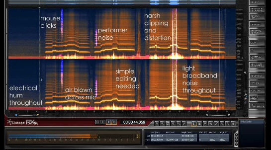

**Main Source:**

**[Wikipedia Audio editing software](https://en.wikipedia.org/wiki/Audio_editing_software)**

**Audio Editing** is the broader term of the process of manipulating and modifying audio recordings using specialized software. It involves various techniques to enhance or alter audio files, such as adding background music, changing spoken word, adding sound effects, cutting or trimming specific part of audio, and etc.

  
Source : https://www.audacityteam.org/

- **Cutting & Trimming** : Cutting is the process of removing data of a specific portion in an audio file entirely. This can be useful for eliminating mistakes, removing silence or pauses, or getting rid of any undesirable parts.

  Trimming, on the other hand, involves shortening the length of an audio file by removing portions from the beginning or end. Trimming is commonly used to get rid of unnecessary or empty spaces at the start or end of a recording.

- **Adding Background Music & Sound Effect** : The editing software under the hood analyze audio properties such as amplitude adjustments, time stretching or compression, pitch shifting, and applying effects.

  The software then adds the corresponding audio together, taking into account their volume levels and any panning or spatial positioning settings. This is called mixing and it creates a new set of audio samples that represents the combined audio.

- **Transition** : Transition is and effect used to smoothly connect or move between different audio segments. Common transition such as Fade, where the audio gradually decreases or increases in volume over a specific duration.

  And many other techniques and terminology in audio editing.

    
   Source : https://larryjordan.com/articles/how-to-auto-duck-audio-in-adobe-premiere-pro-cc/

#### Destructive & Non-Destructive

In audio editing, there are two different approaches to manipulate digital audio.

**Destructive** : In destructive editing, any modifications made to the original audio are permanent and cannot be easily undone or reversed. When you apply changes to an audio file using destructive editing, the original data is overwritten, and the changes become a permanent part of the file.  
Destructive editing makes editing process more precise but after modifying the audio, we can't change it although some editor allows you to "undo" the process.

**Non-Destructive** : Instead of directly modifying the original file, non-destructive editing keep tracks the audio edits in separate file. While playing the audio, the edit file will be applied and processed on the fly. This makes editing more flexing although exporting or remixing may take longer as it need to process the audio edi tfirst.

### Audio Restoration

Audio recordings suffer from a range of issues, such as background noise, clicks, pops, hisses, crackles, distortion, hum, or other artifacts. **Audio Restoration** is the process of enhancing or repairing audio recordings that have been degraded or damaged over time.

#### The Process

The first process is to identify the unwanted elements. Unwanted elements have some charateristics, for example, a clicks are sudden and short-duration audio, pops are similar to clicks but are usually slightly longer in duration, hisses are continuous, high-frequency noise that can be present in audio recordings.

Overall the charateristics of unwanted elements are a sudden change in the constant audio or an unrelated patterns or rhythm to the main audio and not synchronized with specific events or sounds.

After identifying, we can apply some algorithm and filter, for example, we can smoothen the surrounding audio near unwanted elements, apply frequencies filter, noise reduction in frequency domain using FFT.

  
Source : https://youtu.be/fWQ86r14Ei0
