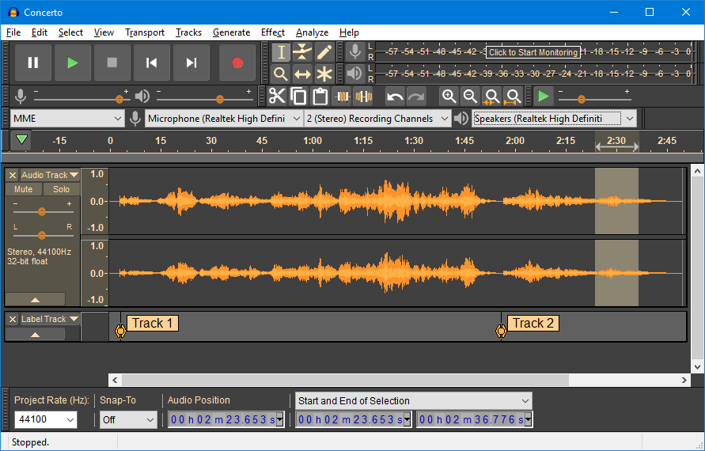
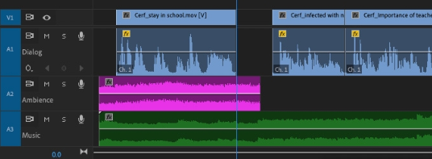

**Audio Editing** is the broader term of the process of manipulating and modifying audio recordings using specialized software. It involves various techniques to enhance or alter audio files, such as adding background music, changing spoken word, adding sound effects, cutting or trimming specific part of audio, and etc.

  
Source : https://www.audacityteam.org/

- **Cutting & Trimming** : Cutting is the process of removing data of a specific portion in an audio file entirely. This can be useful for eliminating mistakes, removing silence or pauses, or getting rid of any undesirable parts.

  Trimming, on the other hand, involves shortening the length of an audio file by removing portions from the beginning or end. Trimming is commonly used to get rid of unnecessary or empty spaces at the start or end of a recording.

- **Adding Background Music & Sound Effect** : The editing software under the hood analyze audio properties such as amplitude adjustments, time stretching or compression, pitch shifting, and applying effects.

  The software then adds the corresponding audio together, taking into account their volume levels and any panning or spatial positioning settings. This is called mixing and it creates a new set of audio samples that represents the combined audio.

- **Transition** : Transition is and effect used to smoothly connect or move between different audio segments. Common transition such as Fade, where the audio gradually decreases or increases in volume over a specific duration.

  And many other techniques and terminology in audio editing.

    
   Source : https://larryjordan.com/articles/how-to-auto-duck-audio-in-adobe-premiere-pro-cc/

### Audio Restoration

### Audacity
