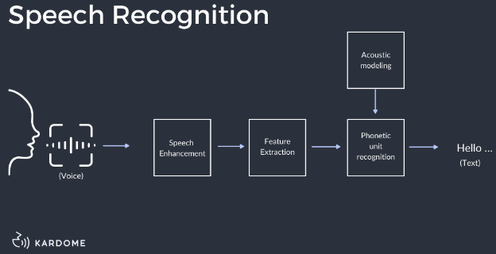

**Main Source : Various source from Google and Youtube**

**Speech Processing** is the analysis, synthesis, and understanding of spoken language. It involves various techniques and algorithms including speech recognition, speech synthesis, speaker recognition, and speech enhancement. Speech processing involves a lot of machine learning and deep learning technique.

Speech processing involves some steps, here is a high-level overview :

1. **Speech Capturing** : The first thing is to capture the speech sound signal, we can use a microphone or other audio recording devices. Sound signal will be converted into digital using an analog-to-digital converter (ADC).

2. **Pre-processing** : Digital signal is then pre-processed, this includes enhancing quality such as filtering, noise reduciton, and removing unwanted elements like background noise.

3. **Feature Extraction** : Feature extraction means we identify and capture sound characteristics such as loudness, pitch, rhythm. This will be give us more information and it will be useful later on.

4. **Speech Recognition** : This is the main process of speech processing, it includes :

   - Acoustics Modeling : Predict the likelihood of a specific word or phrase being spoken given the current state of the audio signal based on probability. For example, after a subject is spoken, a verb will have a higher chance than an adjective to be spoken next.

   - Language Modeling : Language modeling uses statistical properties and patterns of natural language to predict the next word or phrase that is likely to be spoken. The machine learning language model is trained alot of text data.

   - Decoding : In the decoding stage, the acoustic and language models are combined to find the most likely sequence of words that matches the speech input.

  
Source : https://www.kardome.com/blog-posts/difference-speech-and-voice-recognition

:::tip
Find out more about speech processing in [Natural Language Processing (NLP)](/deep-learning/natural-language-processing)
:::
