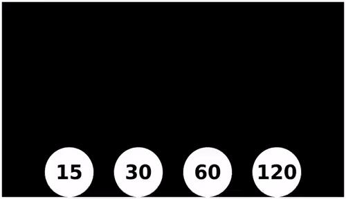
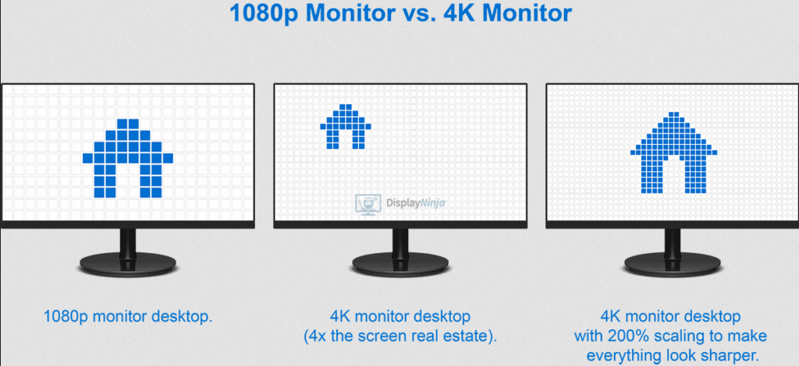

**Main Source : [Computer Graphics : Computer Display](/computer-graphics/computer-display)**

Video is basically a sequence of image. An image is stationary, however, if we keep changing the image with a small change in the detail of image, we will be able to create illusion of animation.

The image is called **frame** and the measurement of how many frame is usually measured per second as FPS (frame per second). The more FPS will result in smoother and better animation.

  
Source : https://gfycat.com/discover/fps-comparison-gifs

:::tip
More about FPS and some standard for display [here](/computer-graphics/computer-display#display-measurement)
:::

#### Resolution

Because video is an image, it also has resolution which is the number of how many pixel exist in an image. Resolution is measured in width x height of the image, the higher resolution would result in a higher quality image but also takes more space in memory.

Common video resolution include :

- **Standard Definition (SD)** : 720x480 pixels (NTSC) or 720x576 pixels (PAL)
- **High Definition (HD)** : 1280x720 pixels (720p) or 1920x1080 pixels (1080p)
- **Ultra High Definition (UHD)** : 3840x2160 pixels (4K UHD) or 7680x4320 pixels (8K UHD)

The resolution also affected by the display size. For example, a small monitor that displays 720p image may looks fine, but a bigger monitor that displays the same image may appear blurry or less sharp and much loss of detail. This is because in a bigger monitor, individual pixels are spread out over a larger physical area.

The measurement of how many pixel are spread out is PPI (pixels per inch), a bigger monitor will have more PPI.

  
Source : https://www.displayninja.com/what-is-pixel-density/

:::tip
Find more about video related to computer display [here](/computer-graphics/computer-display) and about computer animation [here](/computer-graphics/computer-animation)
:::
