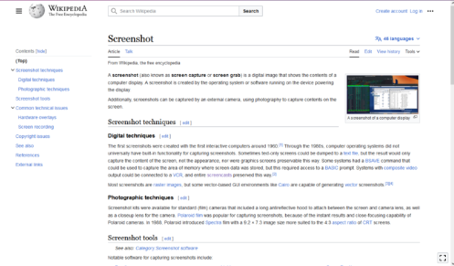

**Main Source:**

- **[Screencast — Wikipedia](https://en.wikipedia.org/wiki/Screencast)**

**Video recording** is the process of capturing and storing video data to be further edited or playback later.

:::note
In this page, the video recording is related to screen recording.
:::

**Screen recording**, also known as **screencast**, is the process of capturing anything happened in the user screen. It is typically done using specialized recording software. They may also include external input, such as audio input from microphone or a webcam that is used to capture photos of videos from user environment.

### Screenshot

A screenshot is a digital image or snapshot of what is currently displayed on a computer or mobile device's screen. It captures a static image of the screen contents, including any open windows, applications, or displayed content such as images, text, or videos.

:::info
Depending on the screenshot mode, user may choose to only capture specific region of the screen.
:::

Screenshot works by capturing the current state of screen's pixels data. At low level, the operating system request access to [framebuffer](/computer-graphics/low-level-graphics#buffer) which is simply a portion of the computer's memory that stores the pixel data representing the screen contents. In other word, framebuffer contains information about each pixel's color and position on the screen.

The operating system reads the raw pixel data from the framebuffer and copies it to a temporary storage area in memory. The pixel data is then encoded to an image format such as [PNG](/digital-media-processing/png) and saved locally in user's storage.

### Screencast

While a screenshot takes a single image, a [video is a sequence of images](/digital-media-processing/video-representation). To be able to record a video, we will need to capture the screen a bunch of time to create a continuous sequence of image.

The idea of screencast to screenshot is similar as image to video. Screencast is made by a bunch of screenshot captured multiple times per second. The number of how many screenshots are taken is called **frame rate**.

The computer takes screenshot at regular intervals, such as 24 or 60 times per second (thus creating a video with 24 and 60 FPS). Along the recording, the recording software may also capture external input, such as audio input from microphone. The video and audio is then combined and encoded in format such as [MP4](/digital-media-processing/mp4).

### Livestreaming

Livestreaming is a real-time broadcasting of video and audio content over the internet. Livestreaming involves capturing user's screen just like screencasting, but the result of video is not saved locally. Instead, it is sent over the network to the livestreaming service, such as YouTube. The livestreaming service will then broadcast it to user anywhere.

The audio and video data is sent gradually, divided into smaller network packets for the transmission over the network. The network protocol used for transmission can be a real-time protocol like [RTC](/computer-networking/rtc).
