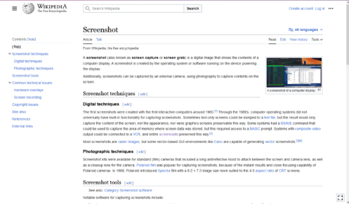

import screencast from "./screencast.mp4";

**Main Source : [Wikipedia Screencast](https://en.wikipedia.org/wiki/Screencast)**

**Video Recording**, in the context of digital, is the process of capturing and storing video data
to be further edited or playback later. In this page, the video recording we are talking about is screen recording.

**Screen Recording**, also known as screencast, captures anything happened in the user screen.
Some recording software may also include external input such as audio from micropone or
webcam that is used to capture photos of videos from user environment.

### Screenshot

A **screenshot** is a digital image or snapshot of what is currently displayed on
a computer or mobile device's screen. It captures a static image of the screen contents,
including any open windows, applications, or displayed content such as images, text, or videos.

Screenshot works by capturing the current state of screen's pixels data.
At low level, the operating system request an access to framebuffer which is
a portion of the computer's memory that stores the pixel data representing the screen contents.
The framebuffer contains information about each pixel's color and position on the screen.

The operating system reads the pixel data from the framebuffer and copies it to
a temporary storage area in memory. The pixel data is then encoded to an image format such as PNG.

### Screencast

While a screenshot takes a single image, to be able to record a video which is a sequence of image,
we need to capture the screen a bunch of time to create a continous sequence of image.

The idea of screencast to screenshot is similar as image to video. Screencast is made by
a bunch of screenshot captured multiple times per second. The number of how many
screenshot is taken is called frame rate, same as the terminology of sequence of image in video.

The computer takes screenshot at regular intervals, such as 24 or 60 times per second.
This will create a video with 24 or 60 FPS. Along the recording, recording software
may also capture external audio from microphone. The video and audio is then combined together
and encoded in format such as MP4.

<video width="560" height="320" controls>
  <source src={screencast} />
</video>

### Livestreaming

**Livestreaming** is a real-time broadcasting of video and audio content over the internet.
Livestreaming involves capturing user's screen just like screencasting, the result of video
is then sent over the network to some livestreaming service such as Youtube. The livestreaming
service will then broadcast it to user anywere.

The encoded audio and video data is divided into smaller packets for transmission over the network.
The packets are then sent over the network using protocols such as RTC.
The packets are transmitted in real-time or near real-time to maintain the live aspect of the stream.

#### Bit Rate

In livestreaming, **bit rate** is the measurement of how many bits are processed or 
transmitted in a given period of time. The higher the bitrate, the better the quality of 
the stream will be, but the more bandwidth it will require. 

A low bitrate means we need to represent the video in a limited amount of data (bits).
This can make some of the detail are skipped to adjust with the available data.

  
Source : https://restream.io/blog/what-is-video-bitrate/

:::tip
More about real-time communication [here](/computer-networking/rtc)
:::
