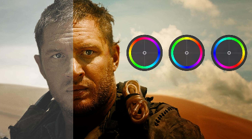
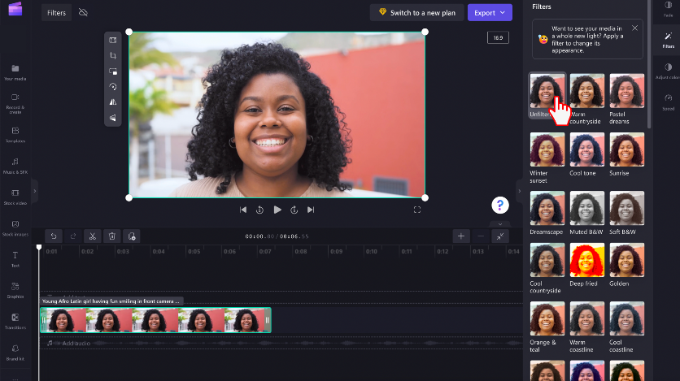
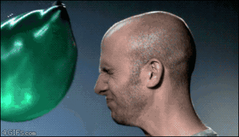
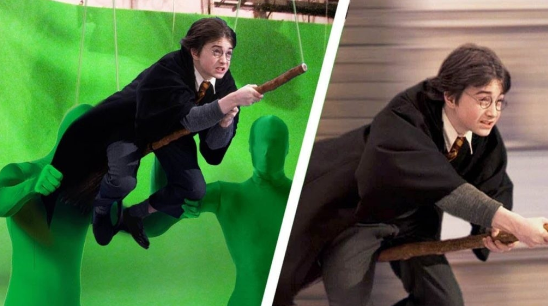

**Main Source : [Wikipedia Visual effects](https://en.wikipedia.org/wiki/Visual_effects)**

**Video Effects** is a visual alterations applied to video to create artistic or stylistic changes, simulate specific environments or conditions, or convey a particular mood or atmosphere.

Video effects are related to [image enhancement](/digital-media-processing/image-enhancement), it uses the similar principle to achieve desired behavior.

Video can also be enhanced, this includes denoising, upscaling, and restoration. The concept used are similar to image processing. Think of it as applying those image enhancement technique to each frame of the video.

Example of video effects :

- **Color Grading** : Adjusting the color and tone of a video to create a specific look or mood.

    
   Source : https://www.studiobinder.com/blog/color-grading-vs-color-correction-process/

- **Transitions** : Transitions are effects used to smoothly transition between two video clips or scenes. For example, a fade effect between two clips of video gradually lower down the transparency or opacity of the first clip, removing it from the scene and slowly increase the opacity of the second clip.

    
   Source : https://www.premiumbeat.com/blog/the-hidden-meaning-behind-popular-video-transitions/

- **Filters** : Filter has various effect such as adjusting the color balance, brightness, contrast, saturation, and overall color tone of the video, sharpening or blur effect, and other stylized filter.

    
   Source : https://support.microsoft.com/en-au/topic/how-to-add-filters-to-a-video-7105a494-0d10-4bb1-ac41-1770606498d1

- **Motion Animation** : Motion animation creates illusion of movement of object. There are many ways to achieve this, a common one is through the use of keyframes. Keyframes are settings that are applied at specific points, these settings are responsible for modifying position, scale, rotation, opacity, etc.

- **Slow Motion** : Slow motion reduces the speed of the video, some ways to achieve are stretching the duration of the video clip by specific amount, other ways is to capture the video at higher frame rate and then play it back at lower frame rate.

    
   Source : https://www.pinterest.com/pin/16-slowmo-gifs-that-are-pretty-cool--815433076268236747/

- **Green Screen** : Also known as chroma key, is a popular technique used in video production to replace a specific color (usually green) in a video footage with another image or video. The idea is the editing software and the user agree on a color, the color will then be made transparent by the software. After that, we can use the transparent background to replace it with another footage.

    
   Source : https://makeavideohub.com/green-screen/what-is-a-green-screen-and-how-does-it-work.html

- **Special Effects** : Special effect includes Visual Effects (VFX) and Computer-Generated Imagery (CGI). These are made possible through computer graphics and simulation.

:::tip
Find more about animation in [Computer Animation](/computer-graphics/computer-animation) and [Simulation](/computer-graphics/simulation)
:::
