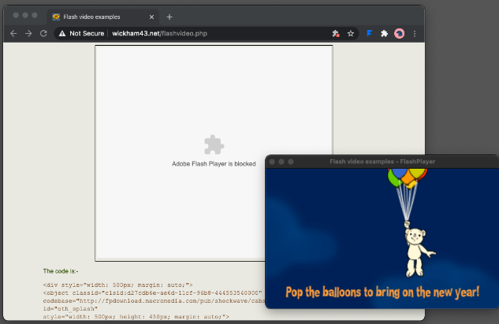

**Main Source :**

- **[Wikipedia Adobe Flash Player](https://en.wikipedia.org/wiki/Adobe_Flash_Player)**
- **[Wikipedia SWF](https://en.wikipedia.org/wiki/SWF)**

**Flash Player** is a multimedia software for playback of multimedia content, such as animations, videos, and interactive applications, on web browsers. Flash player uses variety of assets such as vector graphics, 3d graphics, video, audio and raster image. In addition to assets, we can also add interactivity to the element using a scripting language called **ActionScript**.

  
Source : https://addons.mozilla.org/id/firefox/addon/flashplayer-swf-to-html/

### How flash player works (high-level)

Flash player content are stored in SWF file. After developer creates flash player content, all the assets and script bytecode will be compiled to binary data with some format and tags in SWF format.

A browser must has flash player plugin in order to run flash content or SWF file. Flash player plugin is an extension for browser, it act as a flash player engine for the browser.

The browser with flash player plugin will then parse the SWF file. It reads the binary data, interprets the format and tags, and extracts the necessary information.

The next step is to render the content, the plugin will handle all of this. This will include converting graphics to pixels data in screen, playing audio or video, doing geometry transformation such as scaling and rotation.

Flash player plugin also contains virtual machine for running ActionScript code. The bytecode will be interpreted and executed line by line by the plugin.
