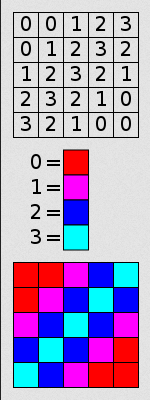

**Main Source :**

- **[BMP file format - Wikipedia](https://en.wikipedia.org/wiki/BMP_file_format)**

**Bitmap or BMP in file format**, is a raster image format that stores pixel data for an image. BMP stores the data in binary format. BMP are generally uncompressed, meaning it stores the full original data.

  
Source : https://stackoverflow.com/questions/33483708/understanding-bmp-file

### Indexed Color

Indexed color image is a type of digital image where the colors used in the image are selected from a predefined color palette. Instead of directly specifying the color of each individual pixel such as RGB, indexed color images represent each pixel with an index value that corresponds to a specific color in the palette.

For example, in RGB we may represent color in pixel x and y with (255, 0, 0) which is a red color, this way we have to store all of them in 24-bit. With indexed color, we can have a predefined color, we may define (255, 0, 0) or red color as 0, this way we can save a lot of data. However, if there are various color, this may result in a larger file size.

  
Source : https://en.wikipedia.org/wiki/Indexed_color

### BMP Structure

BMP file contains several components :

- **File Header** : File begins with a fixed-size header that provides general information about the file, such as the file type, size, and offset to the pixel data.
- **DIB Header** : The Device Independent Bitmap or DIB contains the more specific information such as width and height in pixels, color depth, compression method (if any), and color palette.
- **Color Palette** (optional) : For indexed color images (color depths of 8 bits or fewer), an optional color palette may be present. The color palette is an array of color entries that maps pixel values to specific colors.
- **Pixel Data** : After the headers, the file contains the actual pixel data. The pixel data represents the image itself, with each pixel's color or intensity information stored in a specific format based on the color depth. For example, in a 24-bit color depth BMP file, each pixel is represented by three bytes, typically in the order of blue, green, and red (BGR).

Overall, BMP are relatively straightforward to make or to read by software.

  
Source : https://en.wikipedia.org/wiki/BMP_file_format
