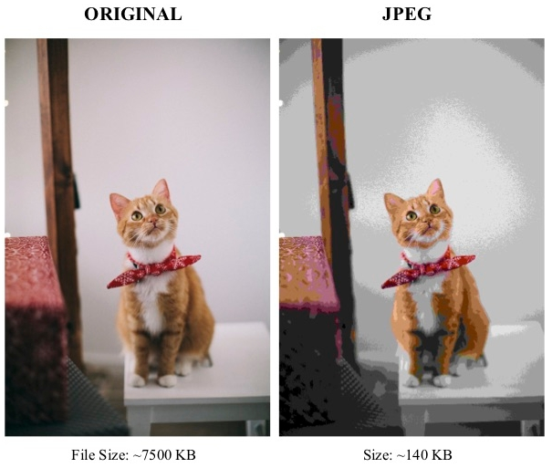
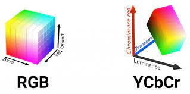
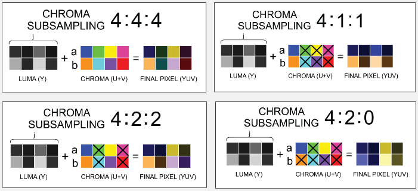
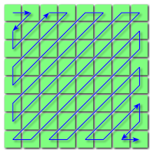

**Main Source : [Wikipedia JPEG](https://en.wikipedia.org/wiki/JPEG)**

**JPG or JPEG (Joint Photographic Experts Group)** is a digital image format known for using [lossy compression](/digital-signal-processing/compression#lossy-compression) which should reduce alot of file size compared to [lossless compression](/digital-signal-processing/compression#lossy-compression) or even more compared to [BMP](/digital-media-processing/bmp) without compression at all.

  
Source : https://theinformaticists.com/2019/08/29/human-based-image-compression-using-a-deterministic-computer-algorithm-to-reconstruct-pre-segmented-images/

### JPG Structure

JPG file are divided to several segment, each begins with marker as the indicator.

- **File Header** : The JPG file begins with a file header that contains markers indicating the start of the JPG image. The most common marker is the Start of Image (SOI) marker (FF D8).

- **Application and Comment Markers** : JPG files can include markers that provide additional information or comments about the image. For example, the APP0 marker (FF E0) is often used to indicate the JFIF (JPG File Interchange Format) segment, which contains metadata about the image, such as resolution and pixel aspect ratio. Comment markers (COM) can be used to store textual comments.

- **Quantization Tables** : The Quantization Tables (DQT) segment (FF DB) contains the quantization tables used during compression. These tables define the quantization values applied to the DCT coefficients during the compression process.

- **Huffman Tables** : The Huffman Tables (DHT) segment (FF C4) contains the Huffman coding tables used for entropy encoding. Huffman coding is a lossless compression technique applied to the quantized DCT coefficients.

- **Image Information** : The image data is represented by one or more compressed image segments. These segments include the Start of Frame (SOF) segment (FF C0 or FF C2), which contains information about the image size, color space, and other parameters. The Scan (SOS) segment (FF DA) specifies the order and location of the image components, including the Huffman tables used for each component.

- **End of Image** : The JPG file ends with an End of Image (EOI) marker (FF D9), indicating the completion of the JPG image.

  
Source : https://stackoverflow.com/questions/48669812/how-do-i-read-and-compare-single-bytes-from-jpeg-file-in-c

### JPG Compression

Many technique are used to compress JPG, including lossy and lossless compression. Here are some techniques :

- **Color Space Conversion** : Color space is the specific color format to represent image. Typically RGB is used, however in JPG, it is converted to YCbCr color space. YCbCr separates luminance (Y), blue chrominance channel (Cb) and red chrominance channel (Cr). Chrominance is the measure how vary is the color from the neutral gray level of the image.

  The reason why it uses YCbCr color space is because human visual system is more sensitive to changes in brightness than color, by using this color space, we can separate the color into these component allowing us to be able to compress more unrelevant data.

    
  Source : https://developingdaily.com/article/technology/rgb-vs-ycbcr/398

- **Chrominance Subsampling** : This is the compression that take advantage over human visual system after color space is converted to YCbCr. Basically the chrominance are reduced or downsampled. This won't affect image quality significantly.

    
   Source : https://www.videomaker.com/article/f6/15788-the-anatomy-of-chroma-subsampling/

- **DCT & Quantization** : In simple term, [DCT](/digital-signal-processing/discrete-cosine-transform) and [quantization](/digital-signal-processing/quantization) replace color that changes often with the neighbour color. In other words, it groups similar colors together to reduce data.

- **Entropy Coding** : Entropy coding is a lossless compression, it is a combination between [run-length encoding](/digital-signal-processing/compression#run-length-encoding-rle) optimized with zigzag scanning and [Huffman encoding](/digital-signal-processing/compression#huffman-encoding).

  Zigzag scanning is used to optimize run-length encoding because, by scanning in a zigzag pattern, we avoid directly jumping to the left every time we reach the right boundary of the image. In the zigzag pattern, we can scan a closer group of colors, which makes run-length encoding more efficient as it can include duplicates within the color group.

    
   Source : https://en.wikipedia.org/wiki/JPEG
