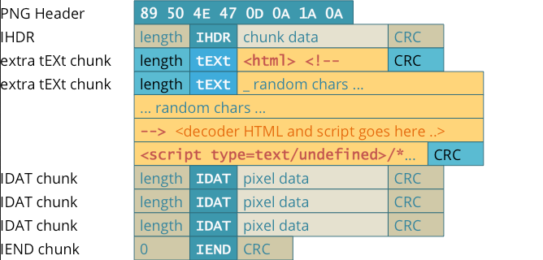
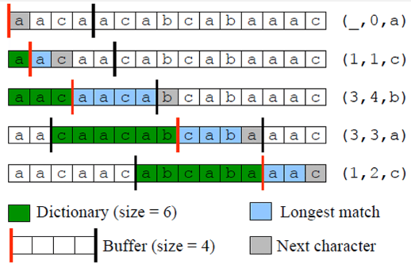

**Main Source:**

- **[PNG — Wikipedia](https://en.wikipedia.org/wiki/PNG)**

**PNG (Portable Network Graphics)** is a digital format that uses lossless compression, meaning it can store images without any loss of quality but with bigger file sizes compared to JPEG.

While PNG has larger size than JPEG, however PNG has an advantages, it supports alpha channel transparency. PNG can display transparent areas within an image. Alpha channel making the it stores extra 8 bit for each color, it becomes RGBA. The alpha value vary between 0 (fully invisible) to 255 (fully visible).

The transparent image can then be place or combined with other transparent image, this is called [alpha blending](/computer-graphics/computer-images-part-2#alpha)

  
Source: https://www.stellarinfo.com/blog/jpg-vs-png/

### PNG Structure

PNG consist of ordered component called chunks, each chunks represent information that makes up PNG file.

- **PNG Signature**: The file starts with an 8-byte signature that identifies it as a PNG file. The signature helps software recognize and validate the file format.

- **IHDR Chunk**: The IHDR (Image Header) chunk stores essential information about the image, such as its dimensions (width and height), bit depth, color type, compression method, and interlace method.

- **Ancillary Chunks**: After the IHDR chunk, there can be an optional ancillary chunks that provide additional information and features. There are many types of ancillary chunks, common examples include:

  - **bKGD (Background)**: The default background color.
  - **PLTE (Palette)**: This chunk defines a color palette for indexed color images.
  - **tRNS (Transparency)**: It specifies transparency information for the image, such as alpha values for individual palette entries or a single transparent color.
  - **pHYs (Physical Dimensions)**: This chunk indicates the intended physical size of the image in terms of pixels per unit.
  - **tIME (Last Modification Time)**: It stores the timestamp of the last image modification.

- **Image Data**: The actual image data comes after the header and optional ancillary chunks. The image data is compressed using a lossless compression, this chunk is called IDAT.

- **IEND Chunk**: The IEND (Image End) chunk marks the end of the PNG file. It serves as a marker to indicate that there are no more chunks following it.

    
   Source: https://github.com/HugoJH/HideIntoPNG

### PNG Compression

The PNG compression consist of two steps:

1. **Filtering**: The first step is to "predict", it's pre-processing before the actual compression. The purpose of this step is to identify patterns or correlations between pixels. It works by applying prediction algorithm to each pixel data in scanline based. The error or the difference between the predicted and actual pixel value is also stored.

There are five types of filter method in PNG, the purpose of these are to capture pattern so that it can be compressed more efficiently:

- **None**: When there is little or no spatial correlation in the image data, no filtering is applied. Each pixel value is stored as is.

- **Sub**: The pixel value is predicted based on the value of the pixel immediately before it in the same scanline.

- **Up**: The pixel value is predicted based on the value of the pixel above it in the previous scanline.

- **Average**: The pixel value is predicted based on the average of the pixel above it and the pixel immediately before it.

- **Paeth**: The pixel value is predicted based on a linear combination of the pixel above it, the pixel immediately before it, and the pixel diagonally above it.

2. **DEFLATE**: This is a combination of LZ77 and [Huffman Encoding](/digital-signal-processing/compression#huffman-encoding)

   - **LZ77**: LZ77 scans through the input data and identifies repeated sequences of data called "matches" or "phrases." Instead of storing each repeated sequence as is, LZ77 replaces them with references, consisting of an offset (indicating the distance to the start of the repeated sequence) and a length (representing the number of characters in the sequence).

      
    Source: https://www.researchgate.net/figure/An-example-of-LZ77-encoding_fig4_322296027

   - **Huffman Encoding**: After LZ77, huffman encoding is also applied to further reduce data by making frequent symbols in smaller size and less frequent symbols in larger size.
