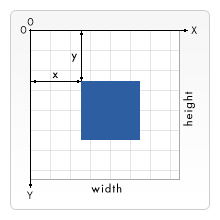

**Main Source:**

- **[SVG — Wikipedia](https://en.wikipedia.org/wiki/SVG)**
- **[SVG in 100 seconds — Fireship](https://youtu.be/emFMHH2Bfvo)**

**SVG (Scalable Vector Graphics)** is an [XML](/digital-media-processing/xml)-based [vector image format](/computer-graphics/computer-images-part-1) used to display two-dimensional graphics on the web. SVG images are resolution-independent, meaning they can be scaled up or down without losing quality.

### SVG Vector

SVG defines a coordinate system where the origin (0,0) is typically located in the top-left corner of the SVG viewport. The x-axis extends horizontally to the right, and the y-axis extends vertically downwards.

SVG uses various shape elements, such as `<rect>`, `<circle>`, `<ellipse>`, `<line>`, and `<path>`. Each shape element is represented by an XML tag and associated attributes that define its size, position, and other properties.

SVG draw shapes in the coordinate system, meaning that the size and position of the shapes are defined relative to the coordinate system, not in terms of absolute pixel values. As a result, scaling an SVG image can be achieved by simply adjusting the coordinate system.

  
Source: https://developer.mozilla.org/en-US/docs/Web/SVG/Tutorial/Positions

### SVG Structure

SVG follows the tree hierarchical structure of XML:

```xml
<?xml version="1.0" encoding="UTF-8"?>
<svg xmlns="http://www.w3.org/2000/svg" width="..." height="..." viewBox="...">
  <!-- SVG content goes here -->
</svg>
```

- `<?xml version="1.0" encoding="UTF-8"?>`: Begins with the version and encoding declaration of XML.
- `svg`: Followed by `svg` tag as the root element, that includes namespace, `width` and `height` of the SVG file, and `viewBox`, which is used to specify the portion of the SVG canvas that should be visible and scaled to fit the available space.

For example, this is an SVG file that defines a red filled heart shape:

```xml
<?xml version="1.0" encoding="UTF-8"?>
<svg xmlns="http://www.w3.org/2000/svg"
     width="100" height="100"
     viewBox="0 0 100 100">
  <path d="M50 90c-15-15-30-30-30-50c0-20
           20-30 30-40c10 10 30 20 30 40c0 20-15 35-30 50z"
        fill="red" />
</svg>
```

- `<path>`: We specify the path we want to draw using the `d` attribute, which indicates the drawing command. The path uses letters as commands to draw different types of paths or curves, including move-to (M), line-to (L), curve-to (C), and close-path (Z). Numbers are used to specify coordinates, with `-` indicating negative values. Uppercase letters indicate movement to absolute coordinates, while lowercase letters indicate movement relative to the last drawing coordinate.
