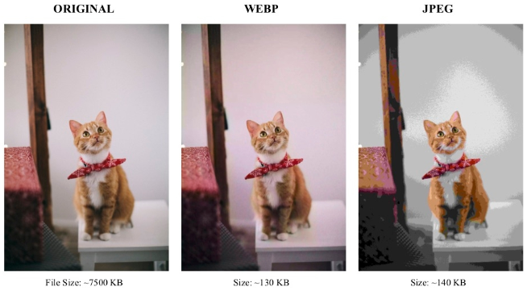

**Main Source :**

- **[Wikipedia WebP](https://en.wikipedia.org/wiki/WebP)**
- **Various sources from Google**

**WebP** is an image format developed by Google that provides both lossy and lossless compression for digital images. WebP is more suitable for website than JPG because it serves in better compression efficiency. WebP also supports transparency, browser native supports, and animation through the WebP Animation format (WebPANIM).

  
Source : https://theinformaticists.com/2019/08/29/human-based-image-compression-using-a-deterministic-computer-algorithm-to-reconstruct-pre-segmented-images/

### WebP Structure

1. **RIFF Header** : A WebP file begins with a RIFF (Resource Interchange File Format) header, which identifies the file as a WebP file. The RIFF header is four bytes long and contains the ASCII characters "RIFF".

2. **File Size** : Following the RIFF header is a four-byte value that specifies the total size of the WebP file, including the RIFF header itself and the file content.

3. **WebP FourCC** : The next four bytes represent the FourCC (Four-Character Code) identifier for WebP files, which is "WEBP".

4. **WebP Chunk** : After the FourCC identifier, the WebP file contains a chunk structure that consists of multiple chunks. Each chunk contains a chunk header followed by chunk data.

   - **Chunk Header** : Each chunk has a four-byte FourCC identifier and a four-byte value indicating the size of the chunk data.

   - **Chunk Data** : The chunk data stores the actual content of the chunk, such as image data metadata, or other relevant information. The size of the chunk data is determined by the chunk header.

     These chunks are :

     - **VP8/VP8L/VP8X Chunk** : This chunk stores the compressed image data using VP8, VP8L (lossless), or VP8X (extended) compression formats.

     - **ICCP Chunk** : This chunk contains an embedded ICC profile, which provides color management information.

     - **ANIM Chunk** : The ANIM chunk is used to store animation-related information in WebP Animation format (WebPANIM).

     - **ALPHA Chunk** : This chunk stores the transparency data for an image with an alpha channel.

     - **Metadata Chunk** : WebP files can include metadata chunks for storing additional information, such as EXIF data, XMP data, or custom metadata.

5. **File Footer** : The WebP file may end with an optional file footer that contains additional information or markers related to the WebP file.

### WebP Compression

Overall, WebP uses similar technique as [JPG compression](/digital-media-processing/jpg-jpeg#jpg-compression), however, there are small difference.

- **Predictive Coding** : WebP uses predictive coding to reduce redundant information within an image. It predicts pixel values based on neighboring pixels and encodes the difference between the predicted and actual pixel values. By knowning the differences between pixel values, we can capture the pattern or correlation to achieve better compression.

- **YUV Color Space Conversion** : YUV is similar to YCbCr in JPG, the difference is YUV valus are centered around 0, ranging from (-127 to 128) while YCbCr values are centered around 128, ranging from (0 to 256).

  
Source : https://developers.google.com/speed/webp/docs/compression
