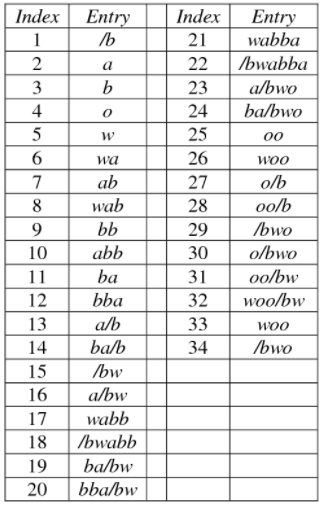

**Main Source:**

- **[GIF — Wikipedia](https://en.wikipedia.org/wiki/GIF)**

**GIF (Graphics Interchange Format)** is a digital image format that supports both static and animated images. GIF also supports transparency and uses lossless compression.

### GIF Representation

#### GIF Color Palette

GIF colors palette are represented in color table, instead of specifying color in each pixel, we use index instead that refer to the color table.

Each entry in the color table represents a specific color and is typically 24 bits in size, with 8 bits for the red component, 8 bits for the green component, and 8 bits for the blue component.

The number of colors in the color table is limited to a maximum of 256 (2^8) due to the 8-bit index used to reference the colors.

For example, we define red (255, 0, 0) as the 0 index. This mean we can specify pixel in specific coordinate as red color by using index 0.

  
Source: http://www.flounder.com/colortable.htm

#### GIF Animation

Animated images is made possible through the sequence of image that is played in short amount of time, creating the illusion of motion. Each image in sequence is called frame, the rate of frame played is not defined with FPS like animation or video. Instead, each frame has its own duration.

For example, a frame duration of 10 centiseconds would mean that the frame is displayed for 0.1 seconds, resulting in a perceived frame rate of 10 frames per second. The minimum of GIF frame duration is 1 centisecond (0.01 seconds), and the maximum duration is 65535 centiseconds (655.35 seconds or approximately 10 minutes and 55 seconds).

Basically, GIF displays an image, after it is run for specific duration, it changes to next image or frame. The continous process creates the illusion of motion. However, GIF may not be suitable for long animation, this is because GIF is not very smooth, uses lossless compression that makes video file larger, limited color palettes.

  
Source: https://www.litmus.com/blog/a-guide-to-animated-gifs-in-email

### GIF Structure

GIF file consist of several component:

1. **File Header**: GIF starts with fixed-size header that identifies it as a GIF file. It contains signature such as "GIF89a" or "GIF87a" to indicate the GIF version. Also includes width and height of the image.

2. **Logical Screen Descriptor**: This contains the global information of the GIF file. This includes width and height of canvas, color index, color resolution, background color, and pixel aspect ratio.

3. **Global Color Table (optional)**: If the logical screen descriptor indicates the presence of a global color table, it is stored immediately after the logical screen descriptor.

4. **Image & Animation Data**: Image and animation follows the color table (if present). Each frame or image consist of:

   - **Graphics Control Extension**:
     - **Frame Delay**: Time delay before displaying the next frame
     - **Transparency Flag & Index**: Indicates if transparency is used with the index of the transparent color in the color table
   - **Image Descriptor**:
     - **Width and Height**: Dimensions of the image frame in pixels
     - **Local Color Table Flag**: Indicates the presence of a local color table
     - **Interlaced Flag**: Indicates if the image is interlaced
     - **Sort Flag**: Specifies if the local color table is sorted
   - **Image Data**: The color of the image using the color table index

5. **Trailer**: End of the GIF file marker, consist of single a single-byte value (0x3B).

  
Source: https://openpreservation.org/blogs/good-gif-hunting/

### GIF Compression

GIF uses several lossless compression:

- **LZW Compression**: LZW (Lempel-Ziv-Welch) compression is the primary compression algorithm used in GIF. It reduces the file size by using a shorter codes for each symbol

  LZW compression operates by creating a dictionary of symbol encountered. This process is dynamic, it keeps expanding the dictionary if new pattern or sequences encountered in the data.
  We then replace each symbol with any element exist in the dictionary.

    
   Source: https://www.semanticscholar.org/paper/Optimization-of-LZW-Compression-Algorithm-With-of-Maulunida-Solichin/54ecf3209d9e52f6795b55a8e4760f8e3b10009c/figure/4

- **Palette-Based Color**: GIF utilizes a palette-based color model, allowing only a limited number of colors to be used in an image. By using a color table or color palette, GIF can represent each pixel as an index into this table, rather than storing the full RGB color information for each pixel. This indexed color approach significantly reduces the file size, especially for images with a limited color range.

- **Color Substitution**: GIF employs color substitution to optimize the compression further. In cases where a color occurs only a few times in the image, the GIF format can replace that color with a neighboring color from the color table. This substitution reduces the number of unique colors needed to represent the image accurately, resulting in additional compression.

  While this sounds like a lossy compression, the loss of color accuracy is often considered acceptable as it doesn't affect much to the overall image.

### GIF Interlacing

GIF interlacing is a technique used to progressively display images as they are being downloaded or loaded. When a GIF image is interlaced, it is divided into a series of scan lines that are displayed in a specific order, allowing a low-resolution version of the image to be seen quickly, followed by a gradual improvement in quality as more scan lines are loaded.

The interlacing process rearranges the pixels in the image so that the first pass displays every eighth scan line, the second pass displays every fourth line, the third pass displays every second line, and the fourth pass displays every line. This process continues until all the lines have been displayed, resulting in a fully rendered image.

Overall, it provides an initial rendering that displays a lower resolution version of the image. It gradually improve the quality and keeps rendering more scanline slowly.

  
Source: https://commons.wikimedia.org/wiki/File:Interlacing_demo.gif
