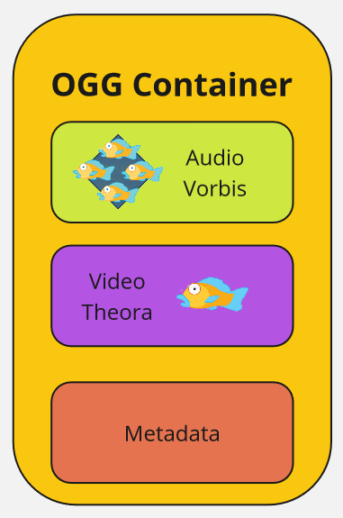
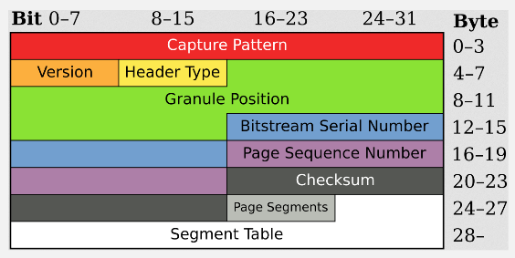

**Main Source :**

- **[Wikipedia Ogg](https://en.wikipedia.org/wiki/Ogg)**
- **[Wikipedia Vorbis](https://en.wikipedia.org/wiki/Vorbis)**

### OGG

**OGG** is multimedia container format including audio, video, text, and metadata. As a container, OGG can hold multiple type of data, this is achieved by [multiplexing](/digital-signal-processing/multiplexing). By supporting multiple type of data, OGG also supports multiple codecs for each data. Codecs is a software, device or program that is responsible for encoding and decoding a data stream or signal.

For example, an OGG file can contain audio, video, text, and metadata. The audio codec used is Vorbis, video codec is Theora, and the metadata provides additional information about the content such as title of the media, artist/author information, album/movie information, genres, and more.

### OGG Structure

OGG file consists of a sequence of pages. Each page begins with a 27-byte header, followed by a variable-length payload. Each page size is generally between 4 to 64 kilobytes.

1. **OGG Header** : The OGG file begins with an OGG header, which provides essential information about the file and its streams. The header includes details such as the OGG format version, the number of streams within the file, and the serial numbers assigned to each stream.

2. **Page Header** : Each page starts with a page header that contains metadata about the page itself. The header includes information such as the granule position, which represents the position of the data within the stream, and the page sequence number.

3. **Packet Data** : Following the page header, the page contains one or more packets of data. Each packet represents a chunk of encoded audio, video, text, or other multimedia data. The packets may belong to different streams within the file.

4. **Page Segments** : The page segments section follows the packet data and specifies the sizes of the individual packets within the page. It allows for variable-sized packets within a fixed-sized page.

5. **Page CRC Checksum** : Each page concludes with a cyclic redundancy checksum (CRC) value, which is used for error detection. In simple term, a data is calculated using mathematical function called hash function to produce a value. The checksum is when we check if the produced value is the same as the value of the data that should be.

6. **Metadata** : Metadata can include details such as track titles, artist/author information, album/movie information, genres, and more. The metadata is typically stored in dedicated packets within the stream.

  
Source : https://en.wikipedia.org/wiki/Ogg  
\* Image of OGG page header

### OGG Vorbis

**Vorbis** is the specific codecs for audio data in OGG file, it uses a lossy compression. The process of vorbis codecs begins with the audio data is divided into small sections called "blocks" or "windows." Each block typically contains a few milliseconds of audio.

#### Encoding Process

1. **Psychoacoustic Modeling** : The Vorbis codec applies a psychoacoustic model to analyze the audio within each block. This model takes into account the characteristics of human hearing and discard the less important audio.

2. **Transform** : The audio data within each block is transformed from the time domain to the frequency domain using the Modified [Discrete Cosine Transform](/digital-signal-processing/discrete-cosine-transform) (MDCT). The modified DCT is used for processing overlapping blocks of audio or video data. This transformation will map the audio to frequency domain.

3. **[Quantization](/digital-signal-processing/quantization)** : The transformed audio data is quantized, meaning the amplitudes of the frequency components are approximated and represented with fewer bits.

4. **Encoding** : The quantized audio data is further processed and encoded using variable bitrate encoding. The codec allocates more bits to preserve important audio details and fewer bits for less important parts, based on the psychoacoustic analysis.

5. **Bitstream Generation** : The encoded audio data, along with metadata such as track information and tags, is packaged into a bitstream or sequence of bit to the OGG container format.

#### Decoding Process

1. **Bitstream Parsing** : The Vorbis decoder reads and parses the encoded bitstream, extracting the compressed audio data and associated metadata.

2. **Decoding** : The quantized and compressed audio data is decoded, reversing the encoding process. The inverse operations of quantization, inverse variable bitrate decoding, and inverse MDCT are applied to reconstruct the frequency representation of the audio.

3. **Time-domain Reconstruction** : The frequency data is transformed back into the time domain through additional processing.

4. **Audio Playback** : The decoded audio is played back through speakers or headphones, allowing the listener to hear the reconstructed audio.
