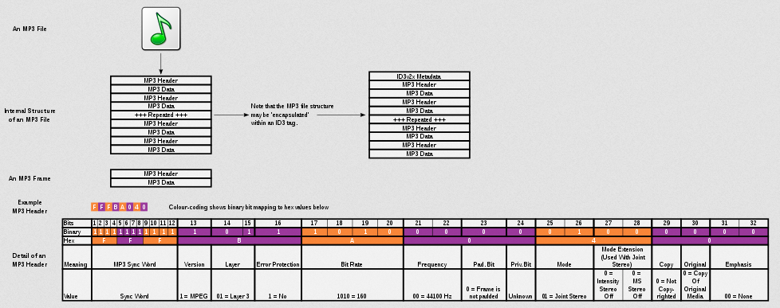
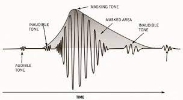

**Main Source : [Wikipedia MP3](https://en.wikipedia.org/wiki/MP3)**

**MPEG Audio Layer-3 (MP3)** is a digital audio format that uses lossy compression, which results in much smaller file than the uncompressed [WAV](/digital-media-processing/wav).

### MP3 Structure

MP3 file is made up of a sequence of frames, each of which consists of a header and a data block.

1. **Header** : The file begins with an MP3 header that contains important information about the file, such as the audio format, bitrate, sampling rate, stereo/mono mode, and more. The header provides essential details for decoding and playing the file correctly.

2. **Audio Frames** : Each frame represents a small segment of audio and contains compressed audio data. The size of each frame can vary depending on the bitrate and other settings used during encoding. The frames are usually consistent in size throughout the file.

3. **Side Information** : For each audio frame, there is corresponding side information that provides details about the frame's structure and compression parameters. This information includes data such as the scale factors, Huffman coding tables, and stereo/mono mode information.

4. **Main Data** : The main data section contains the compressed audio data. It includes the actual audio samples that have been encoded and compressed using various techniques.

5. **Ancillary Data** : MP3 files can also include ancillary data, such as ID3 tags, which store additional metadata about the audio file, such as the song title, artist, album, and other details. These tags provide information that can be displayed by media players.

  
Source : https://en.wikipedia.org/wiki/MP3

### MP3 Compression

MP3 is known for its compression, it can commonly achieve a 75 to 95% reduction in size.

1. **Transform Coding** : MP3 uses a technique called the Modified [Discrete Cosine Transform](/digital-signal-processing/discrete-cosine-transform) (MDCT) to convert the audio signal from the time domain to the frequency domain. The MDCT breaks down the audio signal into frequency components, allowing for more efficient compression of the spectral information.

2. **Psychoacoustics Modeling** : Psychoacoustics Modeling is a technique used to remove less relevant data by analyzing human hearing. This can include removing frequency and components that are masked by other louder or more important sounds.

3. **[Quantization](/digital-signal-processing/quantization)** : Quantization is the process of assigning a limited number of bits to represent the amplitude of the audio samples. In MP3, quantization process also takes account the psychoacoustic modeling.

4. **[Huffman Encoding](/digital-signal-processing/compression#huffman-encoding)** : Huffman encoding is a technique to compress data by assigning shorter codes to frequently occurring audio values and longer codes to less frequent values, reducing the overall number of bits required to represent the data.

  
Source : https://ledgernote.com/blog/q-and-a/how-does-mp3-compression-work/
