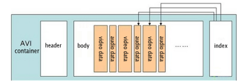

**Main Source :**

- **[AVI Format: Should You Still Use AVI? - Cloudinary](https://cloudinary.com/guides/video-formats/avi-format-should-you-still-use-avi)**
- **[Wikipedia Audio Video Interleave](https://en.wikipedia.org/wiki/Audio_Video_Interleave)**

**Audio Video Interleave (AVI)** is a multimedia container format that supports audio and video file. AVI is an older video format developed by Microsoft in 1992. An AVI file may includes compression using various codecs, such as DivX, XviD, or MPEG-4.

AVI has two types, the type 1 is where audio and video data are [multiplexed](/digital-signal-processing/multiplexing), meaning they are in the same file without wasting more space. The type 2 of AVI is where audio data is saved in additional audio stream file.

  
Source : https://www.samsung.com/in/support/tv-audio-video/what-is-avi-format/

### AVI Structure

AVI is the subset of Resource Interchange File Format (RIFF), the data are divided by chunks and each chunks is identified by FourCC (four-character code).

1. **AVI Header** : This is the first section of the file and contains information about the overall structure and properties of the AVI file, such as the file size, duration, and the number of streams (audio and video).

2. **Main AVI List** : This section contains various lists and chunks that define the structure of the AVI file. It includes:

   - **hdrl (Header List)** : This list contains information about the streams, such as their format, codec, and properties. It typically includes a Stream Header (strh) chunk for each stream.

   - **movi (Movie Data)** : This list stores the actual audio and video data. It contains chunks called "chunks" that store the media samples. Each chunk is identified by a FourCC (four-character code) that indicates the type of data it contains.

3. **Index** : The index section of the AVI file contains an index table that allows for efficient seeking and playback of the media content. It consists of index entries that map the file offsets of the data chunks to their corresponding timestamps.

4. **Optional Lists** : AVI files may include additional optional lists that contains additional information such as the maximum file size, frame rate, and segment information. An example is odml (OpenDML) list, which provides support for files larger than 2GB or non-standard frame rates.

  
Source : https://www.filefix.org/format/avi.html

### AVI Compression

AVI itself is just container for audio and video, it needs specific codecs to compress both the audio and video. There are many codecs that can be used, MP3 and vorbis can be used for audio.

Here is the example for video is :

#### DivX Codecs

DivX is the codecs for video, it uses lossy compression.

- **Interframe Compression** : In a video, often times an object doesn't always move. Interframe compression is when we encode only the difference between the frames. The same region can reference to the previous or future frames. This technique exploits temporal redundancy in video sequences, resulting in more efficient compression.

- **[Quantization](/digital-signal-processing/quantization)** : DivX codecs use quantization to reduce the precision of video data. The original video data are approximated to a smaller set of values, it approximate to the nearest representation.

- **Variable Bit Rate (VBR) Encoding** : Variable bit rate encoding allocates a higher bit rate to complex or high-motion scenes and a lower bit rate to less complex or static scenes.

- **[Huffman Encoding](/digital-signal-processing/compression#huffman-encoding)**: DivX codecs use Huffman encoding, a lossless compression technique that assigns shorter codes to frequently occurring data patterns and longer codes to less frequent patterns.
