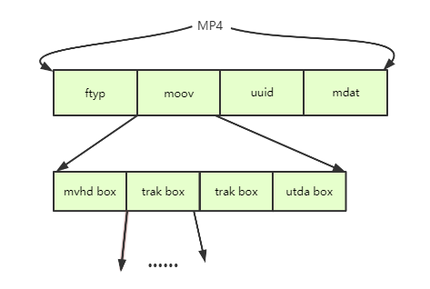
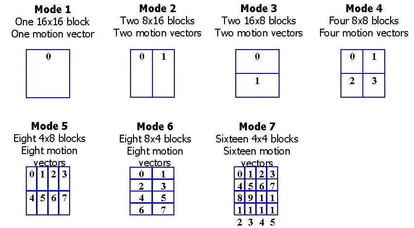

**Main Source : [Wikipedia MP4 file format](https://en.wikipedia.org/wiki/MP4_file_format)**

**MPEG-4 Part 14 (MP4)** is a digital multimedia container format, meaning it's not limited to store one type of file, it can store video, audio, subtitle, metadata, and still images.

It's important to note that MP4 is just container, the actual video or audio data needs to be encoded and decoded by their specific codecs. Codecs are software or hardware that is responsible for the encoding and decoding process. In simple term, they are responsible for converting data into a transmittable format and also converting it back to actual data.

For example, H.264 is the video codec for MP4, MP3 or AAC are the audio codecs. Codecs are also capable of compressing data before being transmitted or stored. This way we can remove redudancides and irrelevant information to save space or bandwidth.

  
Source : https://www.filefix.org/format/mp4.html, https://en.wikipedia.org/wiki/MP4_file_format

### MP4 Structure

MP4 consists of a file header and multimedia data that are organized into containers called atoms or boxes. These atoms represent the actual multimedia data and can also contain other nested atoms.

Atoms have variable sizes and specific types. The minimum size of an atom is 8 bytes. The first 4 bytes of an atom indicate its size, while the following 4 bytes specify the atom's type.

1. **File Header** : This contains the file type, version, and other information about the file.
2. **Atoms** : The main components of an MP4 file comes after the header, it could contain many atoms such as :
   - **ftyp (file type)** : Specify the file type and the common data structures used.
   - **moov (movie)** : Contains the movie metadata, such as the video and audio tracks, the timecode, and the tracks properties.
   - **mdat (media data)** : Contains the media data, such as the video and audio samples.
   - **udta (user data)** : Contains the user-defined metadata.
   - **trak (track)** : Contains information about a single track, such as the track's type, the track's timecode, and the track's samples.

  
Source : https://www.trekview.org/blog/2022/injecting-camm-gpmd-telemetry-videos-part-2-mp4-overview/

### MP4 Compression (H.264)

H.264, also known as AVC (Advanced Video Coding), is a the most commonly used lossy video compression. Like the general compression technique, H.264 removes redundancies and irrevelant information.

H.264 process each frame as "block" which is a fixed-size rectangular region within a frame of video. The block size can vary, example are 4x4, 16x16, or 32x32 pixels.

In H.264, two main technique of compression are used. **Spatial compression** compress each frame of video individually just like compressing an image. **Temporal compression** compress multiple of frames together, it takes advantage of similarities between consecutive video frames. The idea is that not all pixels within each frames changes. We can reference the same block of pixels to the previous or future frames.

Other techniques used in H.264 :

- **Transform Coding** : H.264 uses transform coding, specifically the [discrete cosine transform (DCT)](/digital-signal-processing/discrete-cosine-transform), to convert image data from the spatial domain to the frequency domain. This conversion allows for additional compression by representing the video content using fewer frequency components.

- **Rate Control** : H.264 can adjust bit rate for specific scenes. For example, we can use higher bit rate to complex or high-motion scenes and a lower bit rate to less complex or static scenes.

  
Source : https://www.eetimes.com/emerging-h-264-standard-supports-broadcast-video-encoding-2/
