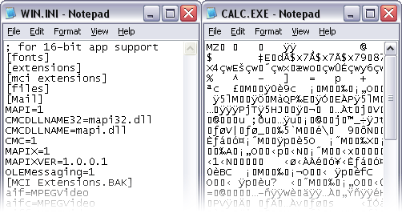

**Main Source :**

- **[Text file - Wikipedia](https://en.wikipedia.org/wiki/Text_file)**

**txt** file format or a text file, is a very simple format used to store plain text data. It contains human-readable text without any specific formatting or metadata. The characters used can be encoded in [ASCII](/computer-and-programming-fundamentals/data-representation#ascii) or [UTF-8](/computer-and-programming-fundamentals/data-representation#unicode).

The structure of txt file is very simple, it consists of sequence of line that vary in length, each line is terminated using a new line character (typically using enter button in keyboard).

### txt File Representation

txt file are stored in binary data encoded with specific character encoding scheme. txt file may also contain metadata for additional information such as file name, file size, creation date, last modified date, and file permissions. The specific metadata and where is it located depends on the operating system used.

For example, consider a text file that uses [ASCII](/computer-and-programming-fundamentals/data-representation#ascii) encoding and contains "Hello, World!". In ASCII, the letter "H" is represented by the decimal value 72, "e" by 101, "l" by 108, "o" by 111, comma (",") by 44, space by 32, and so on. We can then transform each ASCII value of the text to binary.

While decoding it, we will reverse the process, for example if we encounter binary data of "01000001", this means it is "A". We will keep going until the last piece of binary.

  
Source : https://www.thecrazyprogrammer.com/2018/05/difference-between-text-file-and-binary-file.html
