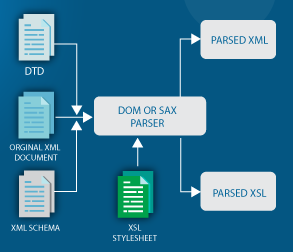

**Main Source : [Wikipedia XML](https://en.wikipedia.org/wiki/XML)**

**Extensible Markup Language (XML)** is a markup language that is used to store arbitary data in a structured format that is both human-readable and machine-readable.

Markup language means that it stores information with specific rules or format, typically uses element in tags  
(`<` and `>`) and enclosed by pair of the element with extra `/` on the front,  
e.g. `<element-name></element-name>`. We can define any element we want, this what makes XML able to store arbitary data.

### XML Component

For example, suppose we want to transfer an employee data. We can define XML and the element tags as the follow :

```xml
<employee>
  <name gender="male">John Doe</name>
  <age>30</age>
  <department>Engineering</department>
</employee>
```

`employee` is the root element. `name`, `age`, `department` are the child element. We then fill out the data surrounded by the element name. XML can also have attributes, which is an additional information or extra metadata about the element. The `gender="male"` is the attribute of `name` element.

### XML Schema

#### Document Type Definition (DTD)

Before filling XML file with data or information, we need define the structure and the valid elements of an XML document. This is called DTD and it is declared within the XML document using the `<!DOCTYPE>` declaration.

For example, the previous XML example above may contains this DTD :

```xml
<!DOCTYPE employee [
  <!ELEMENT employee (name, age, department)>
  <!ELEMENT name (#PCDATA)>
  <!ATTLIST name gender (male|female) #REQUIRED>
  <!ELEMENT age (#PCDATA)>
  <!ELEMENT department (#PCDATA)>
]>
```

- **`<!DOCTYPE>`** : Define the root element "employee".
- **`<!ELEMENT>`** : Declaration that define the structure of elements. It states that "employee" must contain "name", "age", and "department" elements.  
  The `<!ELEMENT>` declarations for `name`, `age`, and `department` specify that they contain parsed character data `(#PCDATA)`, which means they can contain text content.
- **`<!ATTLIST>`** : Specifies that the element has an attribute, the `name` has attribute called gender and must be either "male" or "female" using the `(|)`. The attribute is required `(#REQUIRED)`.

#### XML Schema (XSD)

XML Schema, also known as XML Schema Definition (XSD), is the successor of DTDs, it is far more powerful than DTDs. XSD provide more way to define XML structure including data types, strong typing, complex data structures (such as nested elements and sequences), ability to define custom data types and complex constraints.

XSD also provide a way to distinguish between same XML schema definitions. It ensures that elements, attributes, and types defined within a specific schema are uniquely identified. The unique identifier is called **XML namespace**.

```xml
<xs:schema xmlns:xs="http://www.w3.org/2001/XMLSchema">
  <!-- Schema definition goes here -->
</xs:schema>
```

In the above example, a schema is defined with `<xs:schema> </xs:schema>`, the attribute `xmlns:xs=` is the namespace. The namespace value `http://www.w3.org/2001/XMLSchema` means that the XML file is associated with that mentioned URI.

Combining with the same employee example from above, this is the schema :

```xml
<?xml version="1.0" encoding="UTF-8"?>
<xs:schema xmlns:xs="http://www.w3.org/2001/XMLSchema">
  <xs:element name="employee">
    <xs:complexType>
      <xs:sequence>
        <xs:element name="name" type="xs:string">
          <xs:complexType>
            <xs:attribute name="gender" type="xs:string" use="required"/>
          </xs:complexType>
        </xs:element>
        <xs:element name="age" type="xs:positiveInteger"/>
        <xs:element name="department" type="xs:string"/>
      </xs:sequence>
    </xs:complexType>
  </xs:element>
</xs:schema>
```

- `<xml>` : An XML file begins with `xml` tags specifying version and the encoding used to encode the text.
- `<xs:schema>` : Act as the root of the schema with the namespace attribute.
- `<xs:element>` : Define an element with the attribute `employee` as the name. We can also specify attribute `type` for the data types.
- `<xs:complexType>` : Defines the complex type for the `employee` element. It allows for the specification of the child elements attributes.
- `<xs:sequence>` : Define the sequence or order in which child elements should appear within a complex type.
- `<xs:attribute>` : Define the attribute of element name with attribute `use` to mark it as required.

### XML Parsing

XML file follows a hierarchical tree-like structure. It consists of elements, attributes, and text content. The parsing process includes :

1. **Tokenization/Lexical Analysis** : XML parser reads the raw XML data character by character and breaks it down into small piece called tokens.

2. **Syntax Analysis** : Parser analyzes the tokens to ensure they conform to the XML syntax rules. It checks for correct opening and closing tags, balanced nesting of elements, proper attribute syntax, and other rules defined by the XML specification.

3. **Document Object Model (DOM) Construction** : The parser construct a tree with the token as the node. Constructing a tree will make parsing easier as it corresponds to the XML hierarchy itself.

     
   Source : https://www.w3schools.com/xml/xml_tree.asp

   There is another approach to parse XML, it is called **Event-Based Parsing**. In event-based parsing, the parser generates events as it encounters XML tokens. Events may include the start of an element, end of an element, attribute values, and text content. The purpose of this is to approach a more memory-efficient manner since it doesn't need to load the entire XML document into memory.

4. **Validation** : If a Document Type Definition (DTD) or XML Schema is specified, the parser can perform validation to ensure the XML document adheres to the specified structure and constraints. This step involves checking element and attribute types, data formats, required fields, and other rules defined in the DTD or XML Schema.

5. **Application Processing** : Once the XML data is parsed and validated, the application can access and process the structured XML representation stored in memory (such as the DOM tree) such as extracting information, performing computations, storing data, or generating output based on the XML content.

  
Source : https://www.edureka.co/blog/java-xml-parser/
