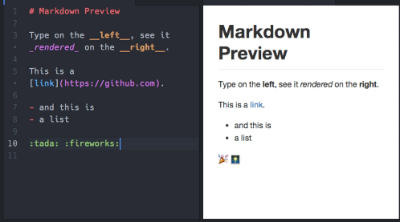

**Main Source :**

- **[Markdown - Wikipedia](https://en.wikipedia.org/wiki/Markdown)**

**Markdown (.md file)** is a markup language used to style plain text with format elements such as heading, list, images, bold, italic, underlined text, links, etc. Markdown can be easily converted into HTML, in fact it also supports HTML itself and CSS styling.

Markdown uses a set of symbol that is used to indicate which part of the plain text to be formatted. For example, surrounding a text around double `*` like `**Hello**` will make the text bold. Using `#` will create a heading 1-6 based on the amount of `#` before the text, `### World` this will produce a "World" text with heading 3.

And there are many others symbol to format text.

  
Source : https://dev.to/developer_anand/learn-basic-markdown-33nl

### Markdown Parsing

Markdown works by analyzing plain text and converting it into HTML while also applying format according to the symbol used. Here is the simplified process :

1. **Tokenization** : The first thing to do is to break down the input Markdown text into individual tokens. Tokens are the elements of the Markdown syntax, such as headers, lists, paragraphs. This step is often done using regular expressions or other pattern matching techniques.
2. **Parsing** : Once the tokens are identified, the Markdown processor analyzes their structure and relationships to build a hierarchical representation of the document. It identifies the nesting of elements, such as nested lists, and creates a data structure (usually tree) to represent the document's structure.
3. **Conversion** : After the document structure is determined, the Markdown processor applies transformation rules to convert the Markdown tokens and structure into the desired output format. For example, it may convert headers to HTML heading tags, lists to HTML lists, or inline formatting to appropriate HTML tags or styles.
4. **Rendering** : The converted output is rendered or displayed according to the target medium. For web-based applications, the rendered output may be displayed directly in the browser.

  
Source : https://accu.org/journals/overload/26/146/balaam_2532/
