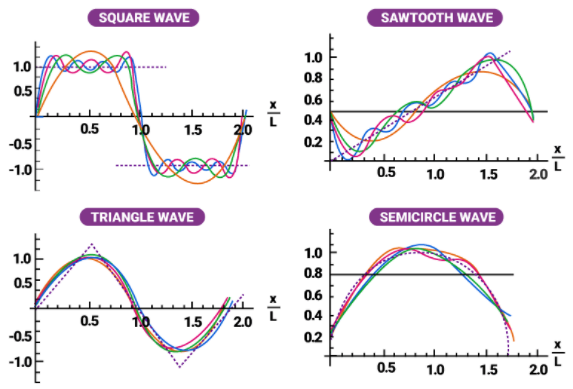
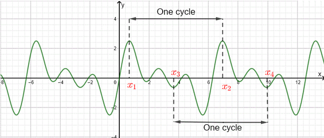
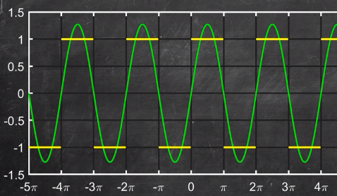
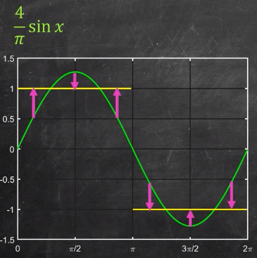
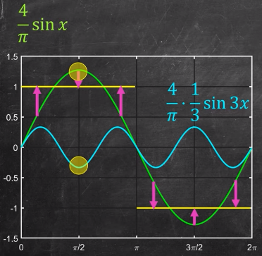
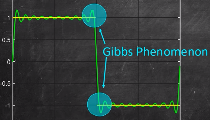
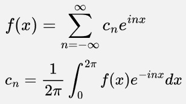
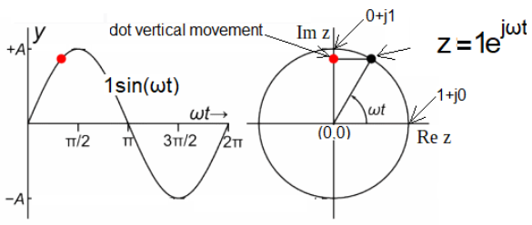

**Main Source :**

- **[Dr. Trefor Bazett, Intro to Fourier Series](https://youtu.be/wmCIrpLBFds)**
- **Various source from Google**

**Fourier Series** is a mathematical method for representing a periodic function as a sum of sine and cosine functions with different frequencies.

We can approximate various of function such as below

  
Source : https://byjus.com/maths/fourier-series/

### Approximating Square Wave

A function is called periodic when it satisfies the following : $f(t + T) = f(t)$.  
Meaning function will repeats its values at some intervals or periods.

  
Source : https://www.analyzemath.com/function/periodic.html

A square wave like this is also a periodic function
  
Source : https://youtu.be/wmCIrpLBFds?t=89

We can approximate a square wave with the sum of sine wave. With a single sine wave, we will get a pretty bad approximation.

  
Source : https://youtu.be/wmCIrpLBFds?t=131

Here, a closer look at the approximation using $\frac{4}{\pi} \sin(x)$ function.

  
Source : https://youtu.be/wmCIrpLBFds?t=195

We can add another sine wave so that the amplitude will lower down. Adding wave will either add up or cancel each other.

  
Source : https://youtu.be/wmCIrpLBFds?t=221

It will result in much better approximation.

  
Source : https://youtu.be/wmCIrpLBFds?t=257

We can keep adding sine wave until we are satisfied with the result.

  
Source : https://youtu.be/wmCIrpLBFds?t=312

#### Gibbs Phenomena

We may encounter a problem in our series of sine wave. While approximating a discontinued function, the Fourier series attempts to "fill in" the gaps with the sum of the sine and cosine functions. However, the sum of the infinite number of sine and cosine functions is not able to perfectly match the discontinuous function, resulting in the overshoot or ringing effect.

  
Source : https://youtu.be/wmCIrpLBFds?t=384

### Fourier Series Formula

Below are the formula for Fourier series for a periodic function $f(x)$ with period of $2\pi$, note that we can also add up with cosine wave.

  
Source : https://www.cuemath.com/fourier-series-formula/

These coefficient can be thought of as how we will represent the amplitude and phase of each frequency component in the Fourier series expansion of a periodic function.

### Complex Fourier Series

Fourier series is represented in sine and cosine wave, we can represent this as a sum of complex exponential functions using Euler's formula.  

  
The formula for complex Fourier series with period of $2\pi$ :  
  
Where $n$ is frequency and $i$ is the imaginary terms.

  
Source : https://pidlaboratory.com/4-complex-fourier-series/ (With modification)
