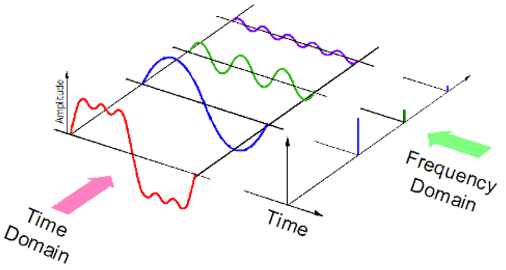

**Main Source : [Up and Atom Fourier Transform Demystified](https://youtu.be/mgXSevZmjPc)**

If Fourier series is used to sum up wave to approximate a function, **Fourier Transform** is a method to separate a complex wave based on its frequency.

When we add together various wave, this is represented in time-domain, it is a function of time and may contain multiple frequency components. By applying the Fourier transform, we can extract the individual frequency components and represent the signal in the frequency domain as a sum of sinusoidal waves with different frequencies.

  
Source : https://kinder-chen.medium.com/denoising-data-with-fast-fourier-transform-a81d9f38cc4c

### How does it works

Fourier transform formula for continous signal is given by the following formula

- $\omega$ is the frequency with unit of radians per unit time
- $F(\omega)$ is the output of fourier transform with input frequency \omega
- $f(t)$ is the original signal in the time domain

Using complex exponential term, we represent the wave as a vector that has magnitude that represents the amplitude of the sinusoidal wave, while the phase angle represents the phase shift of the wave relative to a reference point.

Multiplying the $f(t)$ with the exponential term would make the vector now rotate based on the function.

  
Source : https://tutorial.math.lamar.edu/Extras/ComplexPrimer/Forms.aspx

To be able to separate based on each waves frequency, we can separate it based on the amplitude and the phase. The magic comes from taking the integral of the product of exponential term and input signal $f(t)$.

The products represents the contribution of the frequency component at frequency $\omega$ to the original signal $f(t)$. The idea is we need to find out how much of the signal $f(t)$ is contributed by the frequency component at frequency $\omega$. This mean we need to know the product for all time domain.

This is where integral comes to play, essentially taking the integral for all values of t measures the amount of overlap between the original signal and the oscillating function at frequency ω.

After taking the integral, you will get the complex-valued number which represents the amplitude and phase of the frequency component at frequency $\omega$ in the original signal $f(t)$.
